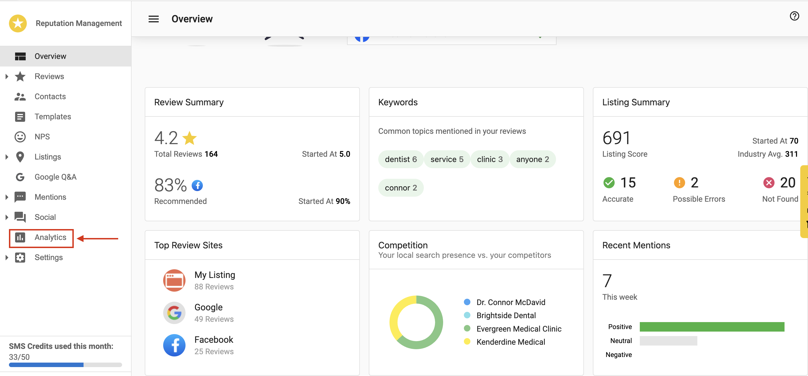
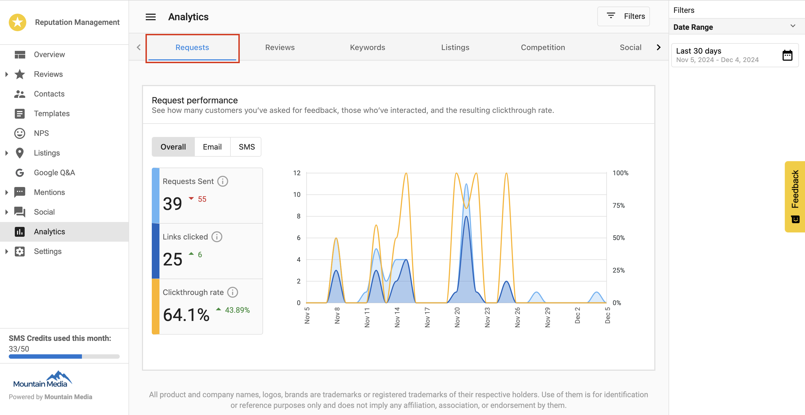
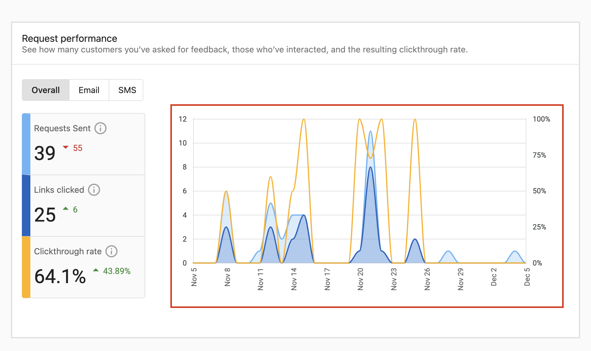
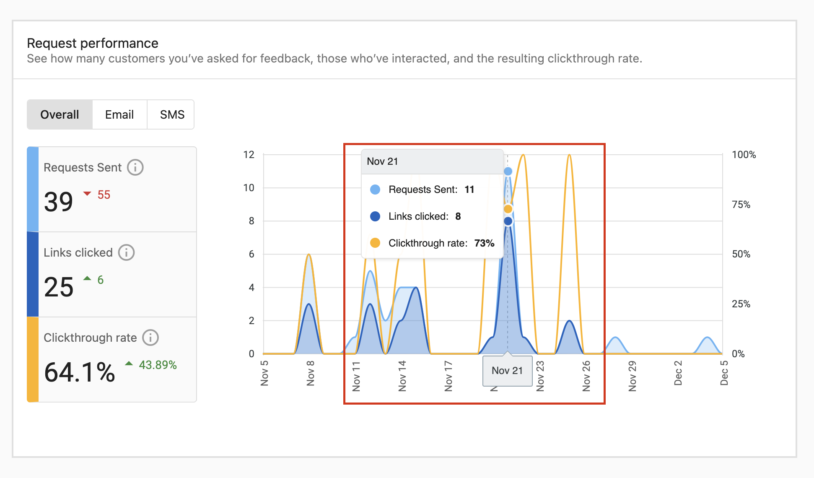
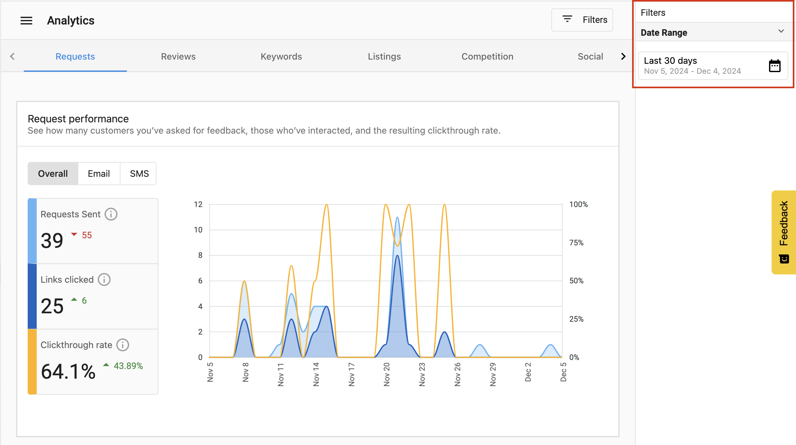

The **Request Performance Metrics** provide insights into the quantity of customer review requests sent, and the resulting customer reviews for a single location. This helps businesses understand the effectiveness of their review requests and track the distribution of their reviews across different platforms.

## Accessing Request Performance Metrics

To view the Request Performance Metrics for a single location:

1. Navigate to `Business App`
2. Select a business
3. Go to `Reputation AI`
4. Click on the `Analytics` tab

## Using the request performance metrics

The Request Performance section displays:

### Performance graph

The graph provides visual insights showing:

- **Requests Sent**: The total number of review requests sent to customers
- **Reviews Received**: The total number of reviews received after sending requests

### No of surveys and conversion rate

The Requests report also tracks two customer-level metrics:

- **No of surveys**: The number of surveys sent to customers.
  - Integration and automation requests count per job or transaction. If the same contact has 3 jobs in the selected period, that counts as 3 surveys.
  - Manual requests with no linked transaction each count as 1 survey.
- **Conversion Rate**: The percentage of surveyed transactions that received an NPS or review response, calculated as (surveyed transactions with a response ÷ total surveyed transactions) × 100.

Channel and Request Type filters don't apply to **No of surveys** or **Conversion Rate**. Both metrics respect the date range, location, and team filters you select.

### Interactive features

- **Mouse over data points**: View detailed information for specific dates

- **Date Range Selection**: Customize the time period for the data displayed

## Analyzing performance

These metrics help you:

1. Track the success rate of review requests
2. Identify trends in customer responses
3. Optimize your review request strategy
4. Measure the ROI of your review generation efforts

## Best practices

- Monitor the ratio of requests sent to reviews received
- Look for patterns in days/times when customers are most responsive
- Adjust your request strategy based on performance data
- Use insights to identify opportunities for improvement

## Frequently asked questions (FAQs)

What information does the Performance Graph show?

The graph visualizes the trend of **Requests Sent** versus **Reviews Received** over your selected time period, helping you see the direct impact of your outreach efforts.

Can I change the date range for the metrics?

Yes. Use the date range selector in the top right corner to filter data for specific periods, such as the last 30 days, last quarter, or a custom range.

How do I calculate the success rate of my requests?

Compare the number of **Reviews Received** to **Requests Sent**. A higher ratio indicates a more effective request strategy and higher customer engagement.

What is the difference between "Clicked" and "Review Completed"?

**Clicked** means the customer opened the review request link. **Review Completed** means the customer submitted a review after clicking. These two numbers will often differ because some customers click the link but do not follow through to submit a review. A gap between them is normal and does not indicate a technical issue.

Why aren't completed reviews appearing on Google?

If your review request links point to your My Listing page (the default), reviews submitted there are separate from Google reviews and will not appear on your Google Business Profile. To send customers directly to Google for reviews, configure a Google override URL: go to **Settings > Preferred Review Sites > Google > Override Review URL** and paste your Google review link.

Why is my performance showing zero?

Common causes include:
- The selected date range does not cover the period when requests were sent — try adjusting the date range.
- No Preferred Review Sites have been configured in Settings.
- Listing Builder is not active for the account, which is required for review request delivery.

What counts toward No of surveys?

Integration and automation requests count per job or transaction, so a contact with 3 jobs in the selected period counts as 3 surveys. Each manual request with no linked transaction counts as 1 survey.

Do the Channel and Request Type filters affect No of surveys or Conversion Rate?

No. Those filters don't apply to **No of surveys** or **Conversion Rate**. Both metrics still respect the date range, location, and team filters you select.

