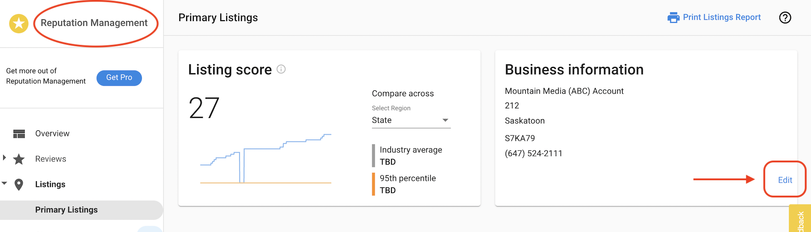
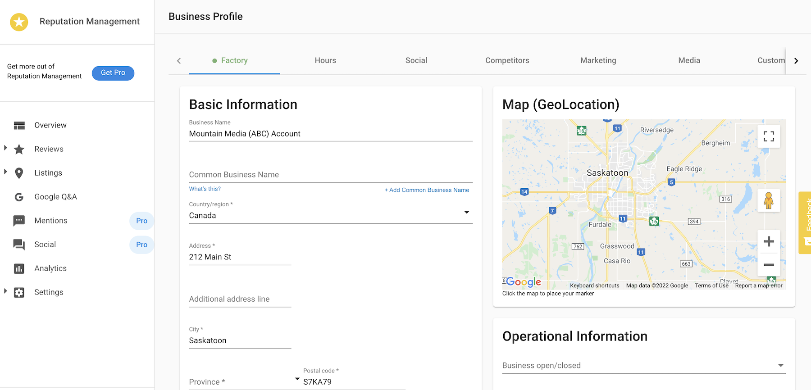

You can easily edit and update your business profile information without leaving Reputation AI.

## Why is editing your business profile in Reputation AI important?

Keeping your business profile accurate ensures that your listing information stays consistent across directories and search platforms. Your profile data, including your business name, address, and phone number, is used to match and verify your listings across the web. You can update your profile directly from the Primary Listings page in Reputation AI without navigating away from the application.

## How does editing your business profile from Reputation AI work?

Go to `Business App` → `Reputation AI` → `Listings` → `Edit` to open the business profile and update the information as necessary.

After updating, click `Save` at the bottom of the page.   

