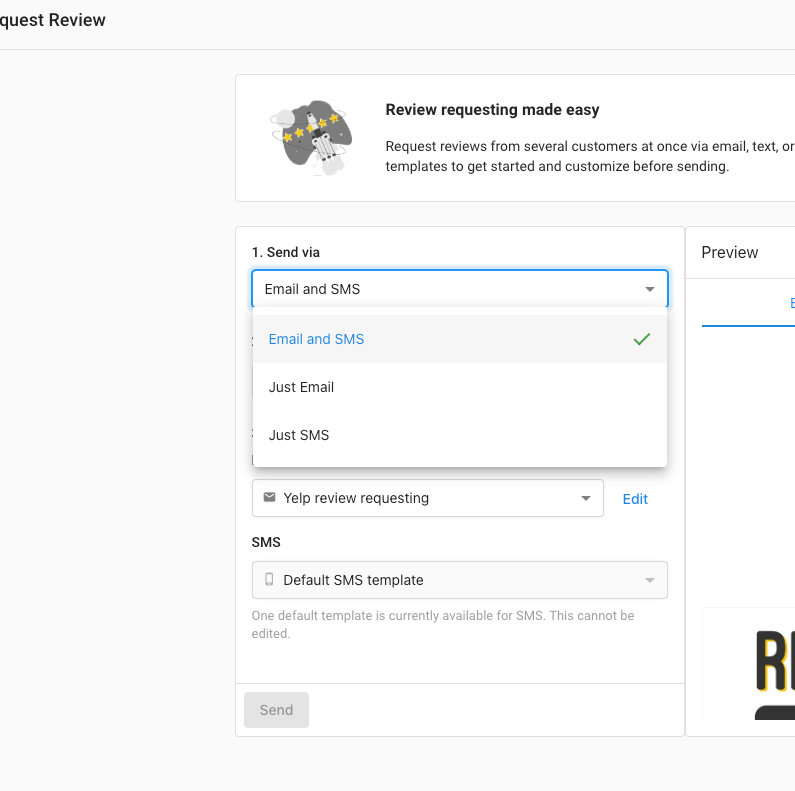
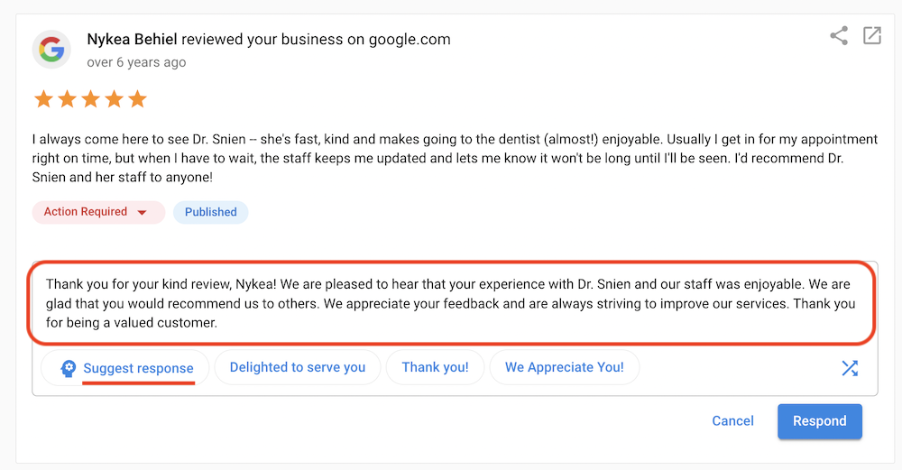
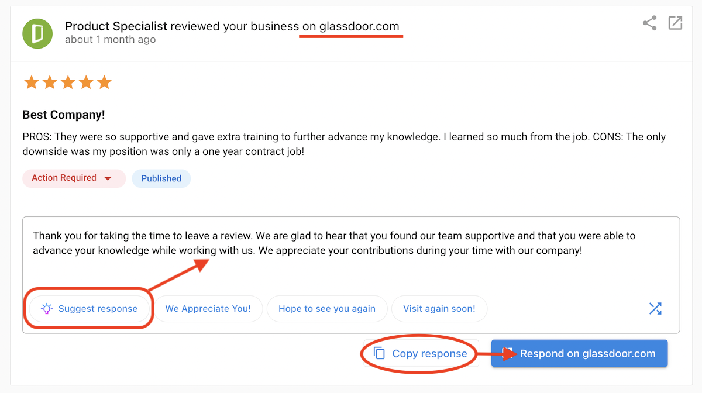

## What are AI-generated review responses?

Reputation AI uses artificial intelligence in the `Manage Reviews` section so you can quickly create review responses. This feature works for accounts with Reputation AI Pro and Premium. The AI-suggested response feature can be used in the app to respond directly to Google or Facebook reviews and used to generate responses for other review sites. See below. 

## Why are AI-generated review responses important? 

Streamlines the process when you want to quickly respond to a review on Google or Facebook to save time, improve the ease of content creation, reduce research needed, and allow you to interact with your audience faster. 

## How do AI-generated review responses work?

Go to the Reputation AI dashboard then click `Reviews` → `Manage Reviews` in the main menu. Filter reviews by `Without Responses` to display the reviews that require a response. Look for `Suggest Response` and select that:

After clicking `Suggest Response` the AI will generate a response. If you have templates set up in different languages, the AI can even understand the language that the review was left in, and will respond in the detected language.

**Note:**

The AI response Suggest Response only appears if there are response templates corresponding to the rating/star number given in the reviews.  

 To ensure the [AI response templates](../templates/) appear, you need to have response templates that cover all star ratings, including the missing 1-star or 2-star cases. 

After the AI response is generated, you can make edits or changes to it. If you are satisfied with the response, simply click the `Respond` button. 

The AI-suggested response feature can also be used to respond to reviews from other sites. Simply click the `Suggest Response` button to generate the response then click `Copy response` → `Respond on [review site]` where this AI-generated response can be used. 

## Frequently asked questions

Does the AI learn from my past responses?

The AI primarily uses general best practices and the context of the specific review to generate suggestions. It does not strictly "learn" from your personal history in real-time, but it is tuned to be professional and helpful.

Can I edit the AI response before sending?

Yes, absolutely. The AI provides a drafted suggestion which you are encouraged to edit, personalize, or correct before hitting send.

Is this available for all review sites?

Direct "one-click" posting is available for core sites like Google and Facebook. For others, you may use the "copy response" feature to paste the AI's suggestion manually.

