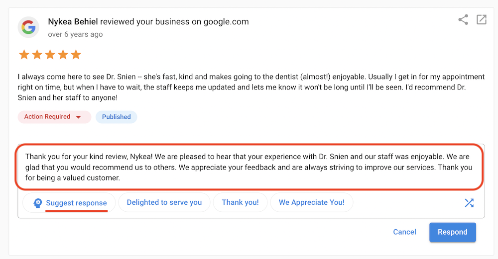
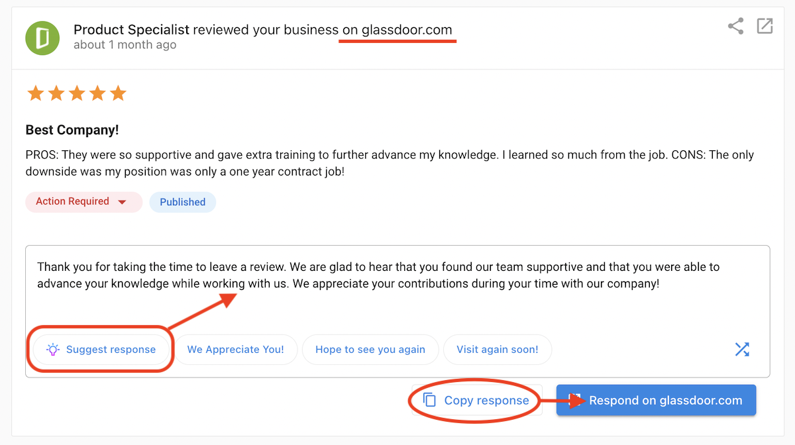

## What are AI-generated review responses?

Reputation AI uses artificial intelligence in the `Manage Reviews` section so you can quickly create review responses. This feature works for accounts with Reputation AI Pro and Premium. The AI-suggested response feature can respond directly to Google or Facebook reviews, and can also generate responses you copy over to other review sites.

## Why are AI-generated review responses important?

This feature helps you respond to reviews on Google or Facebook more quickly, with less time spent writing each reply.

## How do AI-generated review responses work?

Go to the Reputation AI dashboard then click `Reviews` → `Manage Reviews` in the main menu. Filter reviews by `Without Responses` to display the reviews that require a response. Look for `Suggest response` and select that.

After you click `Suggest response`, the AI generates a response. If you have templates set up in different languages, the AI detects the language of the review and responds in that language.

:::note
The Suggest response option only appears if there are response templates corresponding to the rating/star number given in the reviews.

To ensure the [AI response templates](../templates/) appear, you need to have response templates that cover all star ratings, including the missing 1-star or 2-star cases.
:::

After the AI response is generated, you can make edits or changes to it. If you are satisfied with the response, click the `Respond` button.

The AI-suggested response feature can also be used to respond to reviews from other sites. Click the `Suggest response` button to generate the response, then click `Copy response` → `Respond on [review site]` where this AI-generated response can be used.

## Frequently asked questions

Does the AI learn from my past responses?

The AI primarily uses general best practices and the context of the specific review to generate suggestions. It does not strictly "learn" from your personal history in real-time, but it is tuned to be professional and helpful.

Can I edit the AI response before sending?

Yes. The AI provides a drafted suggestion that you can edit, personalize, or correct before you click `Respond`.

Is this available for all review sites?

Direct "one-click" posting is available for core sites like Google and Facebook. For others, you may use the "copy response" feature to paste the AI's suggestion manually.

Why didn't Reputation AI respond to recent reviews even though AI is enabled?

Automatic responses require a verified Google Business Profile. If your Google Business Profile is not verified, AI cannot post replies. Verify the profile, then confirm your AI response settings are still enabled. Contact support if responses still do not post after verification.

