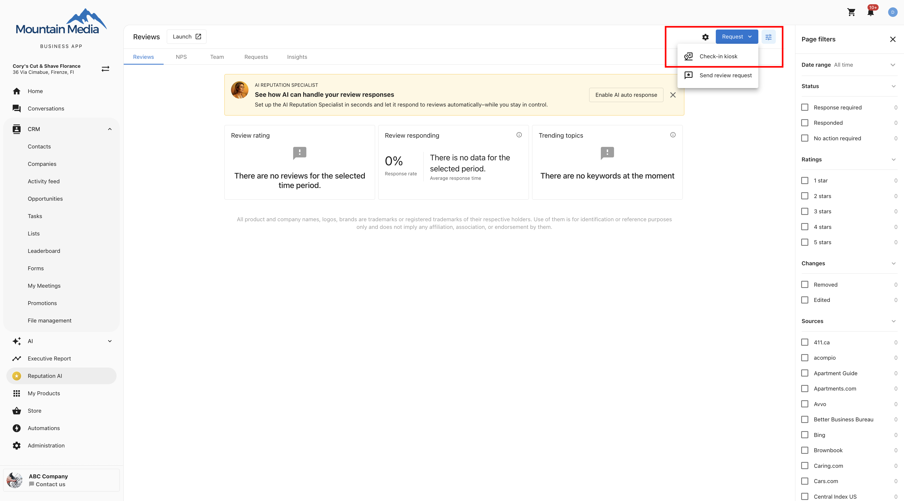
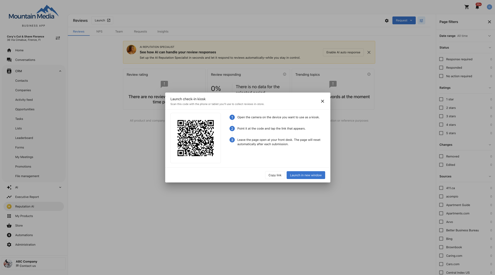

## What is the Check-in kiosk?

The Check-in kiosk is a self-serve check-in screen you run on a tablet or phone at your front desk. Customers who walk in, get served, and leave without ever giving you their contact details can check in themselves on the kiosk, entering their own name and email, and get a review request automatically.

There's no login required on the kiosk device and nothing for your staff to do between customers. The screen resets itself after every submission, ready for the next person.

## Why is the Check-in kiosk important?

- **Reach customers you couldn't before**: Capture reviews from walk-in and counter customers you had no contact details for
- **Ask at the best moment**: Request a review right after the experience happens, when customers are most likely to say yes
- **Grow your CRM from foot traffic**: Every check-in becomes a contact you can market to later
- **No staff time required**: Leave the tablet unattended, no clipboard, no typing customer details in afterward

## What's included with the Check-in kiosk?

- **A dedicated kiosk link per location**: Each of your locations gets its own kiosk link
- **A simple check-in form**: First and last name (optional), email (required), and mobile number (optional), sized to fit a single tablet or phone screen with no scrolling
- **Automatic contact creation and matching**: Submissions become CRM contacts, matched against existing contacts to avoid duplicates
- **Automatic review requests**: A review request email sends immediately using your account's default template
- **Hands-free reset**: The screen clears itself and returns to a blank form after each submission

## How to set up the Check-in kiosk

1. Go to **Reputation AI** → **Reviews**.
2. Click **Request** → `Check-in kiosk`.

   

3. In the **Launch check-in kiosk** panel, set up the device you'll use at the counter:
   - Scan the QR code with the camera on the tablet or phone you want to use as a kiosk, then tap the link that appears, or
   - Click `Copy link` to send the link to that device another way, or
   - Click `Launch in new window` to open the kiosk on the device you're already using.

   

4. Leave the kiosk page open at your front desk. It stays ready and resets itself automatically after every customer.

The first time you open a location's kiosk link, it takes a couple of seconds while the kiosk is created behind the scenes. Every time after that, it opens instantly.

## How the kiosk works for your customers

A customer picks up the device, enters their first and last name (optional), email (required), and mobile number (optional), and taps submit. Submit becomes available as soon as the required fields are filled in, so there's nothing slowing down a customer with a queue behind them.

After a customer submits, a thank-you confirmation shows, then the form clears itself and returns to blank after 5 seconds. No one needs to touch the device, and the next customer sees none of the previous customer's information.

If a submission fails, the kiosk does not reset automatically. The error stays on screen so the customer can try again.

## What happens after a customer checks in

When a customer submits the kiosk form, the system looks for an existing contact by email first, then by phone, and matches to that contact instead of creating a duplicate. New contacts are tagged with the source `Form / Mobile Kiosk`, so you can find or bulk-manage everything the kiosk brought in.

A review request email sends automatically using your account's default template. There are no SMS requests and no follow-up reminders from the kiosk.

If a customer already received a review request in the last 30 days, the kiosk won't send another one. They're still saved or matched as a contact, but only the review request is skipped.

Every contact and every review request from a kiosk is attributed to that kiosk's own location. On multi-location accounts, check-ins are never blended across locations.

## Managing the kiosk automation

The review request the kiosk sends is powered by an automation that appears in your **Automations** list like any other automation. You can turn it off or delete it from there.

If you turn off or delete the automation, check-ins still create or match contacts. The kiosk just stops sending review requests.

The kiosk form itself is provisioned and managed by the platform. It won't appear under **CRM** → **Forms**, and it can't be edited or deleted. This keeps your kiosk link stable.

## Requirements and limits

- The Check-in kiosk is available on single-location Reputation Management Premium accounts.
- You can collect up to 50 check-ins per hour per business. This allowance is shared across every device checking in at that location.
- Review requests from the kiosk go out by email only, using your account's default template. SMS requests and follow-up reminders aren't part of the kiosk flow.

## Frequently Asked Questions

What information does a customer need to enter on the kiosk?

Email is required. First name, last name, and mobile number are all optional.

Does every customer who checks in get a review request?

Yes, unless they already received a review request in the last 30 days. In that case, they're still saved or matched as a contact, but the kiosk doesn't send another request.

Will the kiosk create duplicate contacts?

No. The kiosk matches submissions to an existing contact by email first, then by phone, before creating a new one.

Can I turn off the review request the kiosk sends?

Yes. The kiosk's review request is an automation in your **Automations** list, and you can turn it off or delete it. Check-ins will still create or match contacts, but no review request will send.

Can the kiosk send SMS review requests instead of email?

No. The kiosk sends review requests by email only, using your account's default template.

Does the kiosk send follow-up reminders?

No. There are no follow-up reminders from the kiosk's review request.

Can I use one kiosk link across multiple locations?

No. Each location has its own kiosk link, and check-ins and review requests are always attributed to that location. They're never blended across locations on a multi-location account.

How many check-ins can I collect per hour?

Up to 50 per hour per business. This is a shared allowance across every device checking in at that location.

Can I edit the kiosk check-in form?

No. The kiosk form is provisioned and managed by the platform, so it won't appear under **CRM** → **Forms** and can't be edited or deleted.

Does a customer need to log in to use the kiosk?

No. There's no login on the kiosk device for the customer or for your staff.

What happens if a customer's submission fails?

The kiosk doesn't reset automatically. The error stays on screen so the customer can try submitting again.

Why does the kiosk take a few seconds to load the first time?

The first time you open a location's kiosk link, the kiosk is created behind the scenes, which takes a couple of seconds. Every time after that, it opens instantly.

