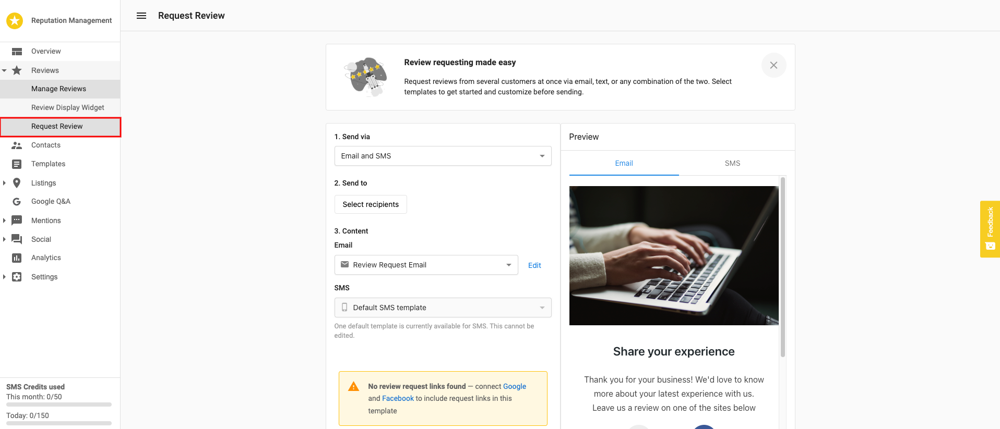
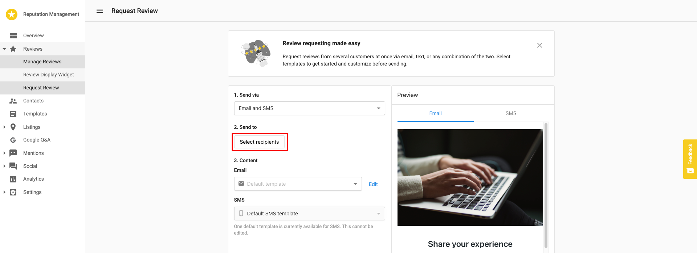
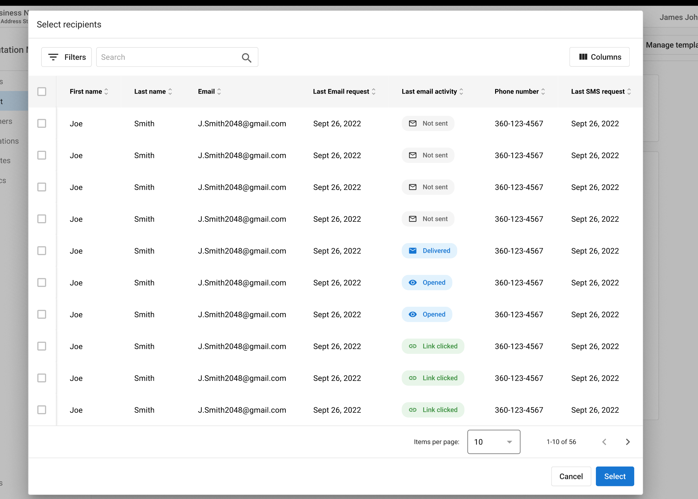
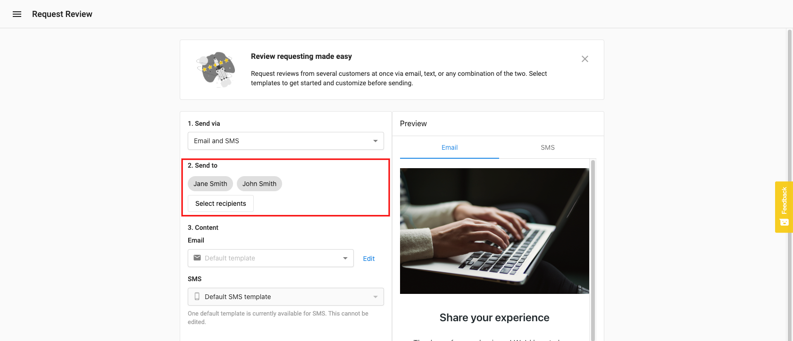
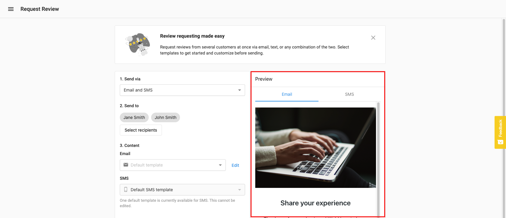
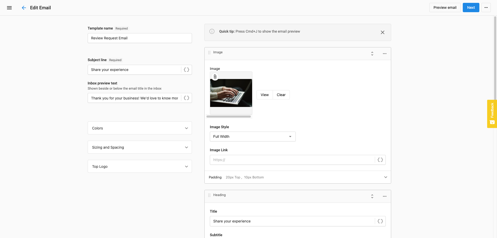

Reputation AI Premium allows you to send branded review requests to your customers' contacts. This capability is accessible through Review Requests Management within the platform.

To send a review request, follow these steps:

1. Click on the `Review Requests Management` tab and select `Send Review Requests` to initiate the process

2. Select the review site(s) where you want to direct customers to leave reviews

3. Add recipient(s) using one of the following methods:
   - The `Add Recipient` feature to add customers one at a time
   - The `Upload List` feature to bulk upload recipients from a CSV file

4. For individual entries, provide customer information by entering their name and email address

5. For multiple entries with the CSV upload, the file should include:
   - First Name
   - Last Name
   - Email Address

6. After adding recipients, select `Add Recipients` to proceed to the email template page

7. Customize the email template with the following options:
   - Email From - Set a specific email address as the sender
   - Subject Line - Modify the default subject line
   - Header Logo - Upload a custom image
   - Email Body - Edit the message content
   - Background Color - Change the background color of the email

8. Preview the email by clicking the `Preview` button

9. When satisfied with your review request, click `Send` to deliver it to your selected recipients

10. View the status of your review requests in the `Requests` section of Reputation AI Premium

## Important notes

- One credit is consumed per email recipient
- Each review request batch can be sent to a maximum of 50 recipients
- To send to more than 50 recipients, you will need to create multiple request batches
- Review requests can be scheduled to be sent at a specific date and time
- You can duplicate past review requests to save time on future campaigns