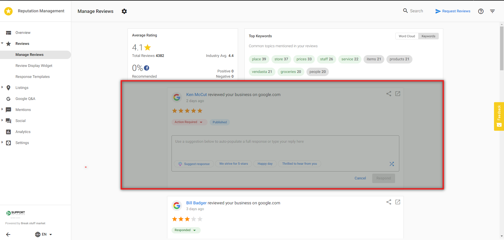
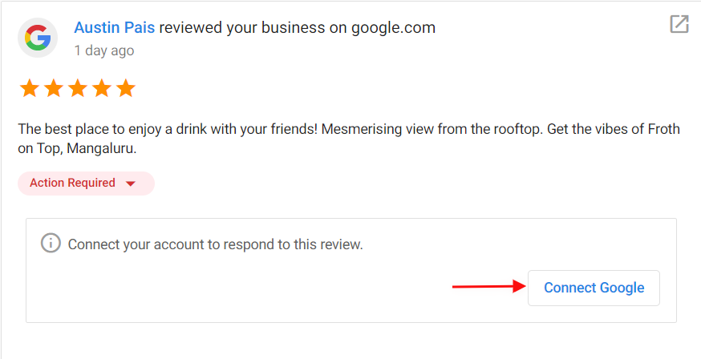

To respond to reviews in Reputation AI, navigate to `Reviews` → `Manage Reviews`.

You can respond directly to Google, Facebook, and My Listing reviews from this page. The Google and Facebook accounts must be connected in Reputation AI to respond. Connect these accounts by going to `Settings` → `Connect Accounts` → click on `+` to connect an account.

To respond to a Google, Facebook, or My Listing review, type your response in the text field. Alternatively, choose from one of the review response suggestions to automatically populate a response in the text field.
**Note:** All review response suggestions can be edited within the text field.

Click **Respond** to post your response automatically to the site.

If the account is not connected, you'll be directed to **Connect Account** before you can proceed to click **Respond**.

For all other review sites, such as Yelp or TripAdvisor, click **Respond** and you will be taken to the site where you can respond to the review.

## Responding to positive reviews

For positive reviews, thank them for their praise, and invite them to come back. You can let them know about upcoming promotions that they might be interested in. You can use your business name in the response to increase your SEO. Remember, positive reviews also make great social posts! If you have Social Marketing connected to the account, click the **Share** icon to share the review on your social networks.

## Responding to negative reviews

Negative reviews should also be personalized to the content of the review. You want them to know that you are listening to their concerns. Make sure to apologize for the experience, and invite the reviewer to resolve the issue offline. It's always better to deal with their issues privately.

## Unable to respond to Google review

You may encounter an error message when attempting to respond to a Google review. This is usually caused by the review being removed from Google shortly after it is pulled into Reputation AI.

## How long does it take for reviews to appear in Reputation AI?

The platform imports reviews at different speeds depending on whether the review source is monitored or directly connected to the platform.

### Monitored review sources (standard, not connected)

For review sites including Google and Facebook if they are not connected, the platform automatically checks for new reviews and imports them within 24 hours of when they're posted on the source website.

These are refreshed regularly but do not use a direct API connection.

### Connected review sources (direct integrations)

Google Business Profile and Facebook Pages can be securely connected to the platform through direct API integrations. When connected, these sources offer faster review syncing, allowing new reviews to appear more quickly than with monitored reviewed sources.

#### Google Business Profile (connected accounts)

New Google reviews typically sync two hours after they're posted, based on the timing at which Google provides new review data.

#### Facebook Pages (connected accounts)

New Facebook reviews and recommendations typically sync about 10 minutes after they're posted, following Facebook's standard timing for releasing new review information.

### My Listing (Listing Source)

Reviews submitted through My Listing appear immediately, since they originate and are managed directly within the platform.

## FAQs

Which sources pull into Reputation AI?

**Major Platforms with Direct Connection:**
- Google (direct connection available)
- Facebook (direct connection available)

**Other Major Review Sources:**
Google, Facebook, TripAdvisor, BBB, Booking.com, Expedia, Trustpilot, Yelp, A Place for Mom, Angi (Angie's List), Apartment Guide, Apartment Ratings, Apartments.com, Avvo, Carfax, Cargurus, Caring.com, Cars.com, CitySearch, DealerRater, Doctor.com, Edmunds, Grubhub, Healthgrades, Hello Peter, Holidaycheck.de, Hotels.com, Houzz, Insider Pages, Leafly, Merchant Circle, MySask411, OpenTable, RateMDs, Redfin, SeniorAdvisor, Superpages, SureCritic, TrueLocal, Vitals, Weedmaps, Wellness.com . . . and many more!

Can I respond to all review resources directly in the product?

You can respond to Facebook and Google reviews directly within Reputation AI. For other review sources, draft your response in Reputation AI, then click to go to the source platform and paste it there.

