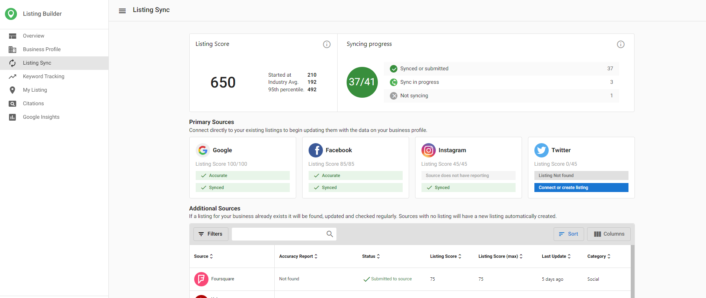

SMS Review Requesting in Reputation AI Premium lets you request reviews from customers via text message, helping you gather feedback and build your online reputation.

:::info US businesses: Registration required
Before you can send SMS review requests, US-based businesses must complete A2P 10DLC registration. This includes updating your website to meet carrier compliance requirements. See [SMS Registration for US Businesses](/business-app/administration/sms_configuration) for the complete registration guide.
:::

:::info UK businesses: Registration required
UK-based businesses using SMS review requests must register their phone numbers with UK carriers. This requirement took effect May 27, 2024 for new numbers and September 30, 2024 for existing numbers. Registration is submitted on your behalf — contact support to initiate the process. Approval typically takes 2–4 business days. Unregistered UK numbers are blocked by carriers.
:::

Reputation AI Premium users will see three options for sending out review requests:

1. Email and SMS
2. Just Email
3. Just SMS

If a user selects 'Just Email,' only email-related options will show such as the email template and email preview.

{/*  */}

If a user selects 'Just SMS,' only SMS-related options will show such as the default SMS template (which is not editable) and the SMS preview.

Review links follow the logic below:

- (First) Google if the Google Business Profile is connected OR
- (Second) Facebook - if it is connected

{/*  */}

If a user selects 'Email and SMS,' it will show template previews for both.

{/*  */}

For the US and Canada, 50 credits will be available for free and users can check their credit usage at the bottom, in the side navigation. Additional credits can be purchased as add-ons to Reputation AI Premium in a variety of amounts.

{/*  */}

## Frequently Asked Questions

How will I know when my SMS registration is approved?

After submitting SMS registration, the approval process typically takes one to four weeks depending on the carrier's review process. Once the registration is approved, an email notification is sent to confirm the approval (if instant email notifications are enabled in your notification settings). There is no need to check the dashboard daily—you will be notified when the registration is complete and SMS messaging is ready to use.

Why was my SMS registration rejected?

The most common reasons for rejection are website compliance issues and business information mismatches. Carriers now manually review your website for privacy policy requirements and opt-in checkboxes. See [SMS Registration for US Businesses](/business-app/administration/sms_configuration#why-registrations-are-rejected) for detailed rejection reasons and solutions.

My EIN is correct but my registration keeps getting rejected. Why?

If your business has a new EIN, the verification databases may not have your information yet. It can take **30 to 90 days** after your EIN is issued for the data to propagate. Check the date on your IRS CP 575 EIN Confirmation Letter and wait the recommended period before resubmitting. See [Newly issued EINs](../../business-app/administration/sms_configuration.md#newly-issued-eins) for more details.

Can I edit the submitted registration answers once the registration has been approved?

Once the SMS registration form has been submitted for A2P 10DLC compliance, the form becomes locked and further edits, including changes to the Authorized Representative, are not possible directly within the platform. This is to comply with carrier and third-party verification requirements, which stipulate that all submitted information must match government records and cannot be altered after submission for security reasons.

Why didn't my SMS review request send?

There are several reasons an SMS review request may not deliver:

- **A2P registration not approved** (US only) — SMS to US numbers requires A2P 10DLC registration to be approved. Check your registration status in **Administration > Conversations Settings > Phone & SMS**.
- **Daily send limit reached** — SMS review requests are limited to 150 per day per account. The limit resets at midnight. Bulk sends over the limit automatically roll over and continue the following day.
- **Recipient opted out** — If the recipient previously texted STOP to your number, they will not receive future SMS messages. They must text START to re-subscribe.
- **Unsupported country** — SMS is not available in all countries. If a contact's phone number is in an unsupported region, the message will not be sent.

What is the daily SMS send limit?

You can send up to 150 SMS review requests per day. The limit resets at midnight. If you upload a bulk list that exceeds 150 contacts, the remaining messages automatically roll over and are sent on subsequent days — you do not need to resend them manually.

A customer says they stopped receiving my SMS messages — how do I fix this?

If a customer previously texted STOP to your number, they are automatically unsubscribed and will not receive any future SMS from your account. They must text START to your number to re-subscribe. You cannot manually override an opt-out on their behalf — this is required by carrier compliance rules.

