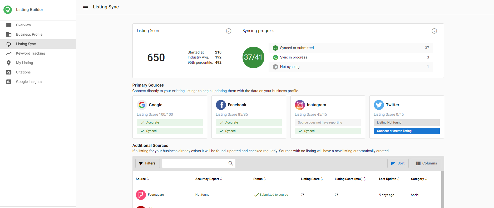

SMS Review Requesting in Reputation AI Premium is an innovative feature that empowers businesses to actively engage with their customers, gather valuable feedback, and enhance their online reputation more effectively than ever before.

Reputation AI Premium users will see three options for sending out review requests:

1. Email and SMS
2. Just Email
3. Just SMS

If a user selects 'Just Email,' only email-related options will show such as the email template and email preview.

{/*  */}

If a user selects 'Just SMS,' only SMS-related options will show such as the default SMS template (which is not editable) and the SMS preview.

Review links follow the logic below:

- (First) Google if the Google Business Profile is connected OR
- (Second) Facebook - if it is connected

{/*  */}

If a user selects 'Email and SMS,' it will show template previews for both.

{/*  */}

For the US and Canada, 50 credits will be available for free and users can check their credit usage at the bottom, in the side navigation. Additional credits can be purchased as add-ons to Reputation AI Premium in a variety of amounts.

{/*  */}