When you want to enhance your customer outreach with personalized review and NPS requests, having a flexible approach to SMS templates is key. With the SMS template management feature, you can easily create and organize custom templates tailored to your specific communication needs. This helps you engage customers more effectively, increases response rates, and strengthens your ability to manage your online reputation through timely, personalized interactions.

## Where to find SMS templates

**Step 1 -** To create an SMS template: 

- Navigate to `Templates` in the side menu in Reputation AI Premium and select the `Request` tab.

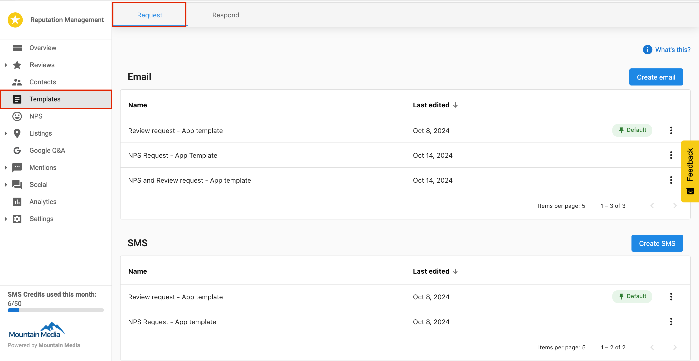

- Under the `Requests` tab, you will find two sections: `Email` and `SMS`.

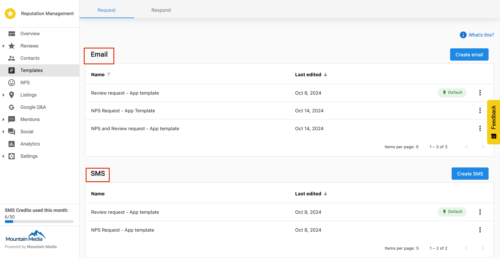

- In the SMS section, click `Create SMS`.

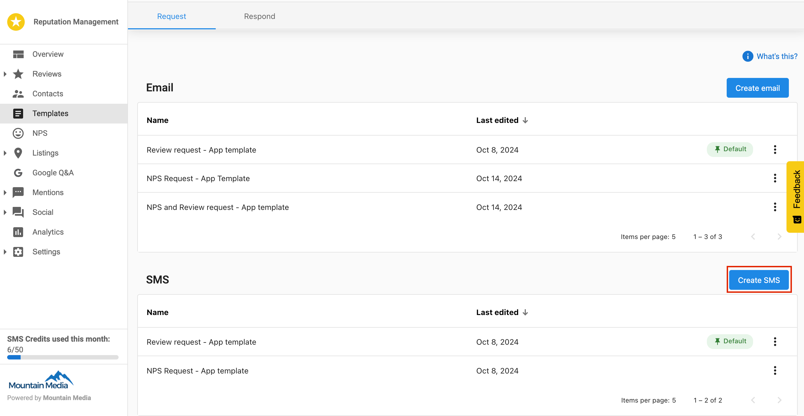

- A pop-up will appear asking you to select the type of request for the template.

1. `Reviews` — Use this option to send review requests.
2. `NPS` — Use this option to send NPS (Net Promoter Score) surveys.
3. `Review and NPS` — Use this option for templates that will be used for both types of requests.

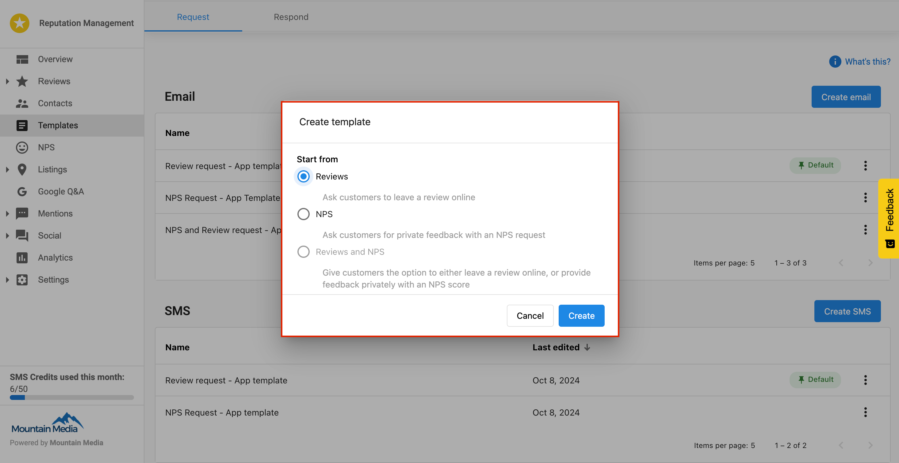

- After selecting the request type, the SMS builder will open. 

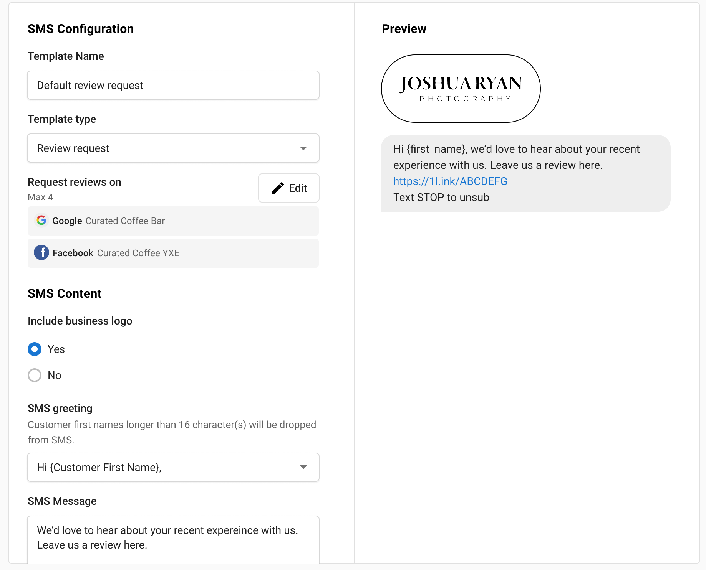

- Once you have made any desired changes, click `Save`. You will now see the new template listed under SMS templates in the templates section. 

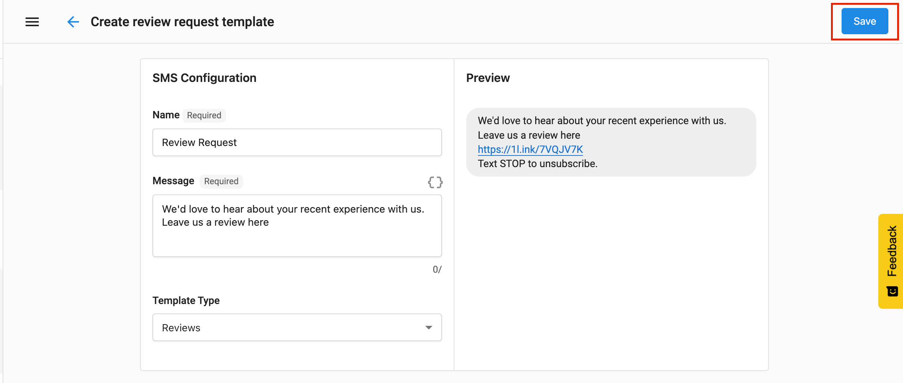

**Step 2 -** To manage SMS Templates: 

- Navigate to `Templates` in the side menu in Reputation AI Premium and select the `Request` tab. 
- Under the `Request` tab, you will find two sections: `Email` and `SMS`.
- In the SMS section, you can see all the created SMS templates will be listed. 

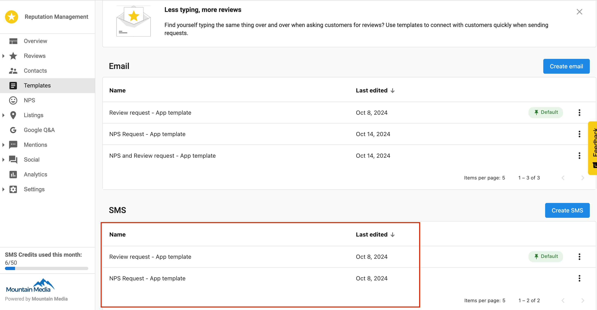

- Each template will have a three dot menu that offers the following options:  
  - Edit
  - Delete
  - Make Default 

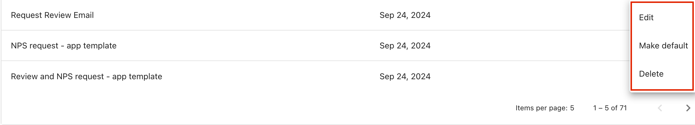

- **Edit:** When you click `Edit`, you are redirected to the SMS builder with the current template's configurations pre-loaded. You can make any necessary changes and then save the updated template. 
- **Delete:** When you select `Delete`, a confirmation pop-up appears with two choices: `Confirm Delete` or `Cancel`.
  - **Confirm Delete:** If you click `Confirm Delete`, the template is permanently deleted from the system. 
  - **Cancel:** If you click `Cancel`, the pop-up closes and you return to the template listing page without making any changes. 

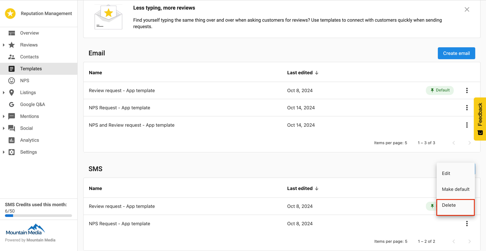

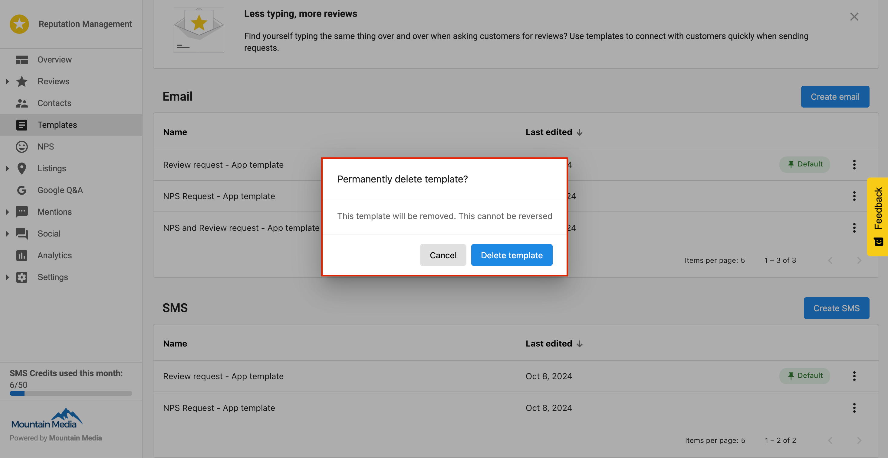

- Make Default: If you click `Make Default`, that template is set as the default for SMS requests. This default template is automatically used in automation processes and pre-loaded in the Request Review section when sending new review requests via SMS. 

## Types of SMS requests 

Three types of SMS templates can be created using the SMS builder:

**Review Request:** 

- You can choose which review source (i.e. Google, Facebook) you want reviews from when sending a review request to contacts. 
- Multiple review source options let you select the specific site for the review request. 

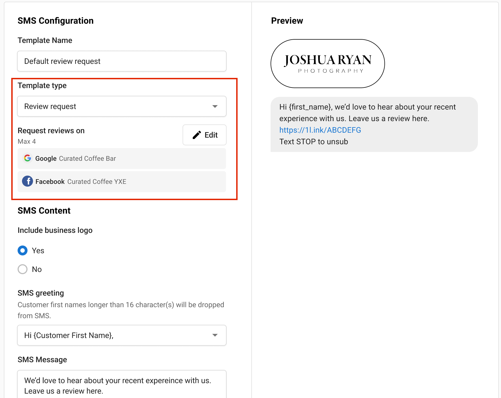

**NPS Request:** 

- You can configure NPS settings directly in the builder, with an NPS block appearing in the editor. 
- A checkbox is available to configure the redirection after the NPS survey is submitted. 

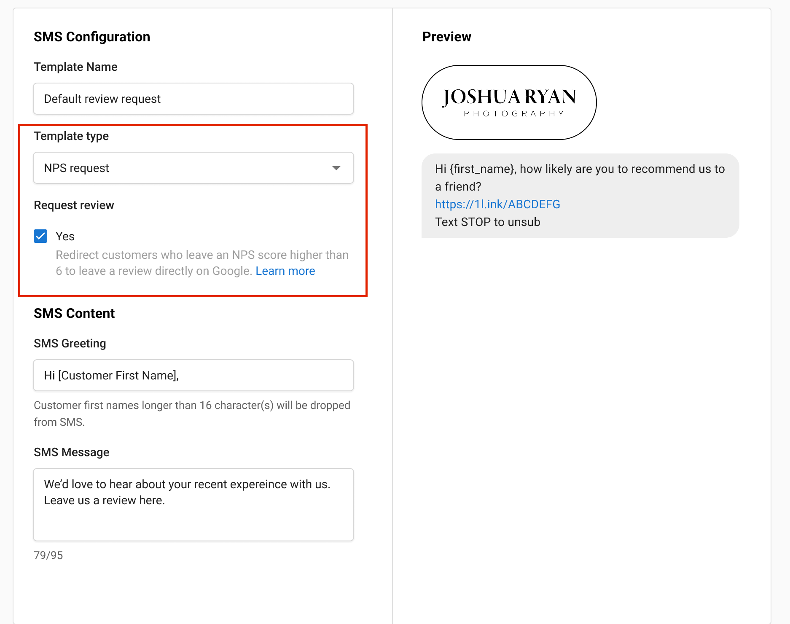

**Review and NPS Request:** 

- You can include both Review and NPS blocks in a single template.
- Both NPS and Review source configurations can be managed within this option, allowing for flexible requests.

## Frequently Asked Questions

Can I include images in my SMS templates?

Standard SMS templates support text only. 

Is there a character limit for SMS templates?

Yes, standard SMS messages are limited to 160 characters.

