Use SMS templates to create and organize the text messages you send for review and NPS requests. Save a template once and reuse it each time you send a request.

## Where to find SMS templates

**Step 1 -** To create an SMS template:

- Navigate to `Templates` in the side menu in Reputation AI Premium and select the `Request` tab.

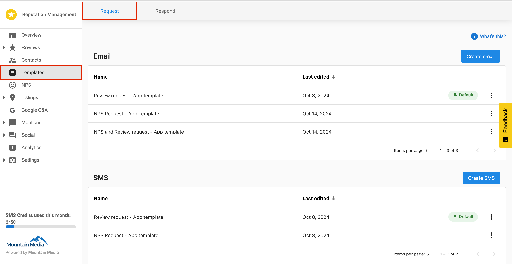

- Under the `Request` tab, you see two sections: `Email` and `SMS`.

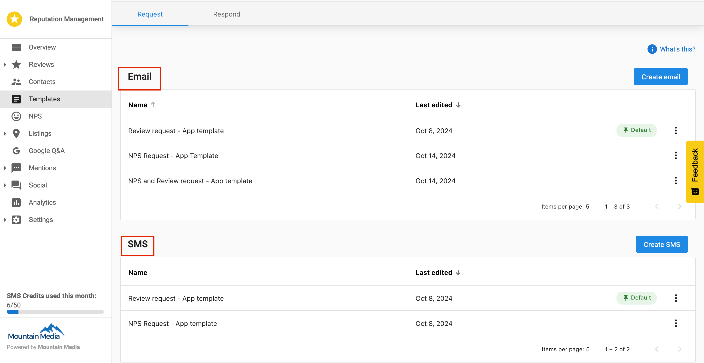

- In the SMS section, click `Create SMS`.

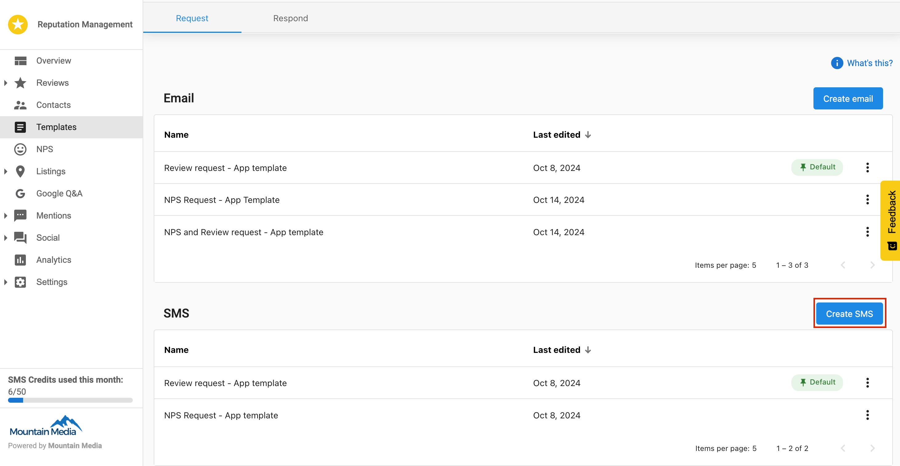

- A pop-up appears asking you to select the type of request for the template.

1. `Reviews`: Use this option to send review requests.
2. `NPS`: Use this option to send NPS (Net Promoter Score) surveys.
3. `Reviews and NPS`: Use this option for templates that will be used for both types of requests.

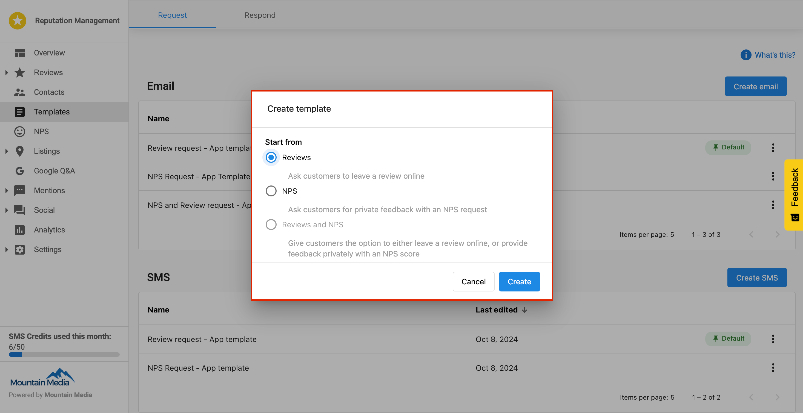

- After you select the request type, the SMS builder opens.

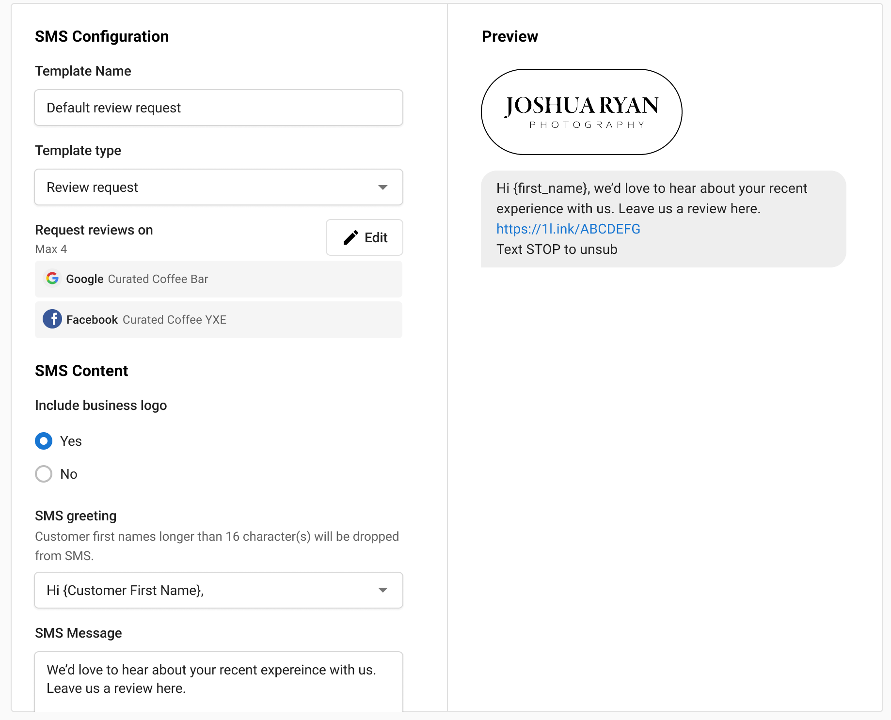

- Once you have made any desired changes, click `Save`. The new template appears under SMS templates in the Templates section.

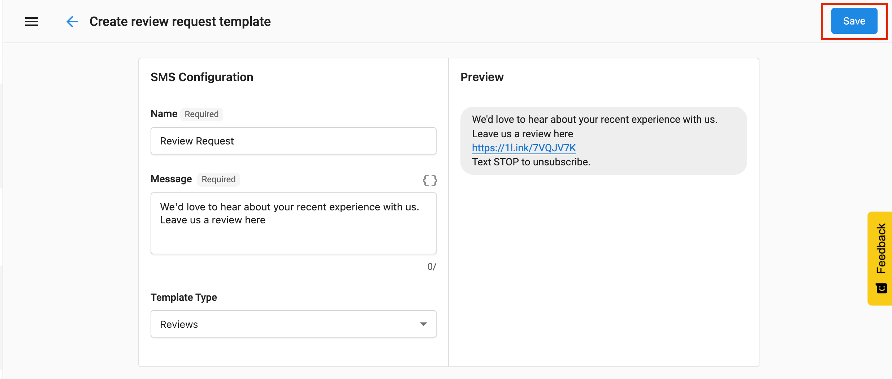

**Step 2 -** To manage SMS Templates:

- Navigate to `Templates` in the side menu in Reputation AI Premium and select the `Request` tab.
- Under the `Request` tab, you see two sections: `Email` and `SMS`.
- In the SMS section, all your SMS templates are listed.

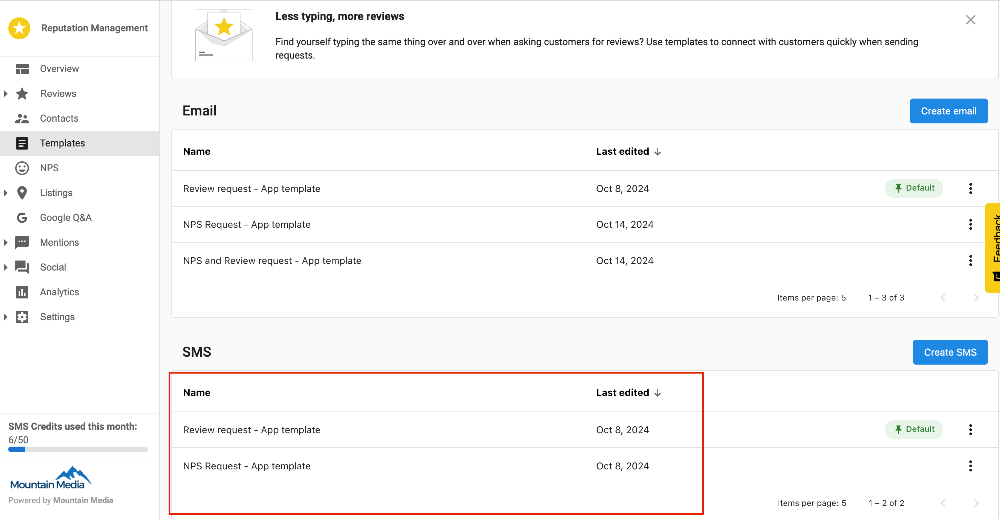

- Each template has a three-dot menu with the following options:  
  - Edit
  - Delete
  - Make default

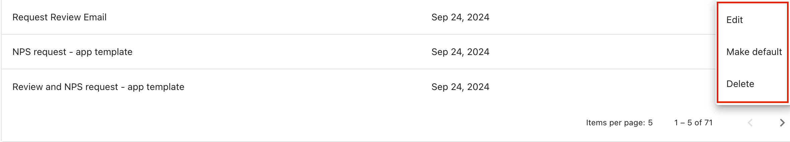

- **Edit:** When you click `Edit`, you are redirected to the SMS builder with the current template's configurations pre-loaded. You can make any necessary changes and then save the updated template.
- **Delete:** When you select `Delete`, a confirmation pop-up appears with two choices: `Delete template` or `Cancel`.
  - **Delete template:** If you click `Delete template`, the template is permanently deleted from the system.
  - **Cancel:** If you click `Cancel`, the pop-up closes and you return to the template listing page without making any changes.

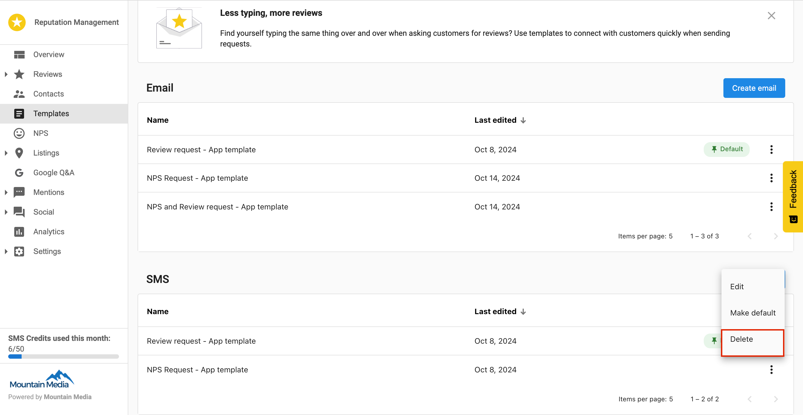

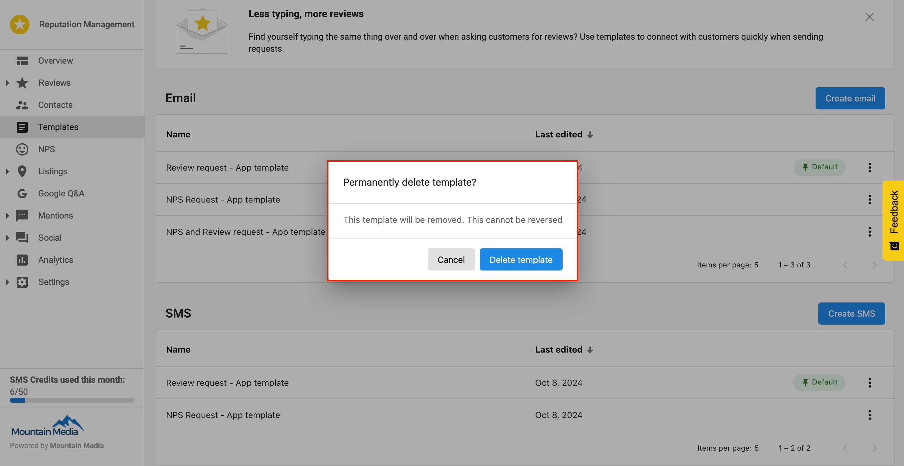

- Make default: If you click `Make default`, that template is set as the default for SMS requests. This default template is automatically used in automation processes and pre-loaded in the Request Review section when sending new review requests via SMS.

## Types of SMS requests

Three types of SMS templates can be created using the SMS builder:

**Review Request:**

- You can choose which review source (e.g. Google, Facebook) you want reviews from when sending a review request to contacts.
- Multiple review source options let you select the specific site for the review request.

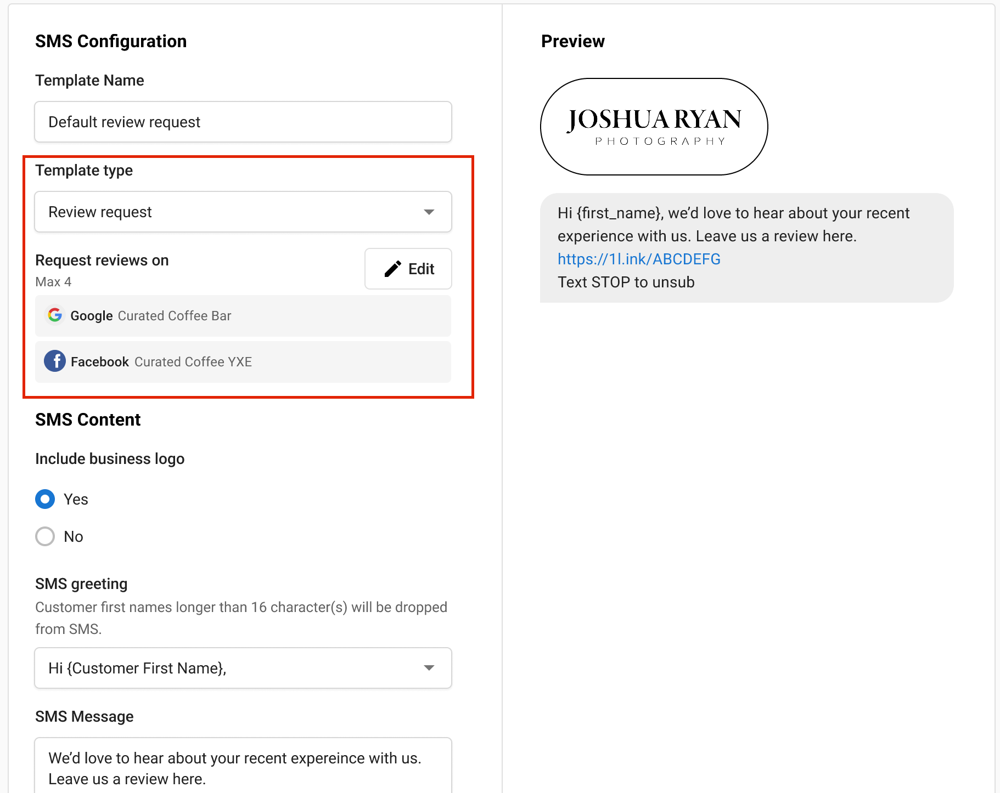

**NPS Request:**

- You can configure NPS settings directly in the builder, with an NPS block appearing in the editor.
- A checkbox is available to configure the redirection after the NPS survey is submitted.

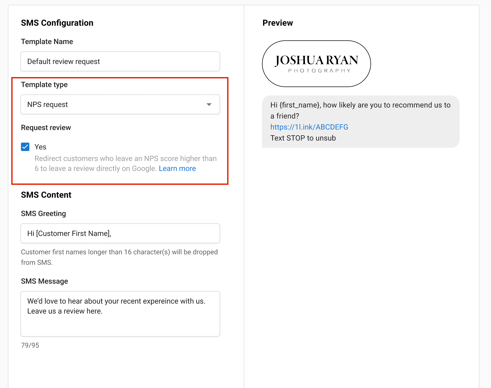

**Reviews and NPS Request:**

- You can include both Review and NPS blocks in a single template.
- Both NPS and Review source configurations can be managed within this option, allowing for flexible requests.

## Frequently asked questions

Can I include images in my SMS templates?

Standard SMS templates support text only.

Is there a character limit for SMS templates?

Yes. The message field in the SMS builder shows a character counter. Keep your message within that limit.

