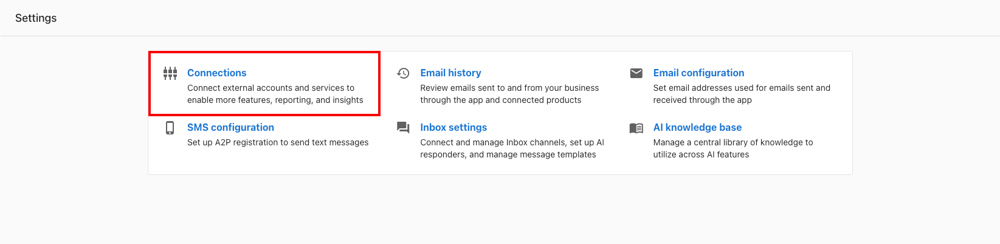

# Connections

You can connect Google Business Profile, Google Search Console, Google Analytics, Facebook, and more to Business App so that your most important business data can all come into one place.

To add connection in Business App, navigate to Settings > Connections.

Connecting your accounts is one of the most important steps you can take to start seeing value in Business App as the connections added will provide the metrics that will prove return on investment. Connections made here will power analytics in the Executive Report and Marketing Funnel. 