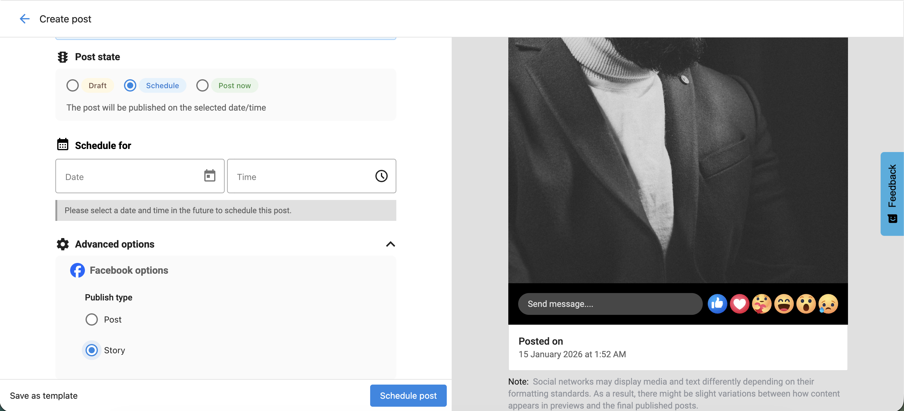

## What is Posts Overview?

The Social Marketing Composer helps you create, schedule, and manage social media content across multiple platforms in one place. Whether posting a single update or running a campaign, you can customize each post for every network.

## Why is Posts Overview important?

* Publish to multiple social accounts at once
* Customize content per platform
* Schedule or save drafts
* Ensure posts meet platform-specific limits
* Use grammar and AI tools to improve quality

## What's included

- **[AI Post Creation](ai-post-creation.mdx)**: Use AI tools to generate engaging post content
- **[Posting Content](posting-content-to-social-marketing.mdx)**: Step-by-step guide to publishing content
- **[Using Images](images-in-social-marketing.mdx)**: Best practices for image content and optimization
- **[Image and Video Requirements](image-and-video-requirements-and-optimization.mdx)**: Technical specifications and platform requirements
- **[Posting Videos](post-videos-to-social-marketing.mdx)**: Complete guide to video content posting
- **[Share Reviews as Posts](share-reviews-as-social-post-images.mdx)**: Convert customer reviews into social media content
- **[Long-Form Blog Content](create-and-publish-long-form-blog-content.mdx)**: Publish blog content through Social Marketing
- **[Manage Posts](manage-posts-in-business-app-social.mdx)**: Edit, delete, and organize your scheduled and published posts

## How to Compose a Post

1. Go to `Social Marketing`.
2. Click `Compose` or `Create`.
3. **Choose Social Accounts** under the `Post to` section.
   - You can select multiple social accounts across platforms.
   - Only **one X (Twitter)** account can be selected per post due to X's publishing rules.
   - Posts cannot be scheduled or published to **expired accounts**.
4. **Write Content** under the `Content` field:
   - Use `Write with AI` to generate post text.
   - Shorten links to track performance or fit character limits on X (Twitter).
   - Add emojis, hashtags, or tagged accounts.
   - Insert content from RSS feeds or curated sources.
   - Save posts as templates for future use, or apply existing templates.
   - Use `Customize by Account` to adjust text for different platforms.
5. **Add Media**
   - Upload your own images or videos.
   - Use `Stock Imagery` or `Generate Image with AI`.
   - Instagram requires an image; TikTok requires a video.
6. **Schedule or Publish**
   - Choose `Post Now`, `Schedule`, or `Save as Draft`.

## Platform-Specific Options

### Instagram
- Choose between `Post` or `Story`.

### Facebook

* A new `Advanced Options` section lets you select `Post` or `Story` as the publish type.
* The preview updates based on your selection in real time.

### TikTok
- **Paid Partnership Content** – Enable if promoting a third-party business.
- **Organic Content** – Enable if promoting your own business.
- **Allow Comments**, **Duet**, or **Stitch** – Choose how others can interact with your video.

### Google Business Profile
- Add a **Call to Action (CTA)**:
  - `Book` – Invite users to book an appointment.
  - `Order` – Link to an ordering page.
  - `Shop` – Encourage browsing a catalog.
  - `Learn More` – Provide more details on a linked page.
  - `Sign Up` – Prompt users to register or join.
  - `Call` – Add a clickable phone number.
- Add a **Start Date** and **End Date** to make it an event.

:::warning
Google Business Profile posts must include a CTA. If no CTA is added, the post will fail to publish.
:::

## Facebook Story Media Requirements

**Image**

* Max Size: 10 MB
* Formats: JPEG, BMP, PNG, GIF, TIFF
* Quantity: 1

**Video**

* Format: MP4 (recommended)
* Quantity: 1
* Duration: 3–90 seconds (max 60 seconds if published as Story)
* Aspect Ratio: 9:16
* Frame Rate: 24–60 fps
* Resolution: 1080 × 1920 (recommended), 540 × 960 (minimum)

## Facebook Reel Media Requirements

**Video**

* Max Size: 1 GB
* Formats: MP4 (recommended), QuickTime
* Quantity: 1
* Duration: Up to 1 hour (90 seconds recommended)
* Aspect Ratio: 9:16 to 16:9

## Grammar and Spell Check Tools

The Composer supports grammar and spell-check extensions such as:

- Grammarly
- Microsoft Editor
- Quillbot

These tools help ensure your posts are accurate and professional.

## Character Limits by Platform

| Platform | Character Limit |
|-----------|-----------------|
| Facebook | 63,206 |
| X (Twitter) | 280 (Standard) / 25,000 (Premium) |
| LinkedIn | 3,000 |
| Instagram | 2,200 |
| TikTok | 2,200 |
| Google Business Profile | 1,500 |

:::warning
HTML is not supported in the Composer.
:::

## Customize by Account

Each social network has different requirements. Use `Customize by Account` to:

- Adapt content automatically to match platform limits
- Avoid errors with image size or video length
- Tailor tone, hashtags, and visuals for each network

## Editing Drafts and Scheduled Posts

1. Go to `Social Marketing` → `Posts` → `Drafts` or `Scheduled`.
2. Click `Edit` to make changes to text, media, or posting date.
3. Use `Customize by Account` to update specific platform versions.

:::info
If a social account disconnects, scheduled posts are automatically saved as drafts.
Reconnect the account, go to `Posts` → `Drafts`, click `Edit`, and select `Schedule Post`.
:::

## Hashtags and Tagging

### Hashtags
- Type `#` in the Composer to view recent hashtags.
- Start typing to see autocomplete suggestions or add new ones manually.
- Frequently used hashtags are remembered for next time.

### Tagging
- Tag other accounts on **Facebook (Business Pages)** and **X (Twitter)** by typing `@` followed by the account name.
- Use tagging strategically to increase visibility and engagement.

## Link Previews

When you add a URL:

- **Facebook, LinkedIn, and X (Twitter)** support link previews with image and title.
- **LinkedIn** allows preview image selection.
- **Instagram** and **Google Business Profile** do not support link previews.
- Google Business Profile allows CTAs (e.g., `Learn More`, `Book`, or `Order`) that include clickable links.

## Bulk Posting Limits

| User Type | Max Scheduled Posts |
|------------|---------------------|
| Standard | 20 |
| Pro | Unlimited |

## Platform Posting Limits

Facebook and Instagram allow **up to 25 API-published posts per 24 hours** per account.
Exceeding this limit may trigger spam detection, reduce reach, or result in account restrictions.

## Frequently Asked Questions (FAQs)

How far in advance can I schedule posts?

You can schedule posts as far ahead as December 31, 9999.

Which platforms support link previews?

Facebook, LinkedIn, and X (Twitter). Instagram and Google Business Profile do not.

What happens if a social account disconnects?

Scheduled posts convert to drafts until the account is reconnected.

Can I customize content per network?

Yes. Use `Customize by Account` to edit per platform.

Why use grammar tools?

They help ensure accurate and professional content.

Can I tag other businesses?

Yes. Use `@` for Facebook Business Pages or X (Twitter) profiles.

Do hashtags improve reach?

Yes. Hashtags help increase post visibility and engagement.

Can I include CTAs in Google posts?

Yes. A CTA is required for Google posts to publish.

How do I publish Facebook Stories and Reels?

Use `Create → Post Workflow`, select Facebook, open `Advanced Options`, and choose `Story` or `Post`. If you upload a video with `Post`, it becomes a Reel. You can also use `Create → Story Workflow` or `Create → Short Video Workflow`.

