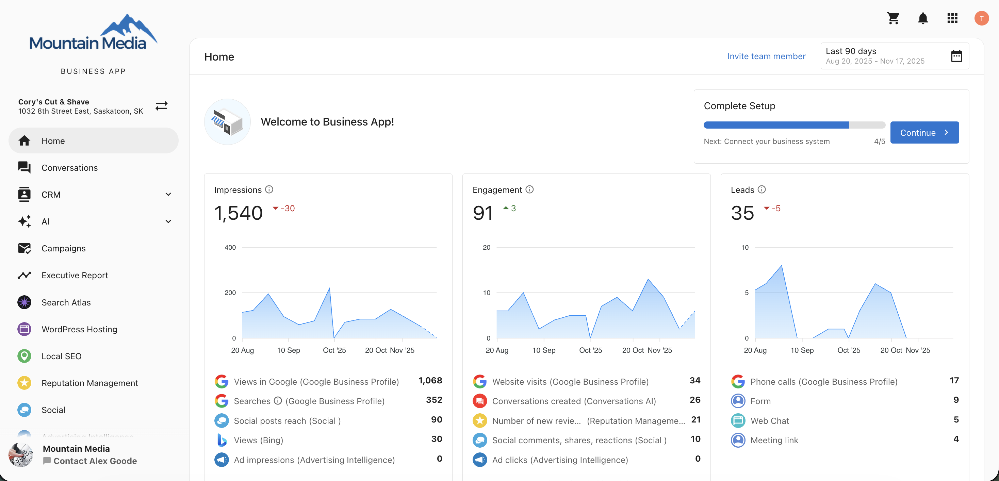
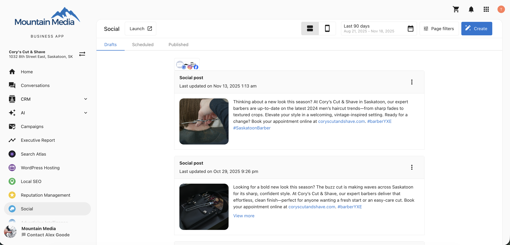
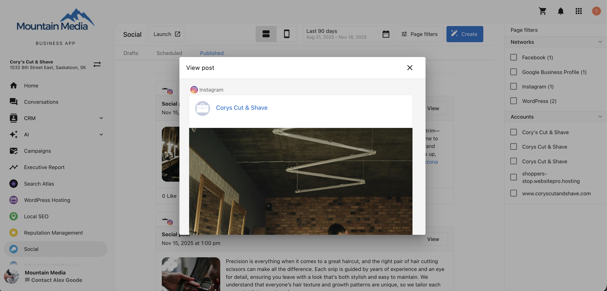
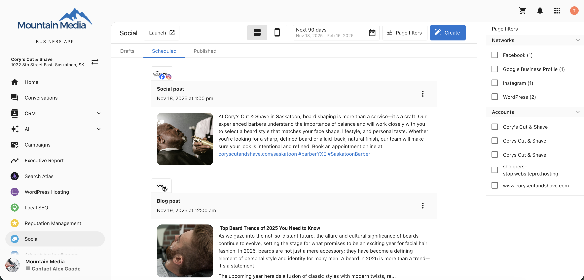
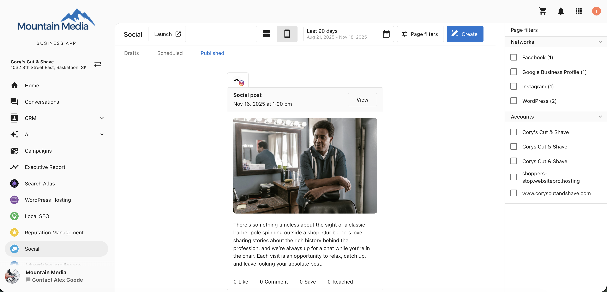

## What is Manage Posts in Business App Social?

The **Manage Posts** feature allows you to view and manage all your social and blog posts including drafts, scheduled, and published content directly within the Business App.  
This provides a centralized location to review in-progress posts, monitor upcoming scheduled content, and track performance on published posts without navigating to the Social Marketing product.

## Why is Manage Posts important?

This simplifies content management by allowing you to:

- Access all social and blog post statuses in one place  
- Quickly review and filter posts by account or network  
- View performance metrics on published posts  
- Save time by reducing the need to switch between products  

With this integrated view, you can make faster, data-informed decisions about your content strategy.

## What’s Included with Manage Posts?

- Tabs for **Drafts**, **Scheduled**, and **Published** posts  
- Post-level engagement and performance data  
- Filtering by network, account, or date range  
- Web and mobile view previews  
- Access to create new posts in Social Marketing  
- Deletion options for posts across all statuses  

## How to Use Manage Posts

### Step 1: Open the Business App

1. Sign in to your Business App.  
2. From the left-hand navigation menu, go to `Social`.

### Step 2: Navigate Between Tabs

You will find three main tabs:  

- **Drafts** – Lists posts currently being created or awaiting approval.  
- **Scheduled** – Displays posts planned for future publication.  
- **Published** – Shows posts that have already been published to your social or blog accounts.

### Step 3: Review and Manage Posts

Within each tab, you can:

- View post content, status, and associated networks  
- Access engagement metrics (likes, shares, comments, reach, etc.) for published posts  
- Click `View` to see how the post appears on its respective social network  

### Step 4: Apply Filters

Use the available filters to refine your post list:  

- **Social Networks** – Filter by platform such as Facebook, Instagram, or LinkedIn.  
- **Connected Accounts** – Focus on posts for specific accounts.  
- **Date Range** –  
  - Drafts and Published: Filter by past date ranges.  
  - Scheduled: Filter by future publication dates.

### Step 5: Preview Posts

You can preview each post in:  

- **Web View** – See how your post appears on desktop devices.  
- **Mobile View** – Review how it appears on mobile screens.

### Step 6: Create a New Post

To create a new post:  

1. Click `Create` in the `Social` section.  
2. You will be redirected to the **Social Marketing** product.  
3. From there, you can compose a new social or blog post, add media, and schedule publication.

## Points to Remember

:::info
You can **delete** draft, scheduled, and published posts directly from the Business App.
:::

:::warning
- You **cannot edit** draft or scheduled posts within the Business App.  
  To make edits, open the post in the **Social Marketing** product.  
- Published **Instagram** posts cannot be deleted from the Business App or Social Marketing.  
  To remove an Instagram post, use the native Instagram app.
:::

## Frequently Asked Questions (FAQs)

Can I edit posts from the Business App?

No. Posts can only be deleted within the Business App. To edit content, open the post in the Social Marketing product.

Can I see engagement metrics for my posts?

Yes. Published posts include performance metrics such as reach, likes, comments, and shares.

Can I create new posts in the Business App?

Yes. Clicking `Create` redirects you to the Social Marketing product to compose a new post.

Can I delete Instagram posts?

No. Instagram posts must be deleted using the native Instagram app.

What filters are available?

You can filter posts by social network, connected account, or date range.

Can I preview posts before publishing?

Yes. You can view posts in both web and mobile preview modes.

What’s the difference between Drafts, Scheduled, and Published tabs?

- **Drafts:** Posts still in progress.  
- **Scheduled:** Posts planned for future dates.  
- **Published:** Posts already live on social or blog accounts.

Can I manage blog posts through this feature?

Yes. The Manage Posts view includes both social and blog posts.

Does deleting a post in the Business App remove it from all platforms?

Yes. Deleted posts are removed from all connected networks, except published Instagram posts.

