## What is Manage Posts in Business App Social?

The **Manage Posts** feature allows you to view and manage all your social and blog posts including drafts, scheduled, and published content directly within the Business App.  
This provides a centralized location to review and edit in-progress posts, monitor and reschedule upcoming scheduled content, and track performance on published posts without navigating to the Social AI product.

## Why is Manage Posts important?

This simplifies content management by allowing you to:

- Access all social and blog post statuses in one place  
- Quickly review and filter posts by account or network  
- View performance metrics on published posts  
- Save time by reducing the need to switch between products  

With this integrated view, you can make faster, data-informed decisions about your content strategy.

## What’s included with Manage Posts?

- Tabs for **Drafts**, **Scheduled**, and **Published** posts  
- Editing of draft and scheduled posts, including text and media, directly in Business App  
- AI-assisted content and image editing while you edit a post  
- Rescheduling of draft and scheduled posts by changing the date and time  
- Post-level engagement and performance data  
- Filtering by network, account, or date range  
- Web and mobile view previews  
- Draft post scheduling directly from the `Drafts` tab  
- Access to create new posts in Social AI  
- Deletion options for posts across all statuses  

## How to use Manage Posts

### Step 1: Open the Business App

1. Sign in to your Business App.  
2. From the left-hand navigation menu, go to `Social`.

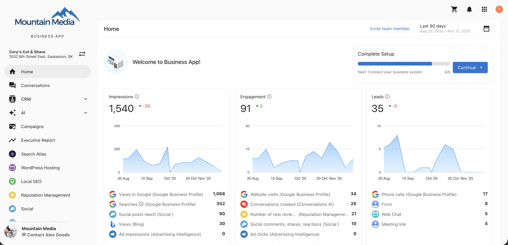

### Step 2: Navigate between tabs

You will find three main tabs:  

- **Drafts** – Lists posts currently being created or awaiting approval.  
- **Scheduled** – Displays posts planned for future publication.  
- **Published** – Shows posts that have already been published to your social or blog accounts.

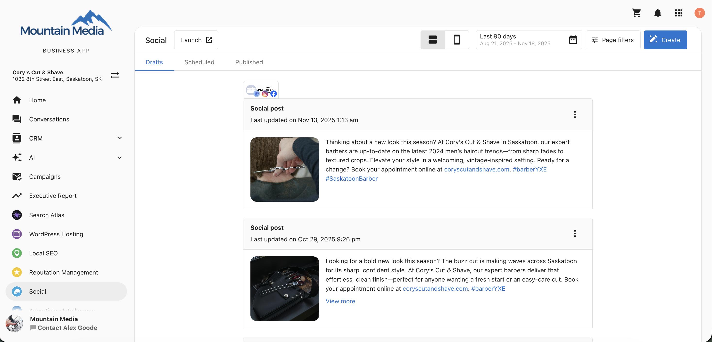

### Step 3: Review and manage posts

Within each tab, you can:

- View post content, status, and associated networks  
- Click `Schedule` on draft post cards in the `Drafts` tab  
- Schedule draft posts for single-location and multi-location social accounts  
- See a confirmation message after a post is scheduled  
- Access engagement metrics (likes, shares, comments, reach, etc.) for published posts  
- Click `View` to see how the post appears on its respective social network  

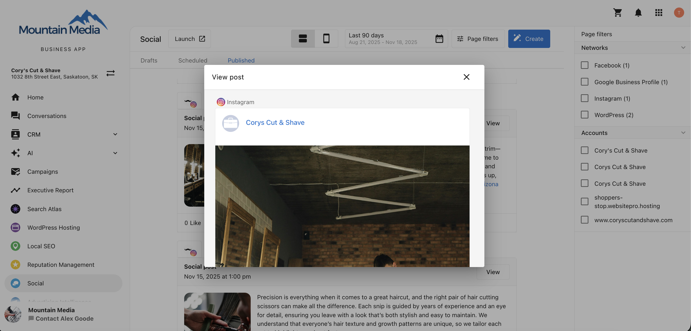

:::warning
- The `Schedule` button is only available for posts in the `Drafts` tab.
- If the selected date and time are earlier than the current time, `Schedule` is disabled and shows: `Please select a future date and time to schedule this post`.
- If the scheduled time is earlier than the current time and no social account is connected, `Schedule` is disabled and shows: `Please ensure the scheduled time is in the future and at least one social account is connected`.
:::

### Step 4: Edit a draft or scheduled post

You can edit **draft** and **scheduled** social and blog posts, including their text and media. Published posts cannot be edited.

1. Open the **Drafts** or **Scheduled** tab, select the **three-dot menu** on the post card, and click `Edit`. The social or blog post card opens.  
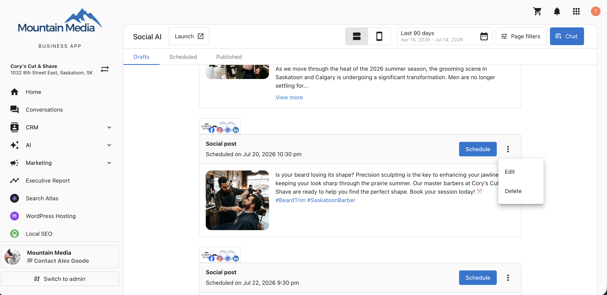

2. **Edit text with AI:** Click into a text box, such as the social post content, blog title, or blog body, to open the **AI Assist** panel, where you can rewrite content, fix spelling and grammar, improve your writing, shorten or lengthen text, and change the tone.
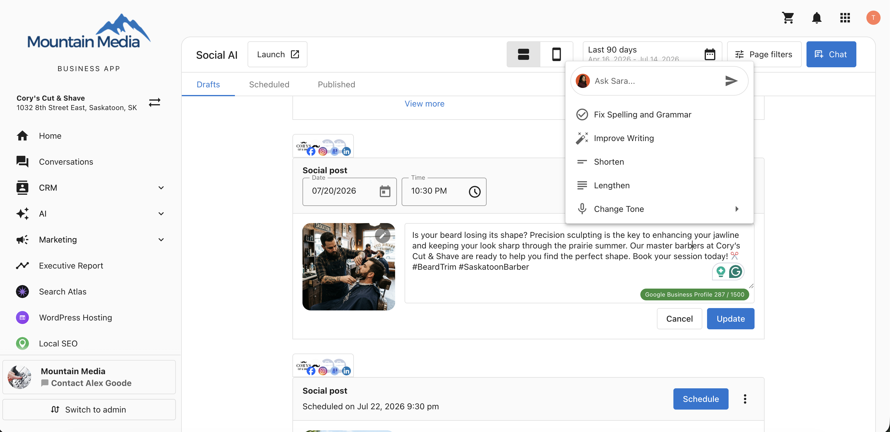
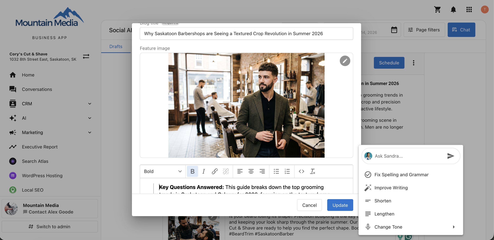

3. **Edit media with AI:** Click the **pen icon** on a piece of media to open the **AI Image Assist** panel, where you can edit an image with AI, upload one from your device, or delete media you no longer want.  
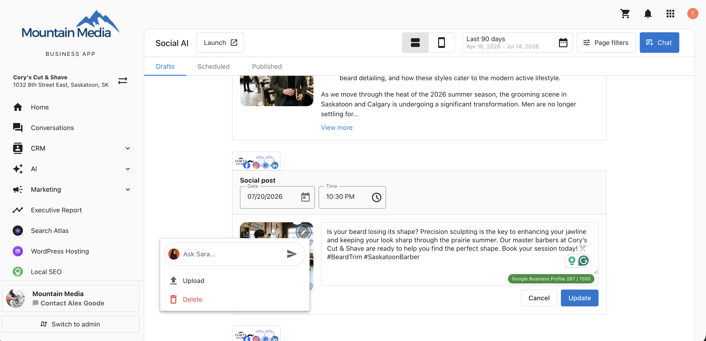
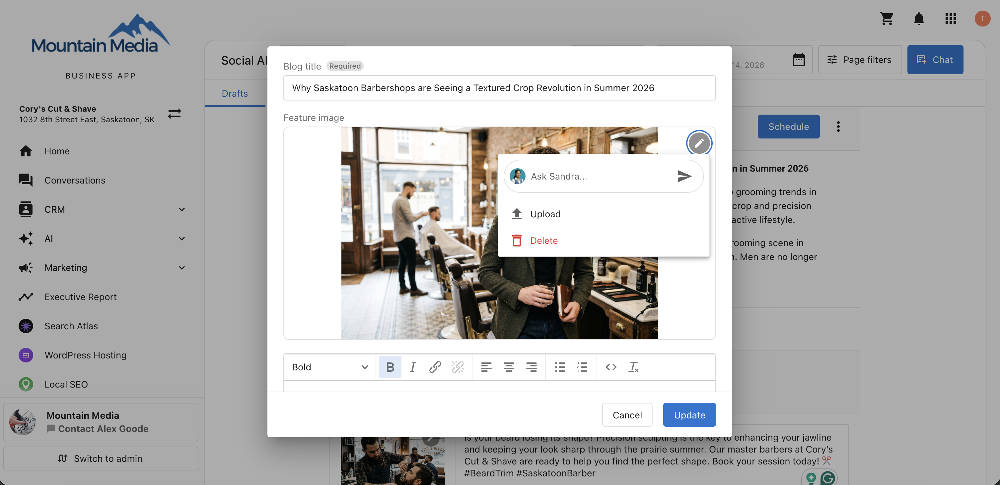

4. **Add more media:** Click the **arrow** to the right of an image to open the **Add Media** screen, where you can generate a new image with AI or upload one from your device.  
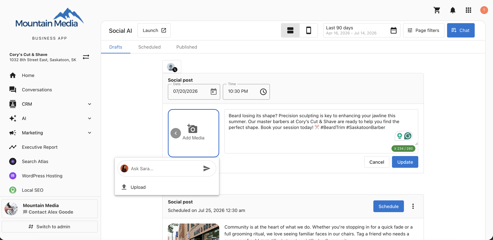
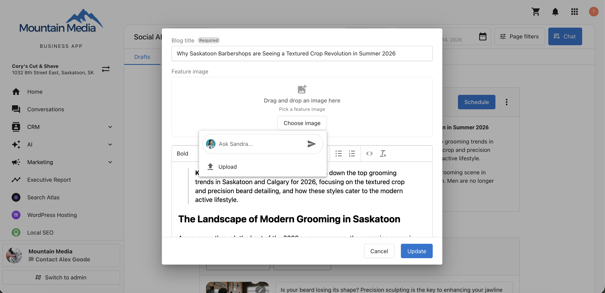

5. **Reschedule:** Change the date and time on the post to reschedule when it publishes.  
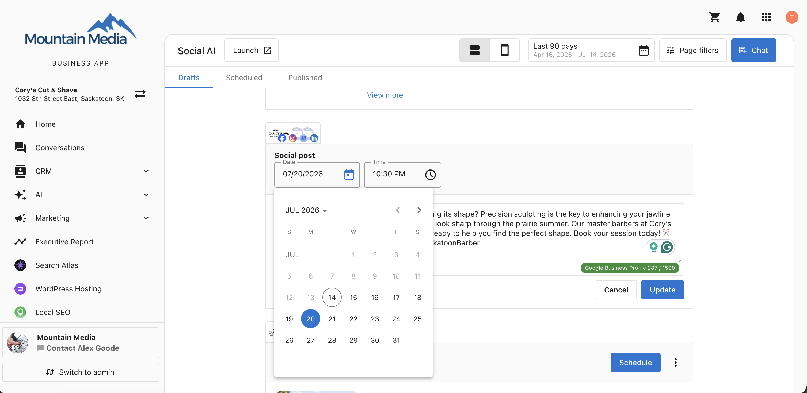

6. **Schedule:** When you are happy with the content and media, click `Schedule` on a draft to publish it at the selected date and time.

   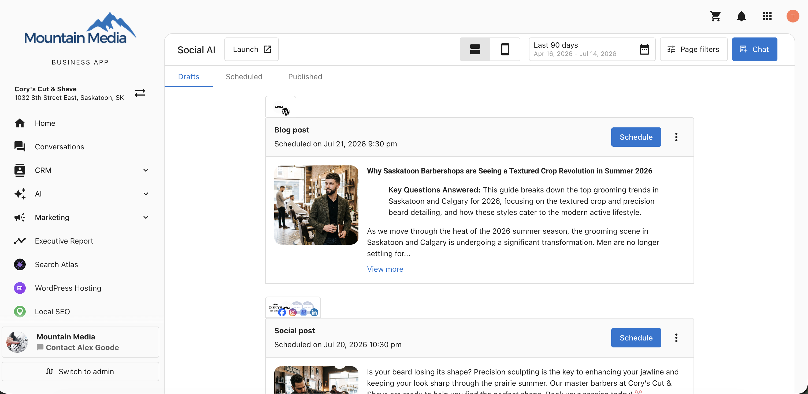

### Step 5: Apply filters

Use the available filters to refine your post list:  

- **Social Networks** – Filter by platform such as Facebook, Instagram, or LinkedIn.  
- **Connected Accounts** – Focus on posts for specific accounts.  
- **Date Range** –  
  - Drafts and Published: Filter by past date ranges.  
  - Scheduled: Filter by future publication dates.

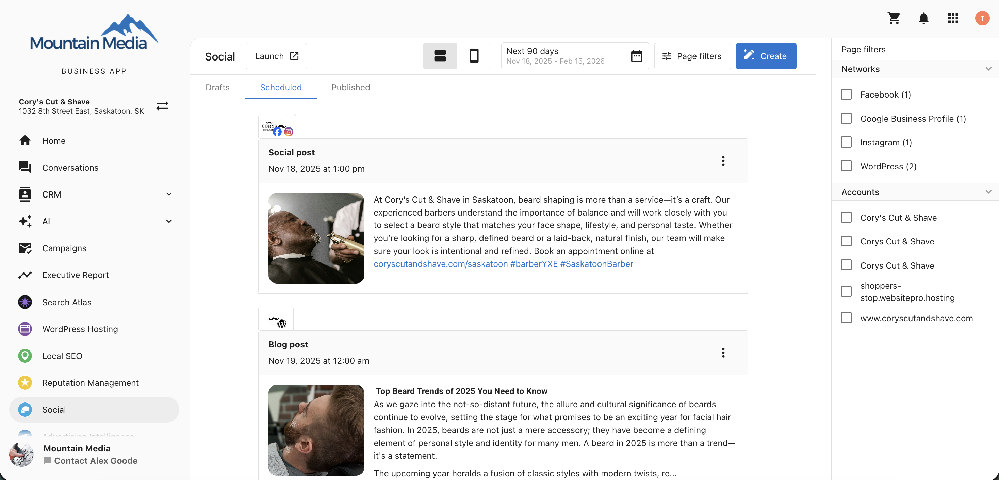

### Step 6: Preview posts

You can preview each post in:  

- **Web View** – See how your post appears on desktop devices.  
- **Mobile View** – Review how it appears on mobile screens.

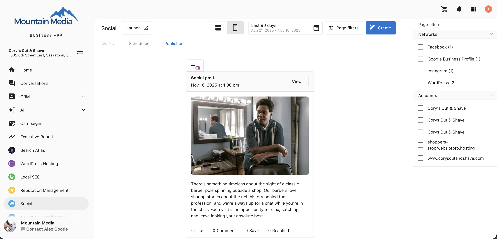

### Step 7: Create a new post

To create a new post:  

1. Click `Create` in the `Social` section.  
2. You will be redirected to the **Social AI** product.  
3. From there, you can compose a new social or blog post, add media, and schedule publication.

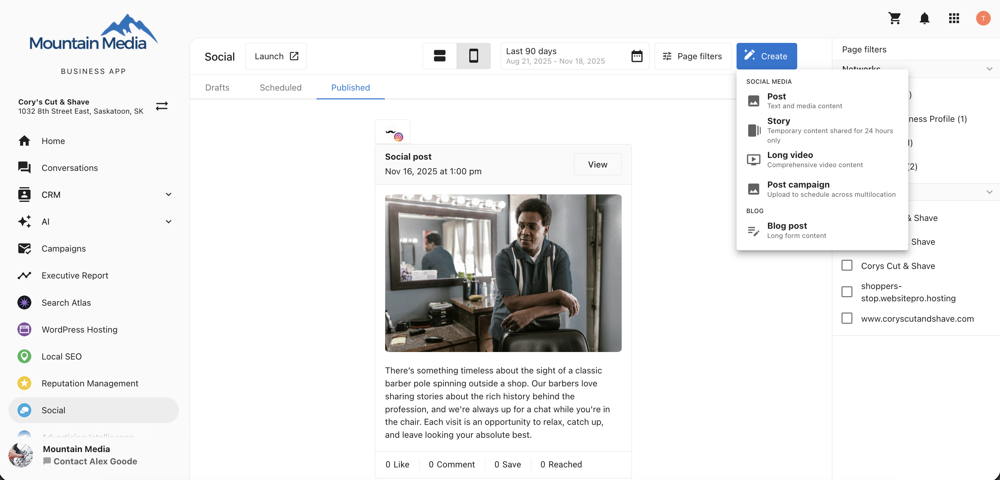

## Points to remember

:::info
You can **delete** draft, scheduled, and published posts directly from the Business App.
:::

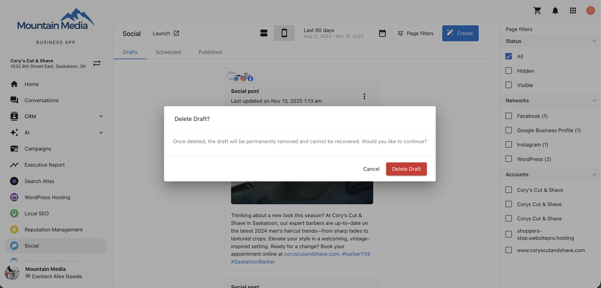

:::warning
- Only **draft** and **scheduled** posts can be edited. Published posts cannot be edited.  
- **Videos** cannot be edited with AI, but you can upload them.  
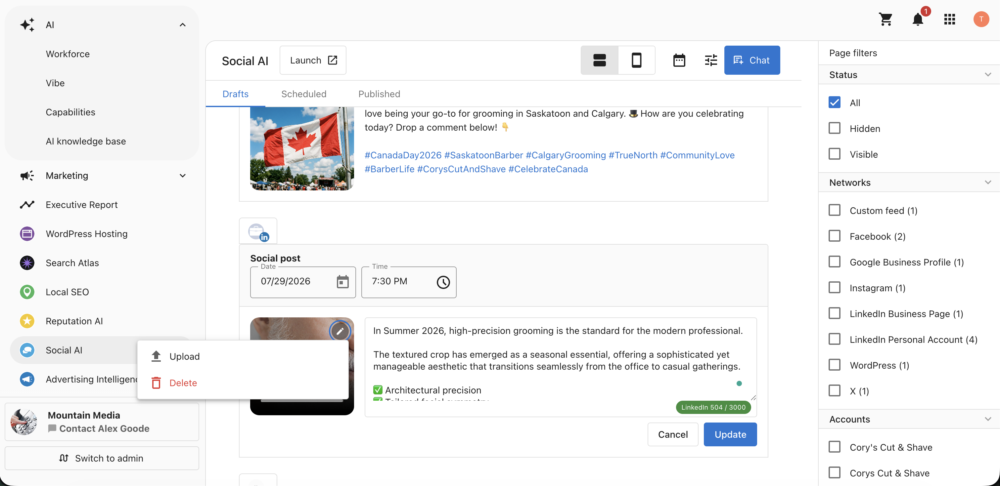
- **Content and media validations** apply across all social and blog networks. If you upload media that does not meet a network's requirements, an error is shown.  
- Published **Instagram** posts cannot be deleted from the Business App or Social AI.  
  To remove an Instagram post, use the native Instagram app.
:::

:::note
The AI editing tools available to you depend on your plan:

- **Premium**: full AI Assist and AI Image tools, including advanced content and image generation and editing.  
- **Pro**: standard AI Assist and AI Image tools. Upgrade to Premium for more advanced content and image generation and editing.  
- **Standard**: AI editing tools are not available; you can upload and delete media only.
:::

## Frequently Asked Questions (FAQs)

Can I edit posts from the Business App?

Yes. You can edit **draft** and **scheduled** social and blog posts, including their text and media, directly in the Business App. Open the post's three-dot menu and click `Edit`. Published posts cannot be edited.

Can I use AI to edit my posts?

Yes. When you edit a draft or scheduled post, the **AI Assist** panel can rewrite, shorten, lengthen, or change the tone of your text and fix spelling and grammar. The **AI Image Assist** panel can edit images with AI. The AI tools available depend on your plan.

Can I edit videos in my posts?

Videos cannot be edited with AI, but you can upload a video when editing a draft or scheduled post.

Can I reschedule a post?

Yes. When editing a draft or scheduled post, change the date and time to reschedule when it publishes.

Can I schedule draft posts from the Business App?

Yes. Go to `Social` > `Drafts` and click `Schedule` on the draft post card.

Can I see engagement metrics for my posts?

Yes. Published posts include performance metrics such as reach, likes, comments, and shares.

Can I create new posts in the Business App?

Yes. Clicking `Create` redirects you to the Social AI product to compose a new post.

Can I delete Instagram posts?

No. Instagram posts must be deleted using the native Instagram app.

What filters are available?

You can filter posts by social network, connected account, or date range.

Can I preview posts before publishing?

Yes. You can view posts in both web and mobile preview modes.

What’s the difference between Drafts, Scheduled, and Published tabs?

- **Drafts:** Posts still in progress.  
- **Scheduled:** Posts planned for future dates.  
- **Published:** Posts already live on social or blog accounts.

Can I manage blog posts through this feature?

Yes. The Manage Posts view includes both social and blog posts.

Does deleting a post in the Business App remove it from all platforms?

Yes. Deleted posts are removed from all connected networks, except published Instagram posts.

