## What are Notifications?

Notifications in the Business App let you control how you are alerted about activity on your social and blog posts. You can choose to receive **in-app notifications**, **email notifications**, or both.

Notifications keep you informed whenever a social or blog post is automatically saved as a draft or scheduled. You manage all of these preferences from one place in the Business App.

## Why are Notifications important?

- **Stay informed** — Know as soon as a new social or blog post is drafted or scheduled, without checking manually.
- **Choose your channel** — Receive alerts in-app, by email, or both, based on how you prefer to work.
- **Reduce noise** — Limit alerts to only your own events, or turn notifications off entirely.
- **Manage everything in one place** — Set your preferences directly in the Business App.

## What's included with Notifications?

- **In-app notifications** — Alerts that appear under the bell icon in the Business App.
- **Email notifications** — Emails for **New Calendar – Drafted Posts** and **New Calendar – Scheduled Posts**.
- **Event toggles** — Enable or disable notifications for **New Calendar Draft Post** and **New Calendar Scheduled Post**.
- **Event scope** — Choose to be notified about all events or only your own events.
- **Recent Activity** — A running list of drafted and scheduled posts on your Business App home page.
- **Administration controls** — Turn the related email notifications on or off from your notification settings.

## How to set up your notifications

### Step 1: Open the Business App

Sign in to your Business App.

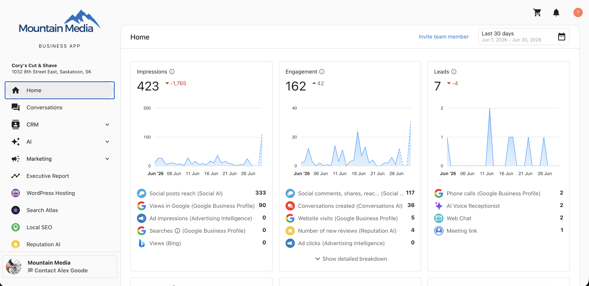

### Step 2: Open your notifications

Click the **bell icon** in the top-right corner to open the notifications screen.

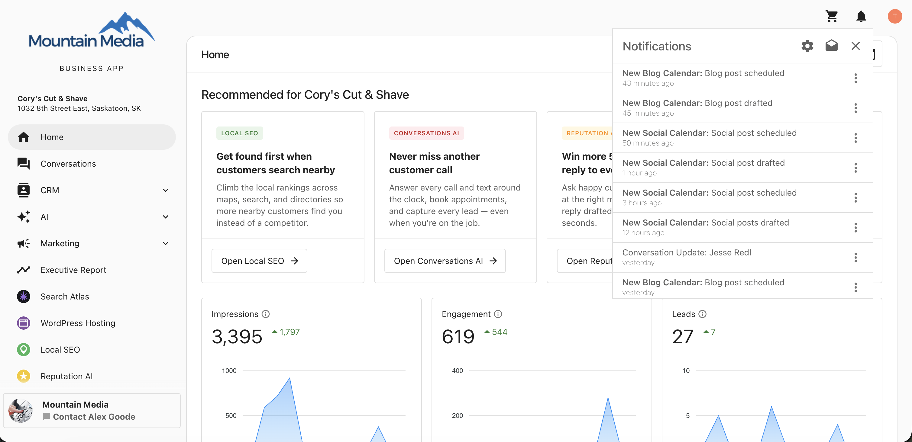

### Step 3: Open notification settings

In the notifications screen, click the **settings icon** to open the notification settings pop-up.

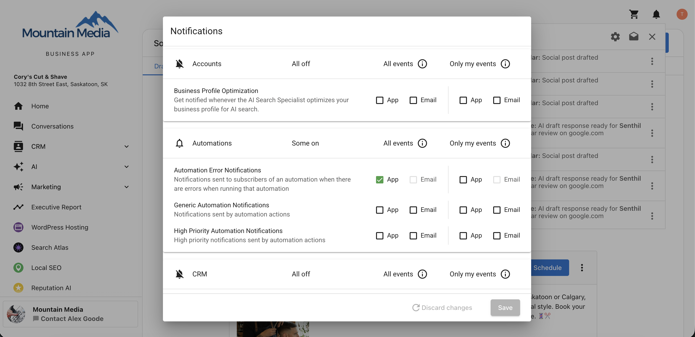

### Step 4: Go to Social Notifications

Select **Social Notifications**.

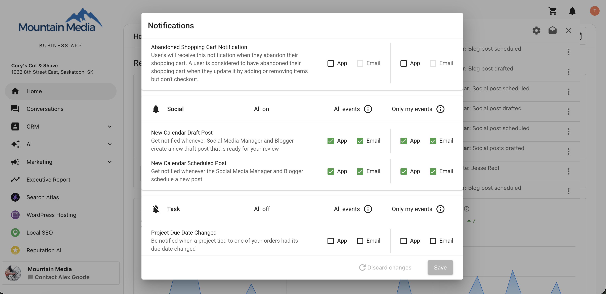

### Step 5: Enable or disable post notifications

Click the **bell icon** next to **Social** to enable or disable all notifications related to **New Calendar Draft Post** and **New Calendar Scheduled Post**.

### Step 6: Choose your preferences

Choose your preferred notification options:

- **In-app notifications** — Show alerts under the bell icon.
- **Email notifications** — Send alerts to your email.
- **All events** — Get notified about every draft and scheduled post.
- **Only your own events** — Get notified only about posts related to you.

Once your settings are configured, notifications are triggered automatically whenever a post is saved as a draft or scheduled.

## Email notifications

When email notifications are turned on, you receive an email for the following events:

- **New Calendar – Drafted Posts**
- **New Calendar – Scheduled Posts**

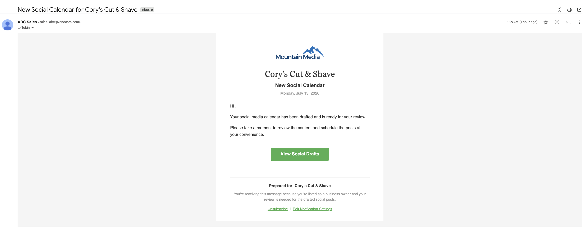

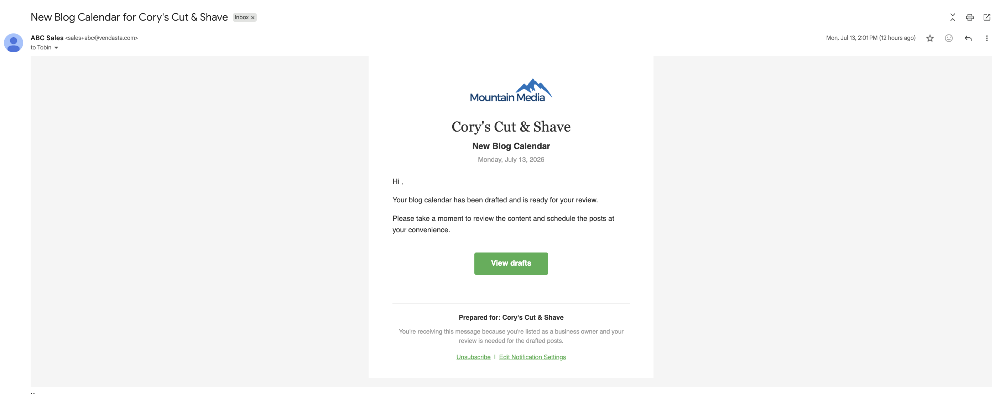
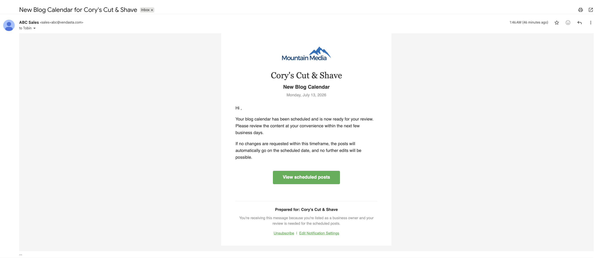

From these emails, you can:

- Click **View Drafts** or **View Scheduled Posts** to open the **Drafts** and **Scheduled** section in the Business App.
- Click **Unsubscribe** to stop receiving emails about drafted and scheduled social posts.
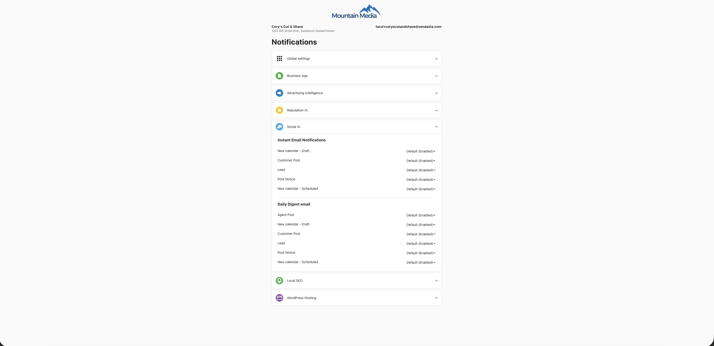
- Click **Edit Notification Settings** to open your notification settings and adjust your preferences.
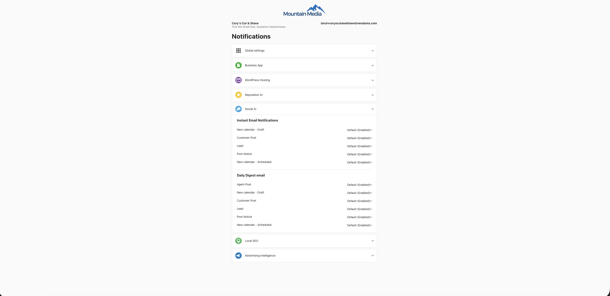

## In-app notifications

When in-app notifications are turned on, alerts appear under the bell icon, including:

- **New Social Calendar: Social Post Drafted**
- **New Social Calendar: Social Post Scheduled**
- **New Blog Calendar: Blog Post Drafted**
- **New Blog Calendar: Blog Post Scheduled**

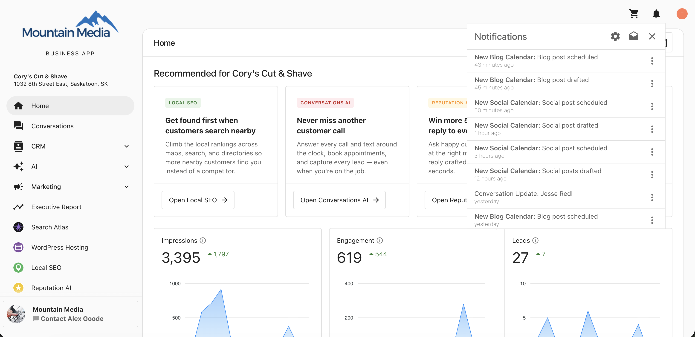

Clicking any of these notifications takes you to **Social** → **Drafts** and **Scheduled** in the Business App.

## Recent Activity

Whenever a post is saved as a draft or scheduled, it also appears under **Home** → **Recent Activity** in the Business App.

- Click **View All Activity** to see the full list of drafted and scheduled posts.
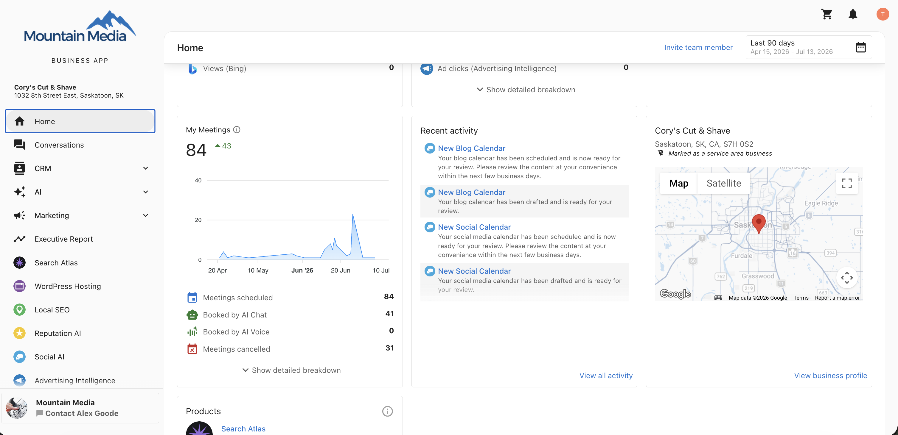
- Click **View** on any item to open the **Social** → **Drafts** and **Scheduled** section.
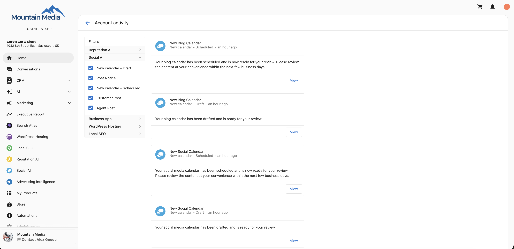
- Filter Recent Activity using the Social AI filters: **New Calendar – Draft** and **New Calendar – Scheduled**.

## Manage email notifications in Administration

You can also enable or disable the related email notifications from your Administration settings:

**Administration** → **Notification Settings** → **Social AI** → **Instant Email Notifications** → **New calendar - Draft** and **New calendar - Scheduled**.
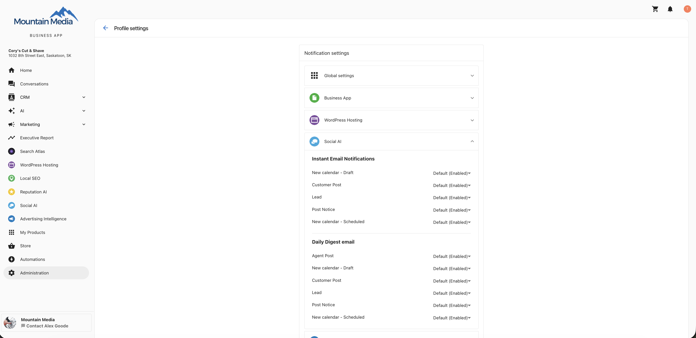

For a full overview of how notifications work across every product, see [Notification settings](../../business-app/administration/notification_settings.mdx).

## Frequently Asked Questions (FAQs)

What triggers a notification?

A notification is triggered whenever a social or blog post is saved as a draft or scheduled.

Where do I manage notifications?

Click the **bell icon** in the top-right corner of the Business App, open the settings, and go to **Social Notifications**.

Can I get emails instead of in-app notifications?

Yes. In your Social Notifications settings, you can choose in-app notifications, email notifications, or both.

What is the difference between "all events" and "only your own events"?

**All events** notifies you every time a post is drafted or scheduled. **Only your own events** limits notifications to posts related to you.

How do I turn off notifications?

Click the **bell icon** next to **Social** in your Social Notifications settings to disable them, or turn off the related email notifications in **Administration → Notification Settings → Social AI**.

Where do notifications take me when I click them?

Both in-app notifications and email links open the **Social** → **Drafts** and **Scheduled** section in the Business App.

Which email notifications are available?

**New Calendar – Drafted Posts** and **New Calendar – Scheduled Posts**.

Can I unsubscribe from the emails?

Yes. Click **Unsubscribe** in the email, or disable the notifications in **Administration → Notification Settings → Social AI**.

Where can I see a history of drafted and scheduled posts?

Go to **Home** → **Recent Activity** in the Business App, then click **View All Activity** to see the full list.

Can I filter Recent Activity for these posts?

Yes. Use the Social AI filters **New Calendar – Draft** and **New Calendar – Scheduled**.

Do these settings affect published post notifications?

No. These settings apply only to draft and scheduled post events.

