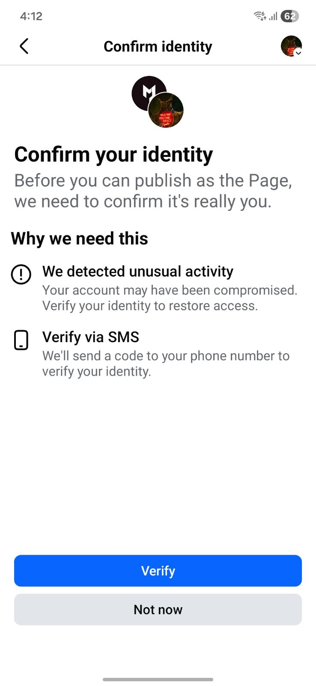

# Troubleshooting Errors in Social AI

Social AI makes it easy to post and schedule content to multiple platforms, but sometimes you may encounter errors that prevent your posts from publishing successfully. This guide walks you through the most common error messages, what they mean, and how to fix them. Whether you're posting to Facebook, Instagram, LinkedIn, Google Business Profile, or X (formerly Twitter), you'll find clear steps to help get you back on track.

---

## Quick Reference Table

| Platform | Common Errors | Solutions Summary |
|----------|----------------|-------------------|
| **Facebook** | Expired token, flagged token, missing permissions, API errors | Reconnect account, verify your identity with Meta, verify Page roles, reauthorize permissions |
| **Instagram** | Wrong account type, not linked to FB Page, permissions missing | Switch to Business/Creator account, link to Facebook Page, reconnect |
| **LinkedIn** | Token expired (every 60 days) | Reconnect via Connect Accounts tab when prompted |
| **Google Business Profile** | Chain location, restricted business category, rejected content | Post directly in GBP, update business category, remove sensitive content |
| **X (Twitter)** | Locked account, expired token, failed video upload | Unlock via x.com, reconnect login, meet video file specs |

## Facebook Troubleshooting

### Common Facebook Errors

#### 1. "Access has not been granted or has expired" or "Connected Facebook account has expired"
- **What it means:** The Facebook connection is expired or incomplete.
- **Fix it:**
  - Go to **Social AI > Settings > Connections**
  - Click **Reconnect** beside Facebook
  - Log in and accept all requested permissions
  - Select and connect the right Pages

#### 2. "You do not have permission to create posts"
- **Fix it:**
  - Log in to the Facebook account with **Admin, Editor, or Moderator** access to the Page
  - Check **Page Roles** under Facebook Page > Settings

#### 3. "Unable to find your Business Manager account"
- Confirm you're logged into the correct Facebook account
- Check [business.facebook.com](https://business.facebook.com) for Business Manager setup
- Ensure the Pages are added and you have proper access

#### 4. (#100) API permissions error
- This error means permissions weren’t granted properly
- **Fix it:** Reconnect the Facebook account and ensure **all permissions are accepted**

#### 5. Content violates Community Standards
- Run your post through Facebook's [Link Debugger](https://developers.facebook.com/tools/debug/) to see what’s being flagged
- Avoid spammy links or flagged language

#### 6. Grey Facebook account

A grey Facebook account has limited functionality or is in a restricted state, which can limit posting until it's resolved. This can happen for several reasons:

- **Account verification issues**: The account needs additional verification
- **Policy violations**: The account violated Facebook's community standards
- **Suspicious activity**: Facebook detected unusual activity
- **Incomplete setup**: The account isn't fully configured

**Fix it:**

1. Log in to Facebook and check for any notifications or warnings
2. Complete any verification steps Facebook requires
3. Make sure all content complies with Facebook's policies
4. If the issue persists, contact Facebook support

#### 7. Access token flagged by Meta

Meta may flag an access token for several reasons, including:

- **Sudden account changes**, such as adding a new admin or resetting the password
- **Admin location or country mismatch**
- **High-frequency posting**

Other activity can trigger a flag too. When it happens, you may also be unable to post directly from your Meta account. To resolve it, verify your identity with Meta:

1. Open the Facebook app on your mobile device
2. Switch to the Page you want to post to
3. When prompted for identity verification, verify using your registered mobile number

Tap **Verify** to receive a code by SMS. Posting is unblocked once verification is complete.

### Best Practices for Connecting Facebook Pages

Always grant access to **all** Pages when you connect an account, and don't change which Pages are included between connections. During authorization, make sure these options are selected:

- **Opt in to all current and future Pages** — for Facebook
- **Opt in to all current and future Businesses** — for Instagram

With these options enabled, if Facebook breaks your token because of suspicious activity, reconnecting even a single expired Page automatically restores access to all your other Pages.

---

## Instagram Troubleshooting

### Common Instagram Errors

#### 1. "Instagram account is not a Business account"
- Social AI can only post to **Business or Creator** accounts
- **Fix it:**
  - Go to IG App > Profile > ☰ > Settings and Privacy > Account Type > Switch to Professional Account
  - Link the account to a Facebook Page

#### 2. "Instagram account not connected to a Facebook Page"
- **Fix it:**
  - IG App > Profile > Edit Profile > Page > Select FB Page to connect

#### 3. "You do not have permission to manage this Instagram account"
- **Fix it:**
  - Ensure IG is a Business/Creator account
  - Confirm the linked Facebook Page is one you have Admin access to

#### 4. "You must be an Admin or Editor on the Facebook Page"
- IG posting permissions come via the linked Facebook Page
- Confirm Page roles in Facebook and reconnect the Instagram account

#### 5. Token Errors (expired, broken, missing)
- These mean your Instagram connection needs to be refreshed
- **Fix it:**
  - Go to **Settings > Connections**, click **Reconnect** beside Instagram

#### 6. Publishing Authorization Needed
- You may see (#263) errors if Page Publishing Authorization is incomplete
- **Fix it:** Complete the authorization at [Facebook Business Help](https://www.facebook.com/business/help/)

#### 7. IG Account is Restricted
- Log in to Instagram directly and follow their prompts to resolve account restrictions

#### Tips for Instagram Success
- Use Business or Creator accounts only
- Link to a Facebook Page and confirm the connection
- Reconnect if passwords, permissions, or account types change
- Clear browser cache or try a different browser if problems persist

---

## LinkedIn Troubleshooting

### "The token used has expired"
- LinkedIn requires you to **reconnect every 60 days**
- You’ll see a yellow banner 10 days before expiration
- **Fix it:**
  - Go to **Settings > Connect Accounts**
  - Click **Reconnect** beside LinkedIn

> Reconnection only takes a few seconds. Do this proactively to avoid failed posts.

---

## Google Business Profile Troubleshooting

### 1. "This location belongs to a chain"
- Google disables Local Post API for chain businesses
- **Fix it:** Post directly through Google Business Profile

### 2. Post rejected
- **Common reasons:**
  - Content includes phone numbers or URLs
  - Contains sensitive keywords or regulated topics
- **Fix it:**
  - Reword the post, remove links or sensitive phrases
  - Review [Google’s policy](https://support.google.com/business/answer/3038177?hl=en)

### 3. "Business category isn't eligible"
- Some categories like hotels, casinos, or cannabis shops can’t post
- **Fix it:** Update business category via **Partner Center > Edit**

---

## X (Twitter) Troubleshooting

### 1. "Account is locked" or "Looks automated"
- X may temporarily restrict accounts
- **Fix it:** Log in at [x.com](https://x.com) to unlock and confirm access

### 2. "Invalid or expired token"
- **Fix it:** Go to **Settings > Connect Accounts > ⋮ > Reconnect**

### 3. "Upload failed" for videos
- Video does not meet format or size requirements
- Check X’s upload guidelines and reformat your video

---

## General Posting Failures

### Post Failed to Publish
- Most often caused by an **expired social token** (broken token)
- **Fix it:**
  - Go to **Settings > Connect Accounts > ⋮ > Reconnect**
  - If user permissions changed, reconnect with a different admin

### Scheduled Posts During Expired Connection
- Social AI **saves failed scheduled posts to Drafts**
- Reconnect the account and reschedule from Drafts

> Only unpublished posts will be saved. If the product is deactivated, posts cannot be recovered.

---

## Error Message Reference Table

| Platform | Error | Meaning | Fix |
|----------|-------|---------|-----|
| Facebook | (#100), permission errors | Token or permission issue | Reconnect, ensure proper Page roles |
| Facebook | Link violates standards | URL blocked | Check with [Link Debugger](https://developers.facebook.com/tools/debug/) |
| Instagram | Not a Business account | Personal account used | Convert to Business/Creator |
| Instagram | Missing permissions | Account not properly linked | Update Page roles and permissions |
| LinkedIn | Token expired | Every 60 days | Reconnect when prompted |
| Google | API disabled or rejected post | Chain or restricted content | Post directly or adjust content/category |
| X | Locked or expired token | Login expired or account locked | Reconnect or unlock at x.com |

---

## Still Having Trouble?

Try the following:

1. Disconnect the affected account in Social AI  
2. Remove the app from the platform (e.g., Facebook > Apps & Websites)  
3. Clear your browser cache or use an incognito/private window  
4. Try using a different browser  

---

## Tips to Prevent Future Issues

- Monitor your account connections regularly  
- Use strong, secure passwords and enable 2FA  
- Accept all permission prompts during setup  
- Maintain multiple admins for all Pages/accounts  
- Reconnect proactively when banners appear  

---

