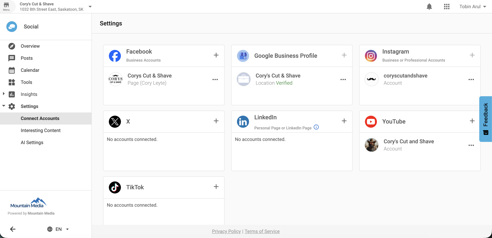

---

title: YouTube Integration – Social Marketing
sidebar_label: YouTube Integration
sidebar_position: 5
description: Connect and publish to YouTube directly from Social Marketing using the Post Composer and Campaign workflows.
tags: [social-marketing, youtube, integrations]
keywords: [youtube integration, connect youtube, schedule youtube videos, publish to youtube]
---------------------------------------------------------------------------------------------

## What is YouTube Integration?

YouTube Integration in Social Marketing allows you to connect your YouTube channel and publish video content directly from within the platform. You can draft, schedule, or immediately post videos to YouTube without leaving Social Marketing.

## Why is YouTube Integration important?

This feature brings video publishing into the same workflow used for other social platforms, streamlining your social media management. It reduces the need to switch between tools and ensures consistent content scheduling.

## What’s Included with YouTube Integration?

* Connect one or two YouTube channels to your account
* Publish videos directly to YouTube
* Draft or schedule YouTube video posts
* Manage YouTube publishing via Post Composer and Campaign workflows
* Edit or delete YouTube connections

## How to Connect a YouTube Channel

1. Navigate to `Social Marketing → Settings → Connect Accounts`
2. Click the `+` (Add) icon next to YouTube
3. You will be redirected to Google OAuth authentication
4. Select the Google account with an associated YouTube channel
5. Review the permissions and click `Allow`
6. Once authenticated, your YouTube channel will appear under `Settings → Connect Accounts`

## Managing YouTube Connections

### Reauthenticate YouTube Account

* Navigate to `Social Marketing → Settings → YouTube → Edit Connection`

### Remove YouTube Account

* Navigate to `Social Marketing → Settings → YouTube → Delete Connection`

## Frequently Asked Questions (FAQs)

How many YouTube channels can I connect?

You can connect up to two YouTube channels per Social Marketing account.

Why can’t I connect my Google account?

Only Google accounts with an existing YouTube channel can be connected.

Where do I manage my YouTube connections?

You can manage connections under `Social Marketing → Settings → Connect Accounts`.

Can I publish videos to YouTube from campaigns?

Yes. You can include YouTube videos in posts created from both the Post Composer and Campaign workflows.

What happens if I delete a connected YouTube channel?

Once deleted, you will no longer be able to publish to that channel unless you reconnect it.

What does reauthentication do?

Reauthentication renews access permissions between Social Marketing and your YouTube account.

Can I draft YouTube posts?

Yes. You can save YouTube video posts as drafts before publishing.

Can I schedule YouTube posts?

Yes. You can schedule video posts to be published at a future date and time.

Is YouTube integration available on all plans?

No. It is only available to users with an active PRO subscription.

