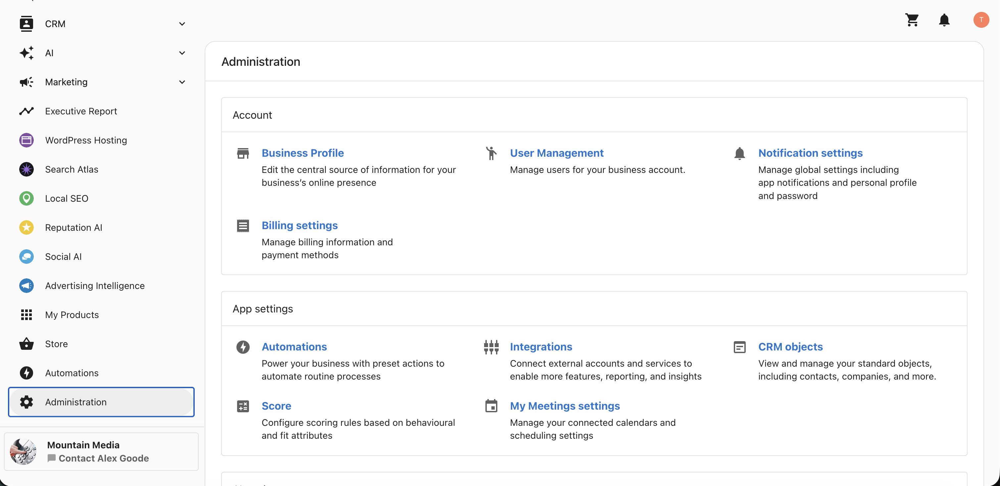
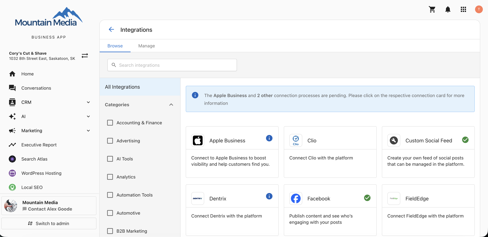
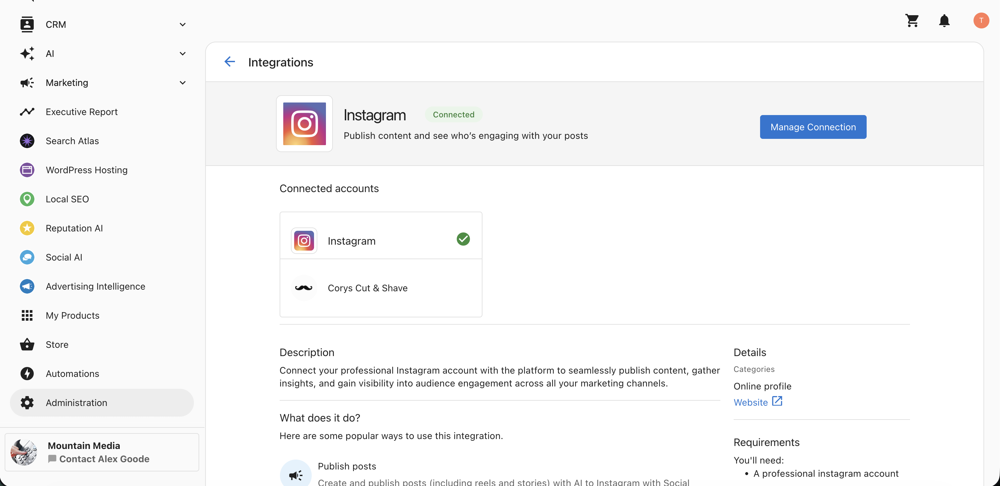
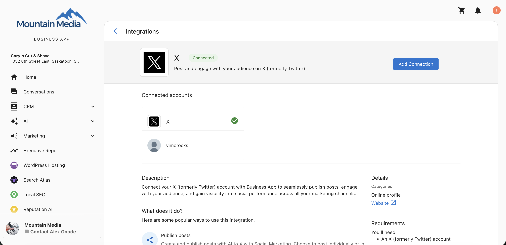
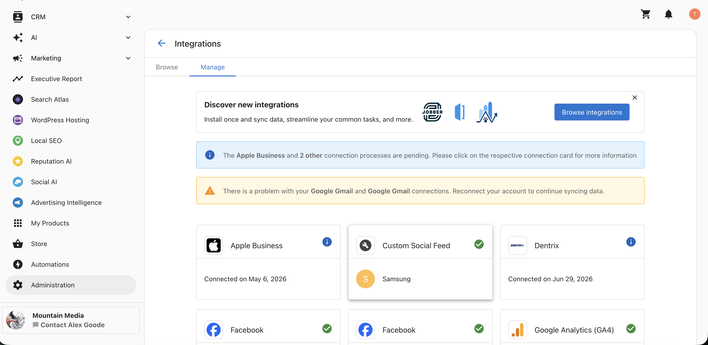
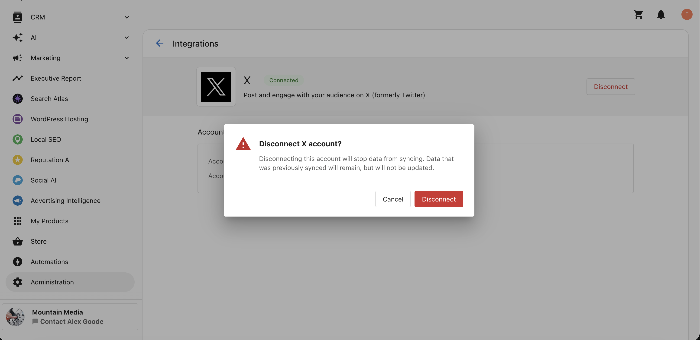

## What are Social Connections in Business App Integrations?

You can connect and manage all your social media accounts directly within the Business App, without navigating to the Social AI product. Everything is managed from **Business App** → **Administration** → **Integrations**, giving you a single place to set up and maintain your connections.

## Why are Social Connections important?

- **One place for everything** — Set up and maintain all your social connections from Business App Integrations.
- **Connect more platforms** — Add a wide range of social networks and content sources.
- **Faster setup** — Establish connections without switching to another product.
- **Easy to maintain** — Review connected accounts and disconnect any you no longer need.

## Which platforms can you connect?

You can connect the following from Business App Integrations:

- **Facebook**
- **Google Business Profile**
- **LinkedIn**
- **X**
- **Instagram**
- **TikTok**
- **YouTube**
- **WordPress Blog**
- **Custom Feed**

## How to connect a social account

### Step 1: Open the Business App

Sign in to your Business App.

### Step 2: Go to Administration

Navigate to **Administration**.

### Step 3: Open Integrations

Click **App Settings** → **Integrations**.

### Step 4: Select the Browse tab

Select the **Browse** tab to view the available platforms.

### Step 5: Choose a platform

Choose the platform you want to connect, such as Instagram, LinkedIn, X, TikTok, YouTube, WordPress Blog, or Custom Feed.

### Step 6: Review the Manage Network screen

The **Manage Network** screen opens, displaying the **Add Connection** button along with your connected accounts, a description, details, and associated products.

### Step 7: Add the connection

Click **Add Connection**.

### Step 8: Sign in to the platform

You are redirected to the platform's sign-in and authorization screen.

### Step 9: Authorize access

Enter your credentials and authorize access. Your connection is now established.

## Removing a connection

1. Go to **Settings** → **Integrations** → **Manage**.

2. Select the connection you want to remove.

3. Click **Disconnect**. The connection is removed.

For more detail on connecting and managing accounts inside the product, see [Connecting and managing accounts in Social AI](./account-connections.mdx).

## Frequently Asked Questions (FAQs)

Where do I manage my social connections?

Go to **Business App** → **Administration** → **Integrations**, then open the **Browse** tab.

Which platforms can I connect from Business App Integrations?

Facebook, Google Business Profile, LinkedIn, X, Instagram, TikTok, YouTube, WordPress Blog, and Custom Feed.

Do I need to go to Social AI to connect an account?

No. You can connect and manage your social accounts directly from Business App Integrations.

How do I add a connection?

On the **Browse** tab, choose a platform, click **Add Connection**, then sign in and authorize access on the platform's screen.

What does the Manage Network screen show?

It displays the **Add Connection** button along with your connected accounts, a description, details, and associated products.

What happens when I click Add Connection?

You are redirected to the platform's sign-in and authorization screen to enter your credentials and grant access.

How do I remove a connection?

Go to **Settings** → **Integrations** → **Manage**, select the connection, and click **Disconnect**.

Where can I see which accounts are connected?

Open the **Manage Network** screen for a platform, or the **Manage** tab, to review your connected accounts.

Can I connect a WordPress blog or a custom feed here?

Yes. Both **WordPress Blog** and **Custom Feed** are available to connect from Business App Integrations.

