# Connecting a WordPress Blog to Social Marketing

Social Marketing lets you connect your WordPress blog so you can schedule and publish blog content directly to your website from within the platform. The connection is made through the **Blog Post Connector** plugin, which you install on your WordPress site.

---

## Before You Begin

- You must have administrator access to your WordPress site.
- The Blog Post Connector plugin can only be installed on WordPress sites.
- Each WordPress website can only be connected to one Social Marketing account at a time.

---

## How to Connect Your WordPress Blog

### Step 1: Open the WordPress Blog connection

1. In Social Marketing, go to **Settings > Connections**.

   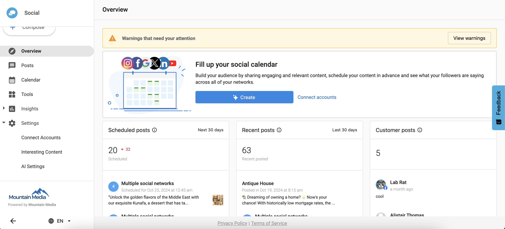

2. Navigate to the **Integrations** tab and select **WordPress Blog**.

   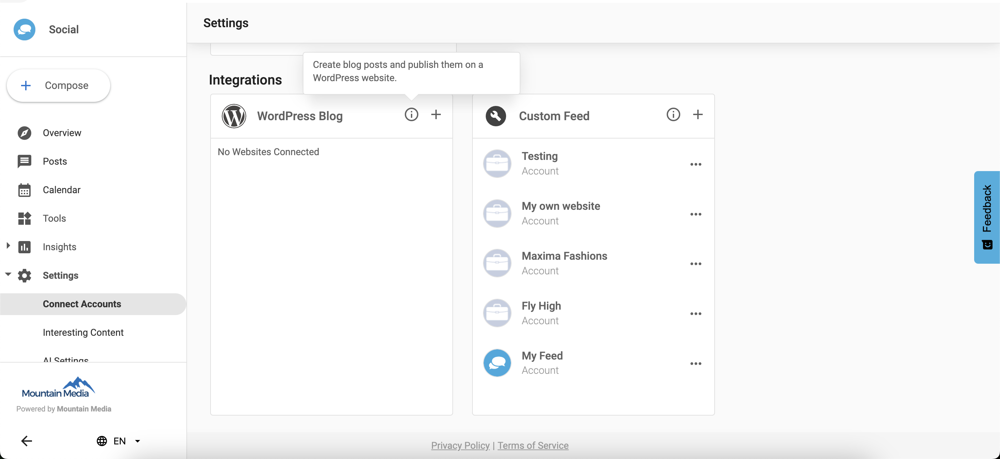

3. Click **Add** to begin setting up a new connection.

   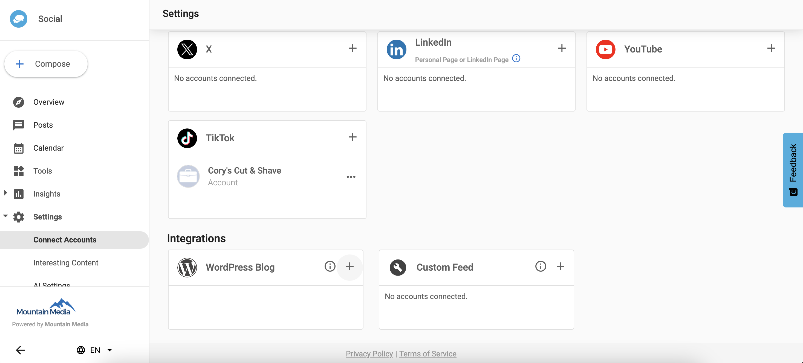

### Step 2: Download and install the plugin

1. On the **Add WordPress Blog** page, download the Blog Post Connector plugin file.

   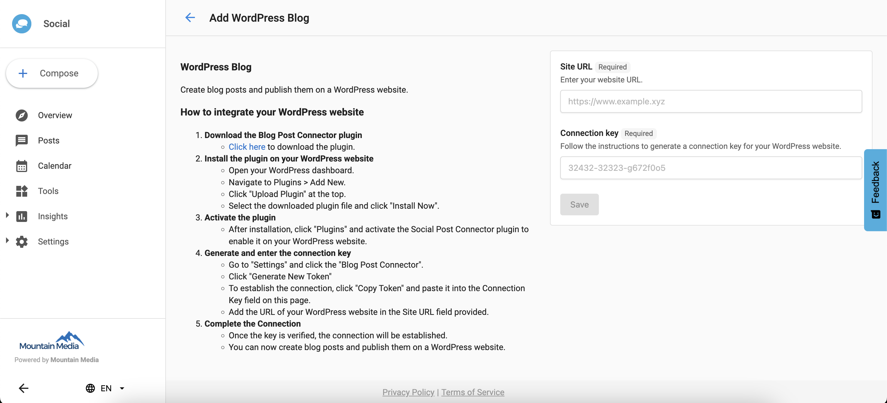

2. Log in to your WordPress Admin Dashboard.
3. Go to **Plugins > Add New Plugin**.

   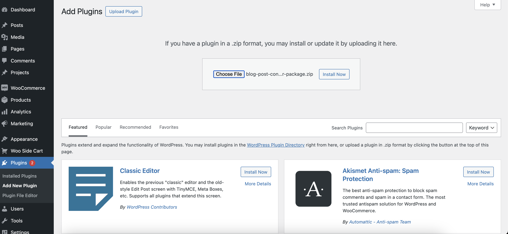

4. Click **Upload Plugin** and select the downloaded plugin file.

   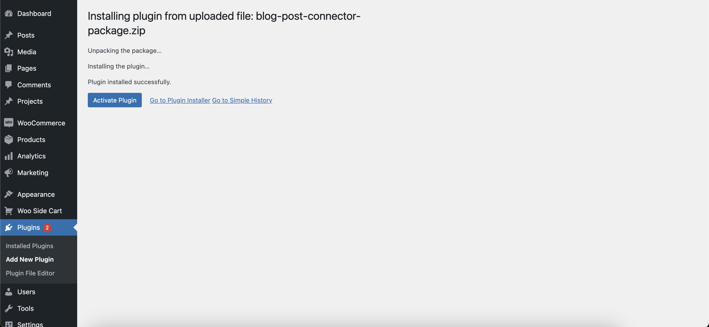

5. Click **Install Now**, then **Activate** the plugin.

### Step 3: Get your access token

1. In your WordPress Admin Dashboard, go to **Settings > Blog Post Connector**.

   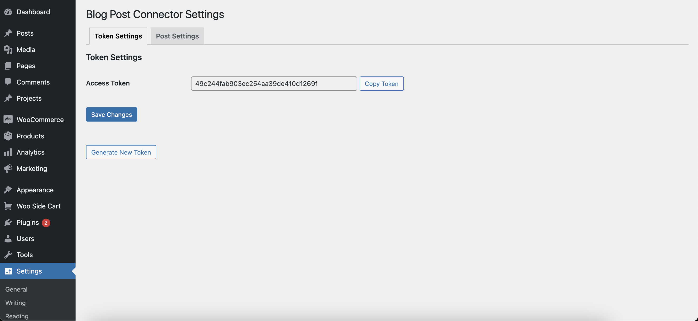

2. Copy your **Access Token**. You can also generate a new token from this page if needed.

### Step 4: Complete the connection in Social Marketing

1. Return to Social Marketing and go to **Settings > Connections > WordPress Blog > Add New**.
2. Paste the **Access Token** you copied from WordPress.

   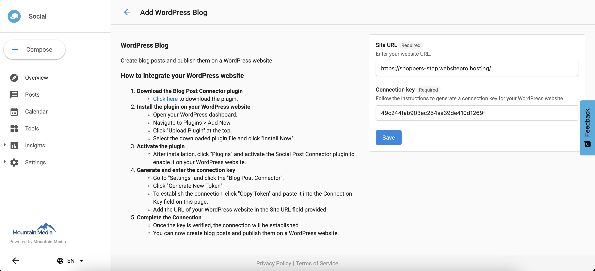

3. Enter your **Website URL**.
4. Click **Save**.

   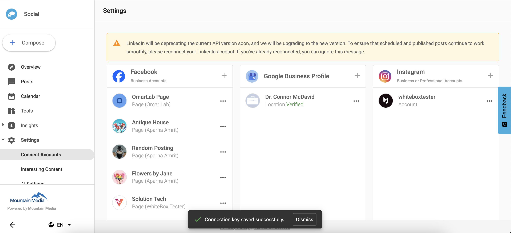

Your WordPress blog is connected to Social Marketing.

---

## Things to Know

- The Blog Post Connector plugin only works on WordPress sites.
- A website can only be connected to one Social Marketing account. If the website is already connected to another account, you will not be able to connect it again until it is removed from the other account.

  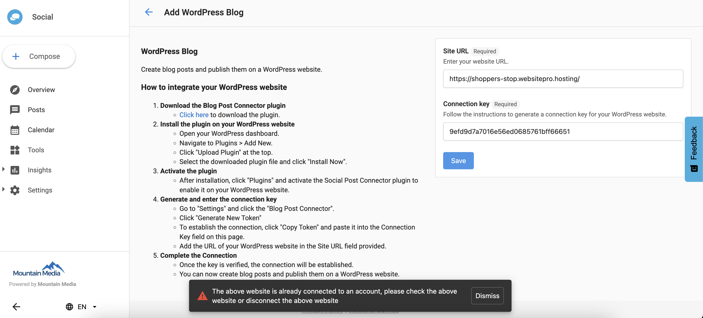

- The **Website URL** and **Access Token** must match the WordPress site where you generated the token, or the connection will fail.

  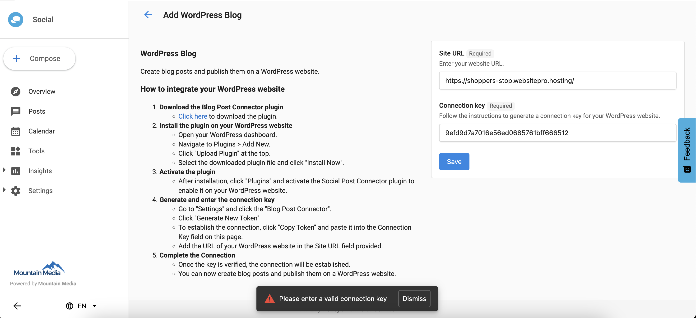

---

## Frequently Asked Questions

What happens if I generate a new access token in WordPress?

Generating a new access token in WordPress will invalidate the previous token. If your blog is already connected to Social Marketing, you will need to update the connection with the new token to restore functionality.

Can I connect more than one WordPress blog?

You can add multiple WordPress blog connections from the **Settings > Connections > WordPress Blog** page by clicking **Add** for each site.

