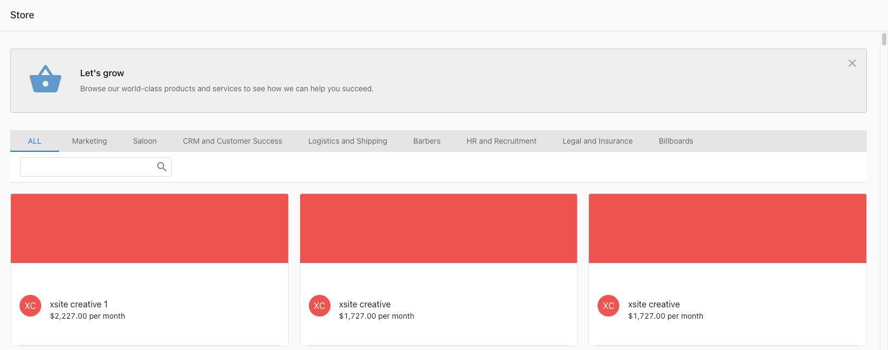
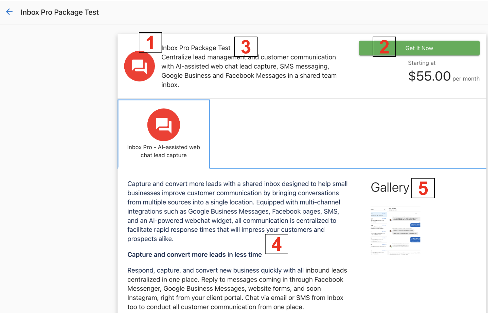
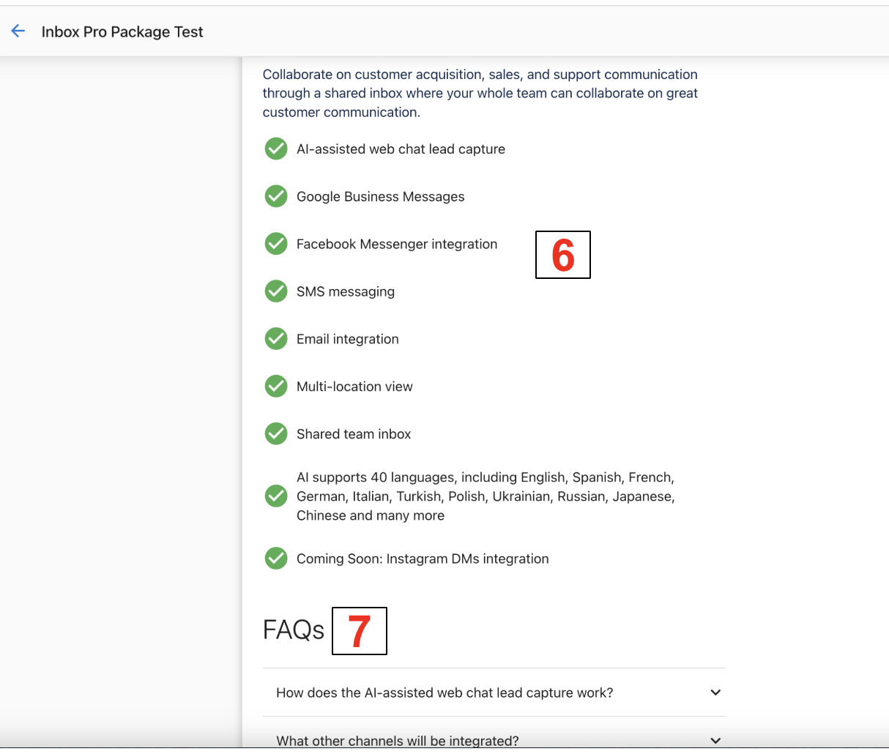

Welcome to the Store tab in the Business App, your one-stop shop for browsing, expressing interest in, and purchasing products directly from the app. When you navigate to the Store tab, you'll find all the products and packages that have been published in your store, making it easy to access and purchase what you need. This feature is designed to streamline your shopping experience, ensuring you have all the available offerings at your fingertips.

## How can I access the Store in Business App?

Log in to the Business App and click on Store.

## How to use the Store

Clicking on any package will bring you to that package's information page. Here, you can see package marketing materials, product details, pricing, and more.

1. Package information – Features the package name, tagline, and solution type.
2. Pricing – Pricing information for the package. Also includes the purchase button (covered below).
3. Package description – Marketing information surrounding the package as a whole
4. Product Description – Information explaining the purpose of the product.
5. Gallery – Media to showcase how the product functions.

6. Key points – Points designed to showcase how the product can help you.
7. FAQs – Additional information designed to explain any questions you may have before purchasing. 

Once you have made your decision and would like to purchase, you will have the option to Contact Sales or Add to the Cart depending on the package's purchase button behavior.

This will prompt a window in which you can either email your salesperson to express interest in the product or purchase it on your own.

## Frequently Asked Questions (FAQs)

What happens when I click "Upgrade now"?

Clicking "Upgrade now" takes you through the standard Store purchase flow where you can review package details, pricing, and complete your purchase.

