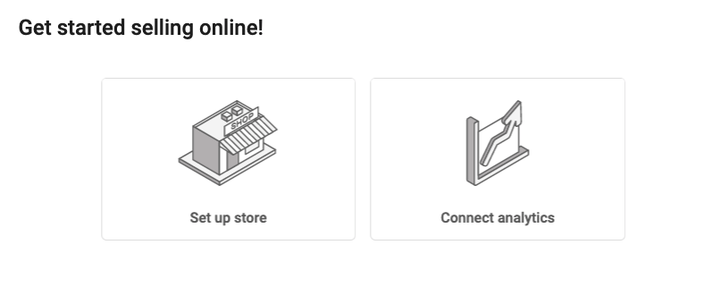
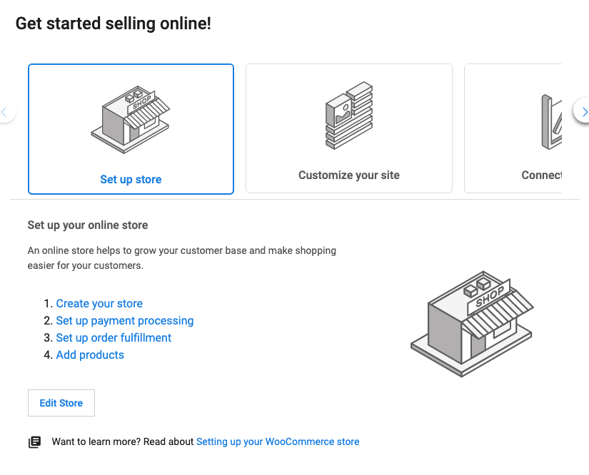
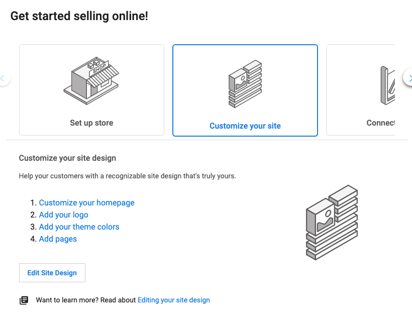
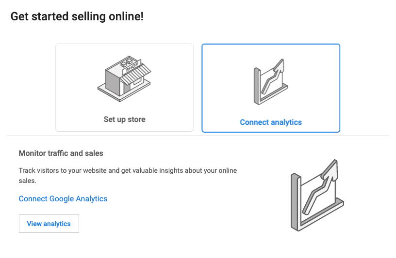

WordPress Hosting Standard and Pro users will see a section on the product’s dashboard. This section has been designed to help guide users through all capabilities and important steps of setting up their website and building their eCommerce store. 

This section includes a series of links to help a user navigate the product and serves as a checklist when building their website. 

Depending on the plugins available on the website, the section will display three sections: 

1.  Set Up Store
2.  Customize Your Site
3.  Connect Analytics

At Vendasta, we’re dedicated to helping local businesses thrive. In order for your clients to thrive with our WordPress Hosting product, it is important to make navigating WordPress as easy as possible. 

### How does the Getting Started Card work?

Upon logging in to WordPress Hosting **Standard or Pro**, the user will see the new section on the **Overview page**. 

If the site was created from one of Vendasta’s 7 eCommerce templates (with Divi Builder and WooCommerce), the user will be prompted with three options: **Set up store, Customize your site, and Connect analytics**. 

If a user creates a website from another template, specifically one that does not have Divi Builder, they will only be prompted to **Set up store and Connect analytics**. _This is because the customize your site card links specifically to Divi Builder customization options._ 

__

### Set Up Store

When a user clicks **Set Up store** they will be provided with a variety of deep links that will take them to a section of WordPress to build their eCommerce store with WooCommerce. At the bottom, the user is provided with a link to a step-by-step guide to building their store. 

_Note: If the WooCommerce plugin is not installed on the website, the user will be prompted to install the plugin._ 

__

**Create your store:** This link will launch the _WooCommerce set-up wizard,_ helping the user input all required and crucial information for their store.

**Set up payment processing:** This link takes a user to the _Settings > Payments tab_ of WooCommerce to set up how they plan to take payments. 

**Set up order fulfillment:** This link takes users to the _Settings > Shipping_ tab of WooCommerce. 

**Add products:** This link will take a user to the _Products tab_ of WooCommerce where they can add their first, or a new product to their store. 

The **Edit Store** button takes a user to the _Products tab_ to make edits or add new products quickly. 

### Customize Your Site

When a user clicks **Customize Your Site** they will be provided with a variety of links taking them to sections of the front and back end of WordPress to customize the design of their website. There is also a helpful guide linked at the bottom to give users a more detailed understanding of how to customize their website. 

**Customize your homepage:** This link will take a user to the _front end_ of their website with the Divi Builder enabled. A user can easily start making changes to the copy and images on their site. 

**Add your logo:** This link will take a user to the _Divi > General Settings tab_ in WordPress, where they are able to add their own logo to their site. 

**Add your theme colors:** This link will take users to _Divi > Theme Customizer_, where they have the freedom to easily change the main colors of their site. Once a user sets their theme colors, all new buttons, text, and boxes on their website will follow this theme. 

**Add pages:** This link will take a user to the _Pages tab_ in WordPress. 

The **Edit My Site** button will take a user to the _Theme Customizer_ to make any other edits to their site. 

### Connect Analytics

This section will prompt a user to connect their Google Analytics account. 

Once a user has connected their Google Analytics, they will display on the product dashboard as usual. The **View Analytics** button will take a user into the backend of WordPress, showcasing their _WooCommerce or online store analytics_.