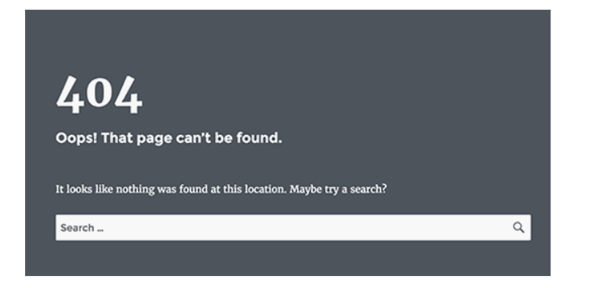

**Fixing WordPress 404 Errors on Posts**

If you're encountering 404 errors on your WordPress posts, here are a few steps you can take to resolve the issue:

### 1\. Re-Save Permalink Settings

Often, simply reconfiguring your permalink structure can fix the problem.

*   In your WordPress Dashboard, go to **Settings** > **Permalinks**.
    
*   Without making any changes, click **Save Changes**.
    

This action refreshes your permalink settings and flushes the rewrite rules, which commonly resolves 404 errors.

### 2\. Check for Plugin Conflicts

Plugins can sometimes interfere with your site’s URLs. To identify the culprit:

*   Temporarily **disable all plugins**.
    
*   Then, **reactivate them one by one**, checking the site after each activation to pinpoint the issue.
    

### 3\. Clear Your Website Cache

A stale cache can cause persistent errors. Make sure to **flush your cache** using your caching plugin or hosting dashboard.

### 4\. Review Error Logs

Access your **site logs** to uncover additional details. They can help identify whether a plugin, theme, or server configuration is behind the issue.