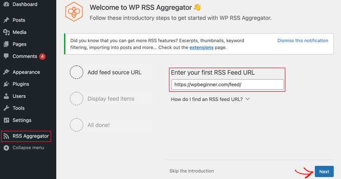

RSS makes it easy to automatically pull content from other sites and display it on yours. This can boost user engagement, grow website traffic, and increase page views.

### Displaying Any RSS Feed With a Widget

To do this, navigate to the **Appearance > Widgets** page in the WordPress dashboard and then click the ‘Add Block’ (+) button at the top of the screen.

### Displaying Any RSS Feed With a Plugin

[WP RSS Aggregator](https://www.wpbeginner.com/refer/wp-rss-aggregator/) is the best [WordPress RSS feed plugin](https://www.wpbeginner.com/showcase/best-wordpress-rss-feed-plugins/) on the market. It lets you display RSS feeds on your blog, and by purchasing premium add-ons, you can turn your website into a content aggregator without any coding.

First, you need to install and activate the free WP RSS Aggregator plugin. For more details, see this step-by-step guide on [how to install a WordPress plugin](https://www.wpbeginner.com/beginners-guide/step-by-step-guide-to-install-a-wordpress-plugin-for-beginners/).

Upon activation, you will be asked to add your first RSS feed URL. For this tutorial, we’ll add `https://wpbeginner.com/feed/`. Once you’ve entered the feed URL, click the ‘Next’ button at the bottom of the page.

On the next page, you will see the latest feed items from the RSS feed you linked, click the ‘Create Draft Page’ button to add the feed to a new page draft or use the shortcode on the right to add them to any post, page, or widget area.

For more information, You can refer to this article: [https://www.wpbeginner.com/wp-tutorials/how-to-display-any-rss-feed-on-your-wordpress-blog/](https://www.wpbeginner.com/wp-tutorials/how-to-display-any-rss-feed-on-your-wordpress-blog/)