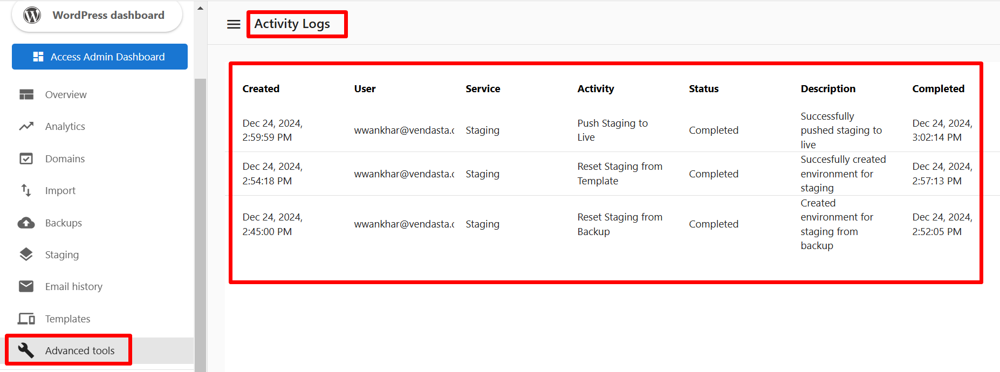
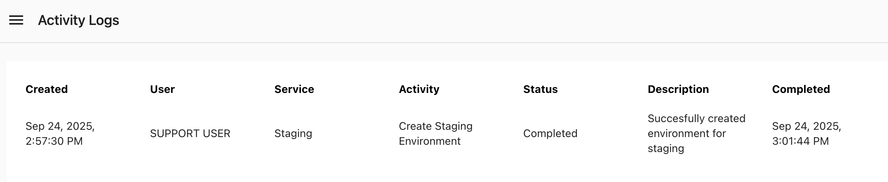
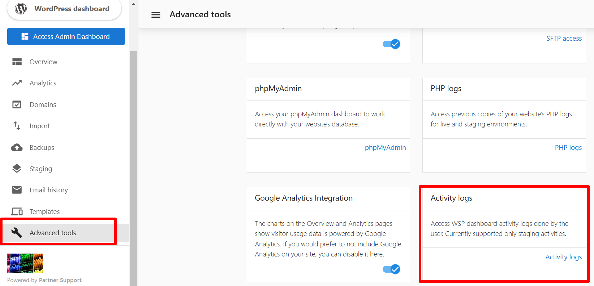

The **Activity Logs** feature in WordPress Hosting helps you track actions performed on your **staging site**. It provides a record of significant activities, making it easier to monitor changes and troubleshoot issues.

### Supported staging site activities

1. **Reset Staging from Template**
   * Logs when the staging environment is reset using a new template.
2. **Reset Staging from Backup**
   * Logs when the staging environment is reset using a backup.
3. **Push Staging to Live**
   * Logs when changes from the staging environment are pushed to the live site.

### Details provided in activity logs

The activity logs include the following information:

* **Created**: The date and time when the activity was logged.
* **User**: The user who performed the action.
* **Service**: The specific service or feature associated with the action.
* **Activity**: The type of activity performed.
* **Status**: The current status of the activity (e.g., completed, failed).
* **Description**: A brief explanation of the action.
* **Completed**: The date and time when the activity was completed.

### Support actions in activity logs

When a support action is performed on your site, activity logs display it as **"Support user"** to keep the record clear and consistent.

### How to access activity logs

1. Log in to your WordPress Hosting dashboard.
2. Navigate to the **Activity Logs** section under **Advanced Tools**.
3. View detailed records of actions performed on your staging site.

