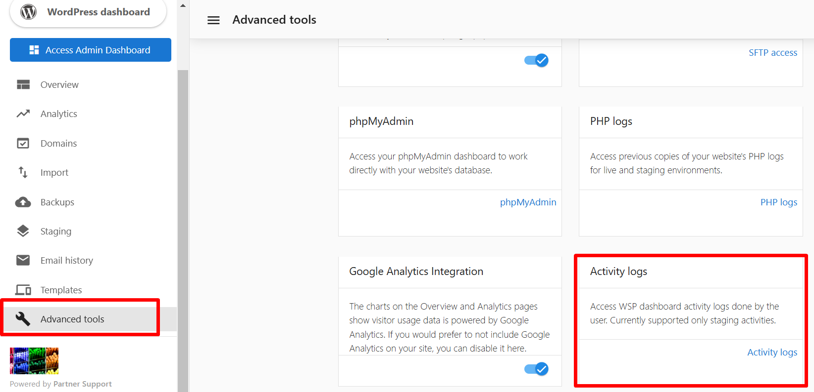

The **Activity Logs** feature in WordPress Hosting Pro helps users track actions performed on their **staging site**. It provides a record of significant activities, making it easier to monitor changes and troubleshoot issues.

### Supported Staging Site Activities

1.  **Reset Staging from Template**
    
    *   Logs when the staging environment is reset using a new template.
2.  **Reset Staging from Backup**
    
    *   Logs when the staging environment is reset using a backup.
3.  **Push Staging to Live**
    
    *   Logs when changes from the staging environment are pushed to the live site.

### Details Provided in Activity Logs

The activity logs include the following information:

*   **Created**: The date and time when the activity was logged.
*   **User**: The user who performed the action.
*   **Service**: The specific service or feature associated with the action.
*   **Activity**: The type of activity performed.
*   **Status**: The current status of the activity (e.g., completed, failed).
*   **Description**: A brief explanation of the action.
*   **Completed**: The date and time when the activity was completed.  
      
    

### White-Labelled Support in Activity Logs

Activity logs also include visibility for **support-related actions**:

* For **internal teams**: The actual **support email** associated with the activity is displayed.  
* For **clients and small businesses**: The log anonymizes support details, and they will only see the label **"Support user"**.  

This ensures transparency for internal teams while maintaining a white-labelled experience for end clients.  

### How to Access Activity Logs

1.  Log in to your WordPress Hosting Pro dashboard.
2.  Navigate to the **Activity Logs** section under **Advanced Tools**.
3.  View detailed records of actions performed on your staging site.  
      
    