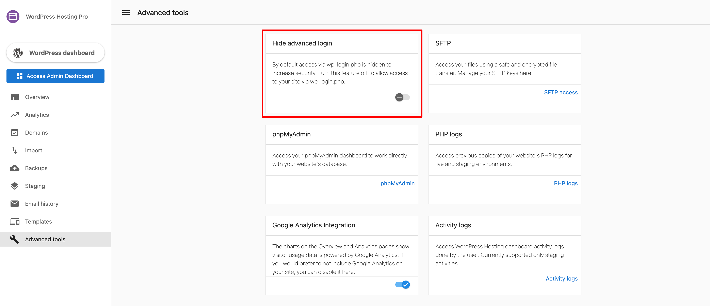
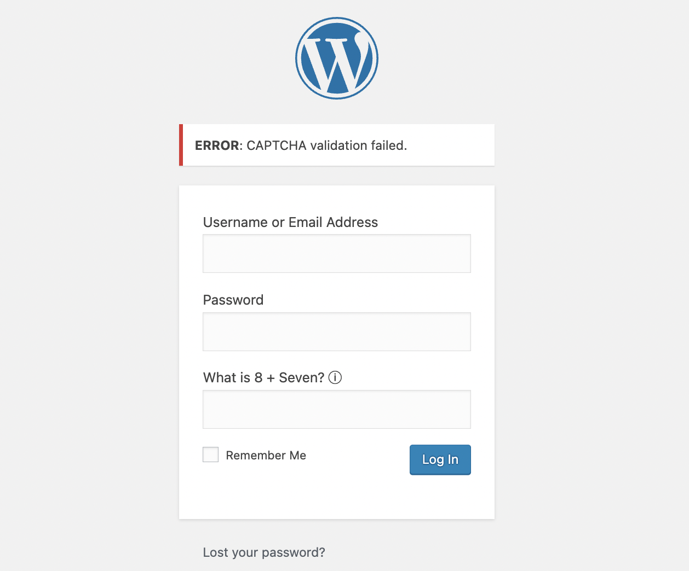

If the Advanced Login feature is enabled, logging into the WordPress dashboard via SSO may be affected when a reCAPTCHA is set up on the WordPress login page.

When the toggle is turned off, you can log in directly using `www.domainname.com/wp-admin`.

### Enhanced captcha settings

You can configure Enhanced Captcha from your WordPress dashboard under **Settings > General**. From here, you can enable or disable captcha and adjust the failed login attempt threshold.

If you prefer to log in directly via SSO, disable the captcha feature on the login page. If you are using a reCAPTCHA plugin, disabling the plugin achieves this.
