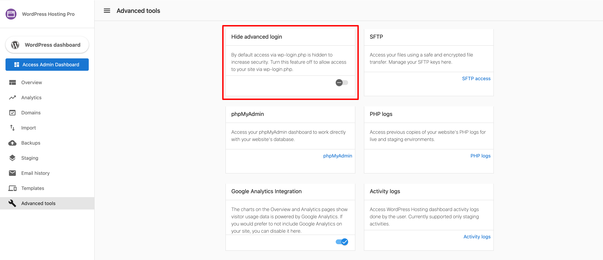
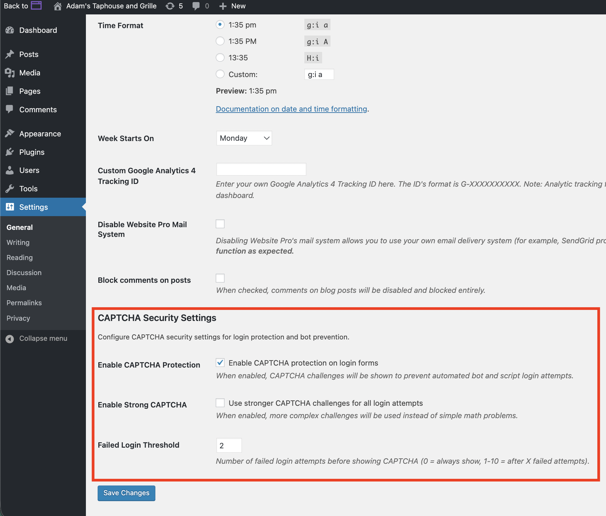
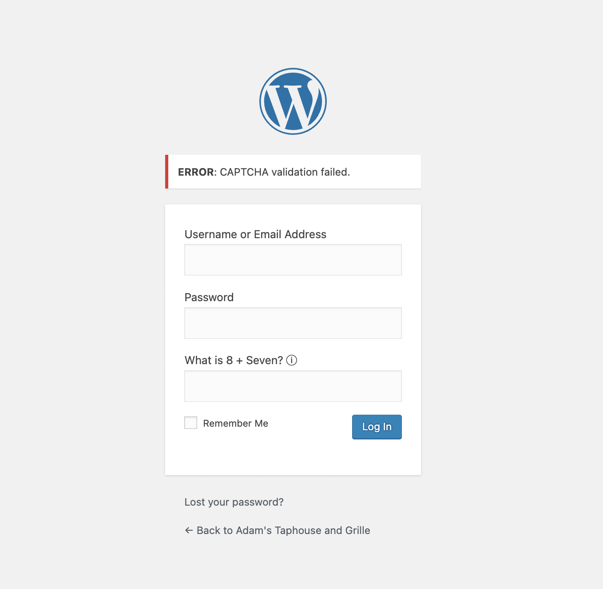

If the Advanced Login feature is enabled, logging into the WordPress dashboard from Partner Center or Business App could be affected if a reCaptcha is set up on the WordPress login page.

When the toggle is turned off, a user can log in using www.domainname.com/wp-admin.  

### Enhanced Captcha Settings

Enhanced Captcha can be configured from your WordPress dashboard -> General settings page. From here, you can enable/disable captcha and adjust the failed login attempt threshold.

If you would still like to log in from Partner Center or Business App, simply disable the captcha feature on the login page (If using a reCaptcha plugin, simply disabling the plugin should achieve this).