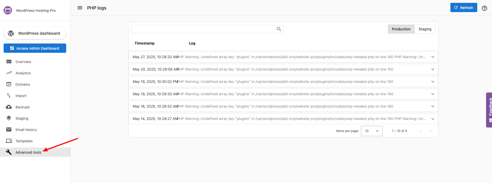

If you're troubleshooting an issue or debugging your website, accessing PHP logs is crucial. WordPress Hosting Pro makes it easy to view these logs through the **Advanced Tools** section. Follow the steps below to locate your PHP logs:

### Steps to Access PHP Logs

1.  **Log in to WordPress Hosting Pro**  
    Start by logging into your WordPress Hosting Pro dashboard.
    
2.  **Select Your Website**  
    From the list of websites, click on the one for which you want to access PHP logs.
    
3.  **Navigate to Advanced Tools**  
    In the website's dashboard, locate and click on the **Advanced Tools** section.
    
4.  **Open PHP Logs**  
    Under **Advanced Tools**, find and click the **PHP Logs** option. This will display the latest PHP error logs for your site.
    
5.  **Analyze the Logs**  
    Review the logs to identify errors or warnings related to your PHP scripts, such as syntax errors, deprecated functions, or unhandled exceptions.
    

:::tip
**Use Logs for Debugging**: Use the logs to pinpoint the root cause of issues like white screens, 500 errors, or slow loading times.
:::

By following these steps, you can efficiently access and review PHP logs to maintain and troubleshoot your website.

## Related Articles

For detailed information on how to use PHP logs for debugging WordPress issues, see [WordPress Debugging Basics](../wordpress-dashboard/wordpress-debugging-basics.md).