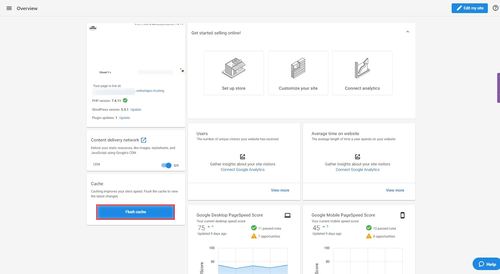

WordPress Hosting uses caching to speed up your site. However, changes may not show immediately due to this caching. You can bypass caching temporarily or manually flush your site cache to ensure visitors see the latest version.

## What is caching?

WordPress Hosting's built-in server-side caching is what makes your sites lightning fast. To deliver content as quickly as possible, WordPress Hosting serves up "cached" versions of pages rather than dynamically generating them each time.

The result is that your WordPress Hosting sites load very fast. However, WordPress Hosting's built-in caching refreshes every hour. This means that if content changes, your users may get the old (cached) version instead of the latest version.

## Temporarily bypass cache

To bypass the cache temporarily and view your most recent changes:

* Add `/?skip` to the end of your page URL
  * Example: `https://examplewebsite.com/?skip`

This forces your browser to pull the latest version of the page without waiting for the cache to refresh.

## Manually flush site cache

To ensure website visitors always see the latest version of your files, click the **Flush Cache** button on the product **Overview page** after making changes. This will clear the cache for your site instantly.

