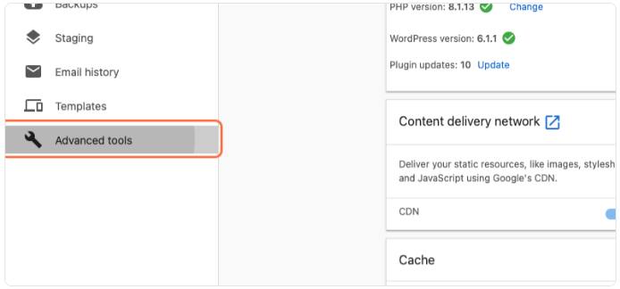
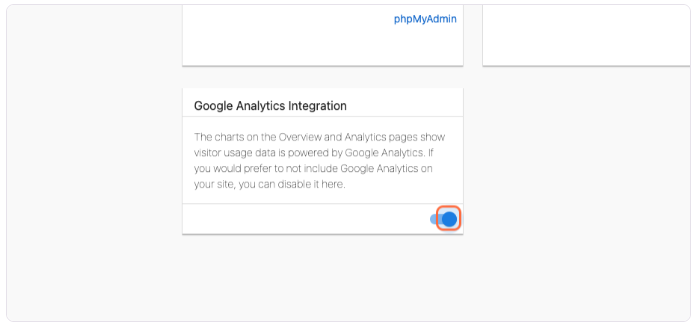
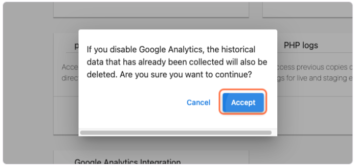

## What is GDPR?

GDPR stands for **General Data Protection Regulation**. It's a European privacy law that protects people's personal information online. Even if your business isn't in Europe, GDPR affects any website that might have visitors from European countries.

GDPR requires websites to:
* Get permission before collecting personal data from visitors
* Be transparent about what data is collected
* Give visitors control over their data

## Why disable Google Analytics?

All websites created with WordPress Hosting come with a default Google Analytics tracking code, even if you don't add your own Google Analytics account. This tracking code collects information about your website visitors, such as:
* Which pages they visit
* How long they stay on your site
* Where they came from (like search engines or social media)

While Google has made some improvements with Google Analytics 4 (GA4), both the older Universal Analytics and GA4 may not fully comply with GDPR requirements using their default settings. If you're concerned about privacy compliance or want to give your visitors more control, you can disable this default tracking.

### What happens when you disable it?

When you disable Google Analytics in WordPress Hosting:
* The tracking code is removed from your website
* Any stored analytics data is deleted
* Analytics charts and reports are hidden in your dashboard

### What if you want to turn it back on?

You can always turn Google Analytics back on later. When you do:
* The tracking code will be added back to your website
* Data collection will resume
* Analytics charts will start working again

## How to toggle the default Google Analytics tracking on/off

1. Go to your WordPress Hosting dashboard.

2. Click on **Advanced Tools**.

3. Toggle the option for the **Google Analytics Integration**.

4. Click **Accept**.

