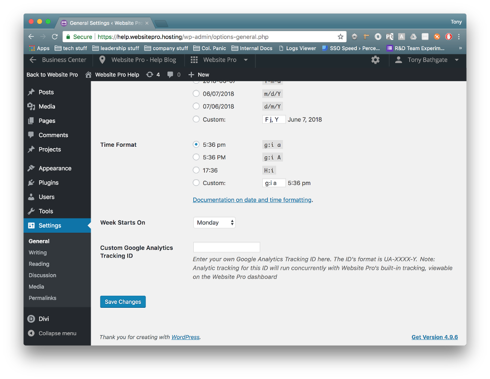

# Add Google Analytics Account

WordPress Hosting has a built-in dashboard that displays highlights of your site’s visitor information using [Google Analytics.](https://www.google.com/analytics/analytics/) However, we understand that you may want to dig deeper using your own account. That’s why WordPress Hosting provides an easy way to do just that.

:::info
Plugins meant to support Google Analytics are available, but these often fail to track or gather data in the WordPress Hosting environment.
::: 

1.  [Sign up](https://analytics.google.com/analytics/web/) for Google Analytics and configure it for your site, or just log in if you’ve already completed that step.
2.  Click [Admin](https://support.google.com/analytics/answer/6132368)
3.  Select your site’s account from the menu in the _ACCOUNT_ column
4.  Select a property from the menu in the _PROPERTY_ column
5.  Under _PROPERTY_, click **Tracking Info > Tracking Code**. Your [tracking ID](https://support.google.com/analytics/answer/7372977) is displayed at the top of the page
6.  Copy that Tracking ID
7.  Sign into to your WordPress Hosting site’s WordPress admin panel
8.  Navigate to **Settings > General Code** and scroll to the bottom
9.  Paste that Tracking ID into the **Custom Google Analytics Tracking ID** and click **Save Changes**

Please keep in mind that this ID will run concurrently with WordPress Hosting’s built-in analytic tracking, which will remain on the WordPress Hosting dashboard.

## Frequently Asked Questions (FAQs)

How do I add my Google Analytics account to WordPress Hosting Pro?

There are two ways to install Google Analytics in WordPress Hosting Pro: using the built-in settings or by manually injecting the tracking code.

**Method 1: Use the Tracking ID field in Settings**

1. Sign in to your [Google Analytics account](https://analytics.google.com/).
2. Navigate to: **Admin > Property Settings > Tracking Info > Tracking Code**
3. Copy your **Tracking ID** (format: `UA-XXXXXXX-X` or `G-XXXXXXX`)
4. In your WordPress dashboard (WordPress Hosting Pro):
   * Go to **Settings > General**
   * Scroll to the bottom and paste your Tracking ID into the **Custom Google Analytics Tracking ID** field
   * Click **Save Changes**

To ensure accurate data syncing, also verify that Google Analytics is connected in:

> **Business App > Administration > Connections**

**Method 2: Add the script manually in Divi**

1. In your WordPress dashboard, go to **Divi > Theme Options**
2. Paste your Google Analytics `gtag.js` script into the **Body Code** section
3. Save changes

This ensures the script loads on all pages across your site.

Why is my bounce rate lower than expected in Google Analytics?

Very low bounce rates (e.g., under 10%) usually indicate a **technical issue**, such as:

* Duplicate Google Analytics tracking (e.g., from both a plugin and hardcoded script)
* Event-based tracking falsely counting interactions
* Improper tag placement in your theme or plugin

Use the **Google Tag Assistant Chrome Extension** to inspect your tags and verify correct implementation: [Google Tag Assistant Tutorial](https://www.analyticsmania.com/post/google-tag-assistant-tutorial/)

If needed, clean up duplicates by:
* Disabling redundant plugins
* Removing extra manual script embeds
* Reviewing tag behavior in Google Tag Manager

How do I check if my website is indexed by Google?

Google Search Console is the best tool to verify and manage site indexing.

**Step 1: Submit your domain**

1. Go to [Google Search Console](https://search.google.com/search-console/)
2. Choose **"URL Prefix"** or **"Domain"** setup
   * `URL Prefix`: Requires only access to your site (e.g., via tracking tag)
   * `Domain`: Requires access to your domain registrar (to add a TXT DNS record)
3. Verify domain ownership through the guided steps

> _Note: DNS changes can take 6–12 hours to propagate._

**Step 2: Submit your XML sitemap**

After verification, submit your XML sitemap to help Google crawl your site.

To find your sitemap:
* **Yoast SEO**: Log in to WordPress > SEO > General > Features tab [Yoast Sitemap Help](https://yoast.com/help/xml-sitemaps-in-the-wordpress-seo-plugin/)
* **Rank Math SEO**: [Rank Math Sitemap Video Tutorial](https://www.youtube.com/watch?v=bK2DHBhUUOo)

Submit the sitemap under the **Sitemaps** tab in Search Console.

**Step 3: Manually request page indexing**

* In the GSC dashboard, click the **URL Inspection** tool
* Paste in the URL you want indexed
* If it says "URL is not on Google," click **Request Indexing**

> Crawling and indexing can take **7–15 days** to reflect in search results.

