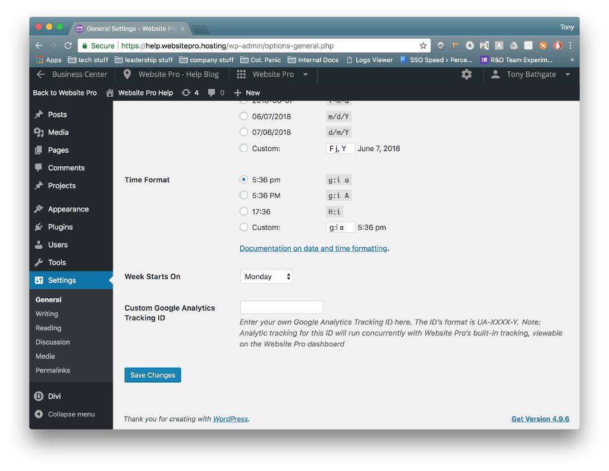

WordPress Hosting includes built-in analytics. You can also connect your own Google Analytics 4 (GA4) property to track data for your site.

:::info
Plugins meant to support Google Analytics are available, but these often fail to track or gather data in the WordPress Hosting environment.
::: 

1.  Sign in to [Google Analytics](https://analytics.google.com/analytics/web/).
2.  Open **Admin**.
3.  Select your GA4 property.
4.  Open **Data Streams** and select your website stream.
5.  Copy your **Measurement ID** (format: `G-XXXXXXXXXX`).
6.  Sign in to your WordPress site.
7.  Go to **Settings** > **General** and scroll to the bottom.
8.  Paste the ID into **Custom Google Analytics Tracking ID**.
9.  Click **Save Changes**.

Your custom GA4 ID can run at the same time as the connected analytics integration.

## Frequently Asked Questions (FAQs)

How do I add my Google Analytics account to WordPress Hosting?

There are two setup options:

1. Connect Google Analytics in **Business App** > **Administration** > **Connections**.
2. Add a GA4 Measurement ID in **Settings** > **General** > **Custom Google Analytics Tracking ID**.

You can use both at the same time.

How does GA4 tracking load on my site?

When Google Analytics is connected, the GA4 `gtag.js` tracking code is added to your site's `<head>` automatically. The script loads asynchronously to reduce page impact.

Can I turn tracking off without removing my connection?

Yes. You can turn default tracking on or off in **Advanced Tools** with the **Google Analytics Integration** toggle. This does not remove your Google Analytics connection.

Why is my bounce rate lower than expected in Google Analytics?

Very low bounce rates (e.g., under 10%) usually indicate a **technical issue**, such as:

* Duplicate Google Analytics tracking (e.g., from both a plugin and hardcoded script)
* Event-based tracking falsely counting interactions
* Improper tag placement in your theme or plugin

Use the **Google Tag Assistant Chrome Extension** to inspect your tags and verify correct implementation: [Google Tag Assistant Tutorial](https://www.analyticsmania.com/post/google-tag-assistant-tutorial/)

If needed, clean up duplicates by:
* Disabling redundant plugins
* Removing extra manual script embeds
* Reviewing tag behavior in Google Tag Manager

How do I check if my website is indexed by Google?

Google Search Console is the best tool to verify and manage site indexing.

**Step 1: Submit your domain**

1. Go to [Google Search Console](https://search.google.com/search-console/)
2. Choose **"URL Prefix"** or **"Domain"** setup
   * `URL Prefix`: Requires only access to your site (e.g., via tracking tag)
   * `Domain`: Requires access to your domain registrar (to add a TXT DNS record)
3. Verify domain ownership through the guided steps

> _Note: DNS changes can take 6–12 hours to propagate._

**Step 2: Submit your XML sitemap**

After verification, submit your XML sitemap to help Google crawl your site.

To find your sitemap:
* **Yoast SEO**: Log in to WordPress > SEO > General > Features tab [Yoast Sitemap Help](https://yoast.com/help/xml-sitemaps-in-the-wordpress-seo-plugin/)
* **Rank Math SEO**: [Rank Math Sitemap Video Tutorial](https://www.youtube.com/watch?v=bK2DHBhUUOo)

Submit the sitemap under the **Sitemaps** tab in Search Console.

**Step 3: Manually request page indexing**

* In the GSC dashboard, click the **URL Inspection** tool
* Paste in the URL you want indexed
* If it says "URL is not on Google," click **Request Indexing**

> Crawling and indexing can take **7–15 days** to reflect in search results.

