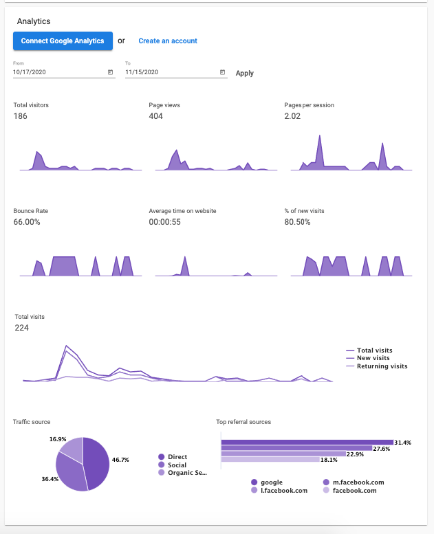
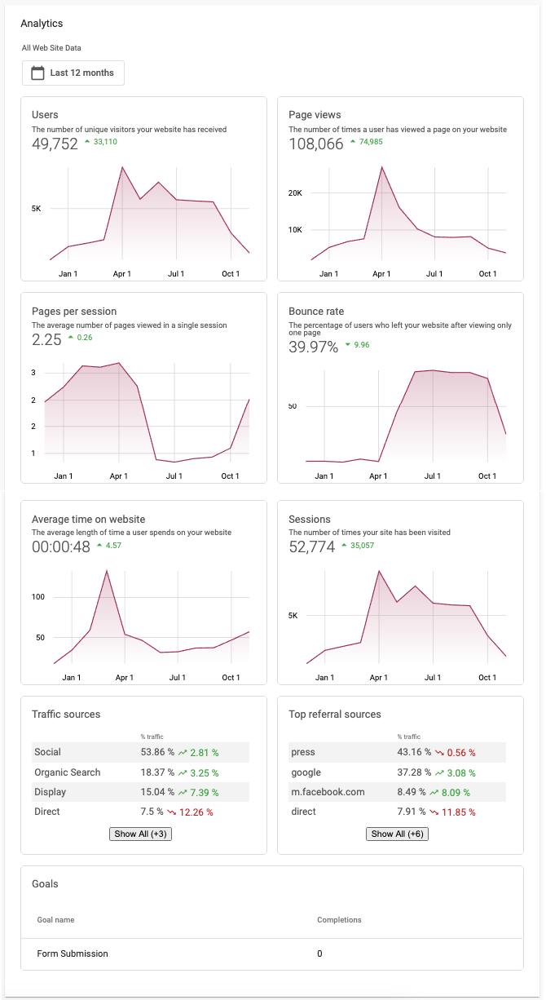

The Google Analytics view in WordPress Hosting allows you to view your top traffic sources and page view metrics within the product. Some available metrics include:

* Total Visitors
* Pageviews
* Pages per Session
* Bounce Rate
* % of New Visits
* Total Visits
* Traffic Source
* Top Referral Sources

### How to add your own Google Analytics account

See [Add your own analytics account](add-your-own-analytics-account.md) for steps on how to add your Google Analytics account.

### How does the Google Analytics view work?

When you set up a site on WordPress Hosting, you can use the default analytics setup or connect your own GA4 property.

1. **Default Google Analytics pulled in by the system**: If there is a prompt at the top informing you to connect a Google Analytics view, you are using the default view and not a custom view.

   

2. **Custom Google Analytics view**: For a custom connected view, you can connect Google Analytics through **Business App** > **Administration** > **Connections** and optionally add your own GA4 Measurement ID in **Settings** > **General** > **Custom Google Analytics Tracking ID**. This gives you more refined traffic metrics.

   

### Which should I use?

We _strongly_ encourage you to connect your own view, as it provides the most accurate data. When you use the built-in Google Analytics system, a shared Google Analytics ID is used, which does not provide data as accurate as connecting your own Google Analytics view. When you rely on the built-in offering, data may not be accurate because the GA ID is shared between sites, so Google Analytics sends data that is aggregated over multiple sites rather than exactly the domain of your site.

### How much Google Analytics data does the platform collect?

When you connect your own Google Analytics view, the platform pulls in data for the past 12 months. If your connected view has 12 months of historical data, you can access that data plus data going forward.

### A user connected GA but there is no data

The most likely issue is being connected to the incorrect view. In Google Analytics, you can configure your own view with specific data collection and filtering behavior. As long as you connect a view that has data, the platform will pull the data in; in addition, it will pull in 12 months' worth of data upon connection.
