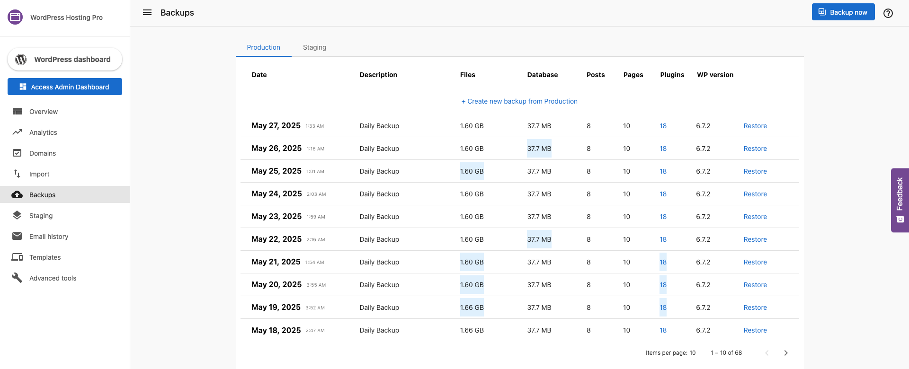

The WordPress Hosting Pro Dashboard offers a robust backup system, empowering users to protect their digital assets efficiently. This article delves into the mechanics of creating backups from the Website Pro Dashboard, highlighting its importance and providing a straightforward, step-by-step guide.

**How Automated and Manual Backups Work**: The WordPress Hosting Pro Dashboard is equipped with a dual-layered backup system for unparalleled security:

**Automated Daily Backups**: The platform diligently creates backups for all websites on a daily basis, ensuring that your latest updates are safeguarded without requiring manual intervention.  
**Manual Backup Capability**: For instances where immediate backup is crucial, users have the flexibility to generate backups at any time, providing an additional layer of control and peace of mind.  
**Backup Retention Policy**: Understanding the varying needs of its users, the platform offers tiered backup retention periods:

*   **WordPress Hosting Pro Accounts**: Enjoy extended security with backups retained for up to 60 days, ideal for comprehensive project tracking and risk management.
*   **WordPress Hosting Standard Accounts**: While still offering the essential safeguard, backups are retained for 1 day, emphasizing the importance of proactive management for these users.

### How does it work?

Users can create a new backup of their live site at any time from the Backups tab. Click on the Backups Tab. Click on **Create a new backup from Production** or **Backup Now** to create a backup of the live/production site.

**Initiate the Backup Process**: Within the Backups Tab, you will have two primary options:

*   Create a new backup from Production: Ideal for capturing the current state of your live site. -
*   Backup Now: Instantly generates a backup of your live/production site, ensuring any recent changes are secured.