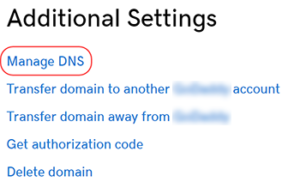

This guide provides GoDaddy-specific instructions for connecting your domain to WordPress Hosting, whether you're setting up a new domain or transferring one from another host.

## For New GoDaddy Domains

If you recently purchased your domain from GoDaddy (or it has never been pointed to a site), follow these instructions.

### Part 1: DNS Settings in GoDaddy

1. In GoDaddy, go to **Domains > All Domains**.
2. Select your domain and go to **Manage DNS**.
3. Under **Records**:
   * Add an **A Record** for `@` that points to `34.149.86.124`.
   * Add a **CNAME Record** for `www` that points to `host.websiteprohosting.com`.
4. Click **Save**.
5. Allow up to 24 hours for all changes to take full effect. During this time your old host may still be serving your site's traffic. You can check on the status of your DNS Settings using tools like [MxToolbox DNS Lookup](https://mxtoolbox.com/DNSLookup.aspx) or viewing the **Domains** tab in WordPress Hosting **Pro.**

:::tip
Flush Google's DNS cache for faster propagation: [Google DNS Cache Flush Tool](https://developers.google.com/speed/public-dns/cache)
:::

### Part 2: Connect Domain in WordPress Hosting Pro

1. Log into WordPress Hosting **Pro** and go to the **Domains** tab.
2. Click **Connect a Domain** and enter your domain.
3. Wait a few minutes for the domain to show as "Connected."
4. If needed, disable **Redirect to HTTPS** temporarily while the SSL certificate is provisioning. Remember to re-enable it once secure.
5. Click **Make Primary** on the domain that you want all your visitors to be redirected to.

For general instructions on connecting new domains (not GoDaddy-specific), see [Point a new Domain to WordPress Hosting](point-a-new-domain-to-wordpress-hosting.md).

## For GoDaddy Domains Being Transferred from Another Host

If your domain is currently pointing to a site on another host, follow these instructions to transfer it with zero downtime.

### Part 1: Configuring your WordPress Hosting Site

1. Log into WordPress Hosting Pro and navigate to the **Domains** tab.
2. Click **Connect a Domain.**
3. Enter the domain name. Click **Add Domain.**
4. Your domain will show up in the table and it will be marked **pending** while WordPress Hosting gets ready to handle requests on that domain (this should take a minute).
5. When it can handle requests on that domain it will appear **disconnected** because WordPress Hosting can detect that your DNS records have not been updated. Once you follow the steps in Part 2 it should become **connected**.
   * Your SSL Certificate will also be **pending** at this point. Once the domain is **connected** it takes several more minutes to obtain an SSL Certificate.
6. Expand **Advanced Settings** and disable **Redirect to HTTPS** temporarily (Part 3 will enable it again). _It is very important to re-enable this setting_ because serving traffic on **HTTPS** is much safer and it improves your site's ranking in Search Engines.
7. Click **Make Primary** on the domain that you want all your visitors to be redirected to from the alternate domains.

### Part 2: Editing your DNS settings on GoDaddy

1. On GoDaddy, go to **Domains > All Domains.**
2. Select your domain name from the list to access the **Domain Settings** page.
3. Scroll down to **Additional Settings** and select **Manage DNS.**

4. On the **DNS Management** page, find the **Records** section.
5. Click the pencil icon at the right side of the row with the **Name** **"@"**, make sure it is an **"A"** record, and change the value to be _**34.149.86.124.**_
6. If you have a **www** record click the pencil icon at the right side of the row with the **Name** **"www"**, make sure it is a **"CNAME"** record, and change the value to _**[host.websiteprohosting.com](http://host.websiteprohosting.com/)**_
7. Click **Save** to complete the process.
8. To encourage the DNS system on the internet to update quickly you can flush Google's DNS cache using their [Google Public DNS Flush Cache](https://developers.google.com/speed/public-dns/cache) tool.
9. Allow up to 24 hours for all changes to take full effect. During this time your old host may still be serving your site's traffic. You can check on the status of your DNS Settings using tools like [MxToolbox DNS Lookup](https://mxtoolbox.com/DNSLookup.aspx) or viewing the **Domains** tab in WordPress Hosting**.

### Part 3: Finalizing your WordPress Hosting Configuration

_It is very important to re-enable this setting_ because serving traffic on **HTTPS** is much safer and it improves your site's ranking in Search Engines.

1. Log into WordPress Hosting and navigate to the **Domains** tab.
2. Expand **Advanced Settings.**
3. Enable **Redirect to HTTPS.**

## Other Domain Registrars

If you purchased your domain from Namecheap or another registrar, the process is similar. You need to log in to your registrar's dashboard and update the DNS records (A Record or CNAME) to point to the values provided in the WordPress Hosting dashboard:

* **A Record**: `@` → `34.149.86.124`
* **CNAME Record**: `www` → `host.websiteprohosting.com`

For general domain connection instructions, see [Connect a Custom Domain](connect-a-custom-domain.md).

## Frequently Asked Questions (FAQs)

How do I find the DNS management page in GoDaddy?

In GoDaddy, navigate to **Domains > All Domains**, then select your domain. Scroll down to **Additional Settings** and click **Manage DNS**. This will take you to the DNS Management page where you can edit your A and CNAME records.

What if I can't find the @ record in GoDaddy?

In GoDaddy, the root domain record may appear as `@` or as your domain name (e.g., `example.com`). Look for an A record with the Name field showing either `@` or your domain name. If you don't see one, you can add a new A record with `@` as the name.

Do I need to disable HTTPS redirect during setup?

For domains being transferred from another host, it's recommended to temporarily disable **Redirect to HTTPS** in WordPress Hosting Pro's Advanced Settings while the SSL certificate is provisioning. This prevents potential connection issues during the transition. Once your domain shows as "Connected" and SSL is active, re-enable the HTTPS redirect.

How long does it take for GoDaddy DNS changes to take effect?

DNS changes in GoDaddy typically take a few minutes to several hours to propagate. It can take up to 24 hours for changes to fully propagate across all internet service providers. You can check propagation status using tools like [MxToolbox DNS Lookup](https://mxtoolbox.com/DNSLookup.aspx) or by monitoring the Domains tab in WordPress Hosting Pro.

Can I use GoDaddy's nameservers with WordPress Hosting?

Yes, you can use GoDaddy's nameservers. The DNS records (A and CNAME) need to be configured in GoDaddy's DNS Management interface, regardless of which nameservers you're using. As long as your DNS records point to WordPress Hosting's IP address (`34.149.86.124`) and CNAME (`host.websiteprohosting.com`), your domain will connect properly.

