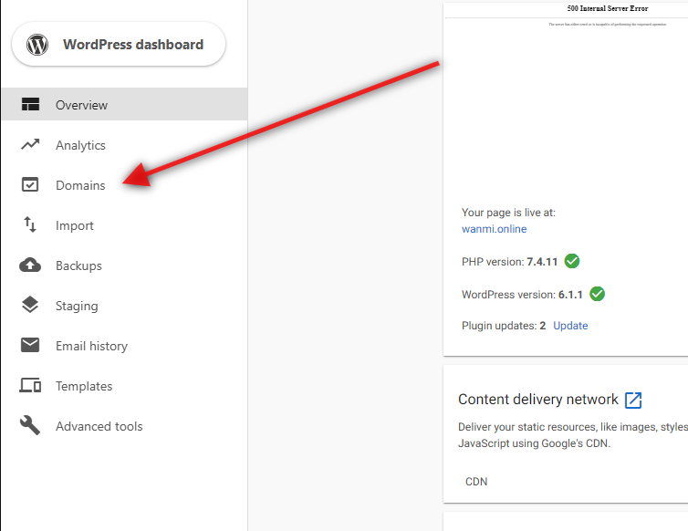

The preferred URL or domain can be set from the domains tab of WordPress Hosting.

Select the _**Make Primary**_ button next to the domain you want to use. This will make it so that when the site is accessed from any of its connected domains, the user is redirected to your primary one.

The current primary domain will be indicated by _**Primary**_. 

