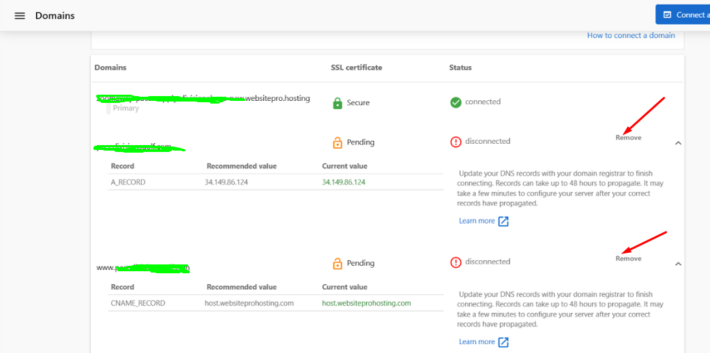
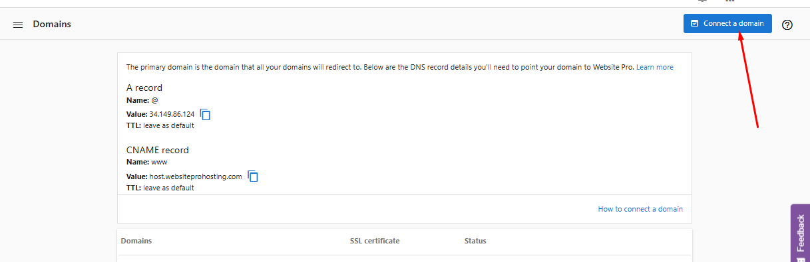

If you have correctly added the following A and CNAME records in your domain’s DNS settings, follow the steps below to connect SSL to your custom domain.

### Required DNS Records

**A Record**

*   **Name:** @
*   **Value:** 34.149.86.124
*   **TTL:** Leave as default

**CNAME Record**

*   **Name:** www
*   **Value:** host.websiteprohosting.com
*   **TTL:** Leave as default

For detailed information on configuring DNS records, see [Understanding DNS Records](understanding-dns-records.md).

### Step 1: Reconnect Your Domain

If the DNS records are configured correctly but the SSL status still shows as “Pending,” remove the domain and reconnect it. This action restarts the automatic SSL generation process.

  

### Step 2: Wait for SSL Activation

After reconnecting the domain, allow up to **30 minutes** for the SSL certificate to be issued and installed.****

### Notes

*   Ensure only **one A record** exists, pointing to WordPress Hosting Pro’s IP (**34.149.86.124**).
*   There should be **no AAAA record** in the DNS settings.

If the issue persists, contact Support via **chat** or **email at support@vendasta.com** for further assistance.

## Frequently Asked Questions

How long does it take for an SSL certificate to be issued?

After your domain is connected and DNS records are properly configured, SSL certificate provisioning typically takes up to 30 minutes. The certificate is automatically issued by Let's Encrypt once WordPress Hosting Pro detects your domain is properly connected.

What should I do if SSL stays "Pending" for more than 30 minutes?

If your SSL certificate remains in "Pending" status for more than 30 minutes, try disconnecting and reconnecting your domain in WordPress Hosting Pro. This restarts the SSL certificate provisioning process. Also verify that your DNS records are correctly configured and have propagated.

Can I have multiple A records for my domain?

No, you should only have one A record pointing to WordPress Hosting Pro's IP address (`34.149.86.124`). Multiple A records can cause SSL certificate provisioning issues and connection problems. Remove any duplicate or conflicting A records.

What is an AAAA record and should I have one?

An AAAA record is used for IPv6 addresses. WordPress Hosting Pro does not support IPv6, so you should not have an AAAA record in your DNS settings. If you have one, remove it, as it may interfere with SSL certificate provisioning and domain connection.

My SSL certificate was working but now shows as "Not Secure" - what happened?

If your SSL certificate was working but now shows as insecure, it may have expired or been revoked. WordPress Hosting Pro automatically renews Let's Encrypt certificates, but if there's an issue, try disconnecting and reconnecting your domain to trigger a new certificate request. Also check that your DNS records haven't changed.

