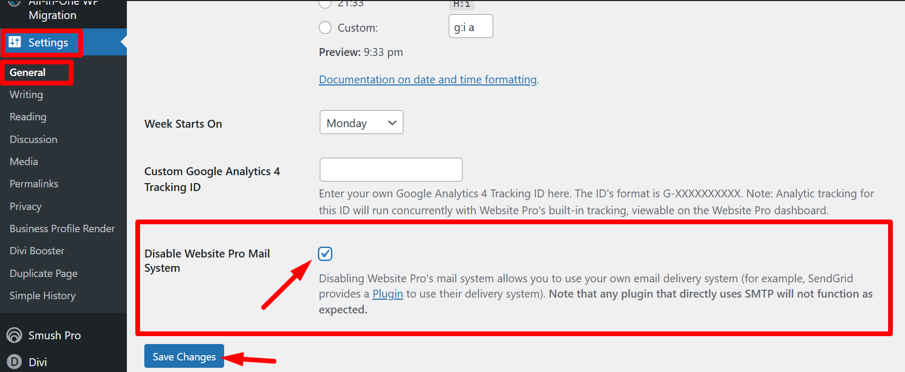

## Email statuses

When reviewing emails in the Activity section, you'll see the following statuses:

| Status | Meaning |
|--------|---------|
| **Processed** | The email has been accepted by the system. This is a combined status covering both delivered and bounced emails. |
| **Delivered** | The email was successfully delivered to the recipient's inbox. |
| **Bounced** | The email could not be delivered — usually due to an invalid email address or a full mailbox. |
| **Opened** | The recipient opened the email. |
| **Clicked Through** | The recipient clicked a link within the email. |
| **Spam Report** | The recipient marked the email as spam. This can negatively affect your sender reputation. |
| **Unsubscribed** | The recipient opted out of receiving future emails. See below for important details. |
| **Dropped** | The email was not sent due to prior bounces, unsubscribes, spam reports, or invalid addresses. |
| **Deferred** | The receiving server temporarily limited access. The system retries delivery for up to 72 hours. If still deferred after 72 hours, the deferral becomes a block. |

## Understanding unsubscribed emails

WordPress Hosting contact form submissions are classified as **transactional emails**. Transactional emails cannot be unsubscribed from — this prevents the loss of leads and ensures you receive every contact form submission.

If a recipient unsubscribes from other WordPress-generated emails (such as notifications or marketing emails), they can resubscribe using the same link in the original email. If they need further help managing their email preferences, direct them to your account administrator. For more information on how email preferences work, see [Email Subscription Preferences](../../business-app/administration/email/email-subscription-preferences.md).

## No email logs showing

If you don't see any logs under the Email History tab, your site is likely configured to use an external SMTP plugin (such as WP Mail SMTP) instead of the built-in mail system. When an external SMTP service handles email delivery, WordPress Hosting cannot capture or log those emails.

### How to enable the built-in mail system

1. Log in to the **WordPress Dashboard** for your site
2. Navigate to **Settings > General**
3. Locate the **Enable WordPress Hosting Mail System** option and check the box
4. Click **Save Changes**

Once enabled, all outgoing emails will be routed through the built-in email system and appear in the Email History tab.

## Deferred emails

A deferred status means the receiving server temporarily limited access — similar to a busy signal. Common reasons include:

* The inbox provider is seeing too many spam complaints for email that has already been delivered
* The receiving server is experiencing technical issues

The built-in email system automatically retries delivery for up to **72 hours**. If the message is still deferred after that period, the deferral becomes a **block**. Otherwise, it results in a successful delivery once the receiving server accepts the message.

## Frequently Asked Questions (FAQs)

Does WordPress Hosting require an SPF record?

No, an SPF record is **not required** to connect or launch a site with WordPress Hosting.

The only DNS records you need are:

* **A Record** — Name: `@` or your domain name, Value: `34.149.86.124`
* **CNAME Record** — Name: `www`, Value: `host.websiteprohosting.com`

If you're sending emails using your own custom domain and want to improve deliverability, you may optionally configure SPF, DKIM, and DMARC records, but they are not required by default.

Why are emails bouncing after I migrated my website?

This is often caused by missing email domain settings during the migration process.

**To fix:**

1. Go to your site's **WordPress Dashboard**
2. Navigate to **Plugins > Add New**
3. Search for and install **All-in-One WP Migration**
4. After activation, go to the plugin's menu and choose **Export > Advanced Options**
5. Select **"Do not replace email domain (SQL)"**

This prevents the migration tool from incorrectly rewriting email addresses, which is a common cause of bounced messages after import.

Can I use my own SMTP service instead of the built-in mail system?

Yes. You can use an external SMTP plugin (like WP Mail SMTP) to route emails through your own provider (e.g., Gmail, Mailgun, Amazon SES). However, emails sent through external SMTP services will **not** appear in the Email History tab — only emails routed through the built-in email system are logged.

How do I send emails on WordPress Hosting Premium (Multisite)?

WordPress Hosting Premium does not include a built-in mail system. You need to configure a custom SMTP service (such as WP Mail SMTP with Gmail, Mailgun, or Amazon SES) on each site in your Multisite network to send and deliver emails.

