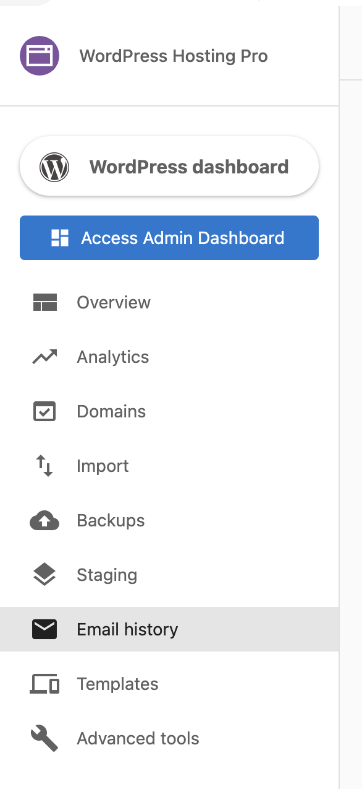
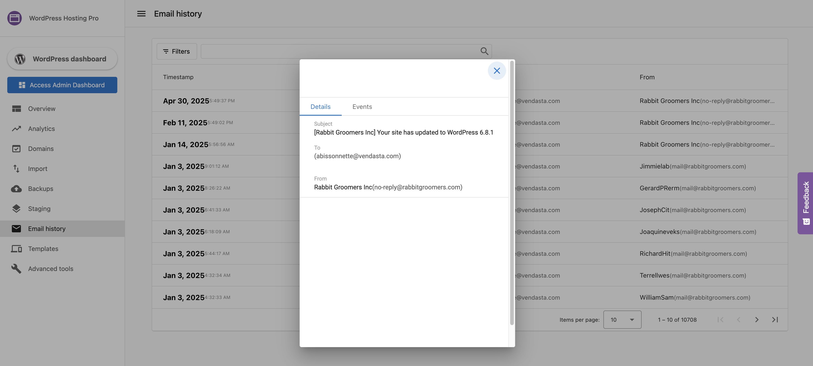

You can now understand the deliverability of outgoing emails sent through WordPress Hosting with the **Email History** feature. This centralized location allows all users to see details of all outgoing emails such as their delivery status and the time sent. To protect privacy, the actual content of emails is not visible to all users; clients can see their own email content. 

Emails being sent through a user's website are usually automatically triggered when a customer fills out a contact form or expresses interest by providing their email address somewhere on the site. These outgoing emails will now be displayed in the Email History tab. 

_Note: A user is not able to send or respond to emails via the Email history tab._ 

### How does Email History work?

To see any emails that have been sent, a user will enter the WordPress Hosting product and navigate to the **Email History** tab. 

They will now see a list of all the emails that have been delivered via their site. A user can click on a specific email to get more information about it. 

_Note: This screenshot is what a Partner Admin user would see._

## Frequently Asked Questions

Does WordPress Hosting Pro require an SPF record?

No, an SPF record is **not required** to connect or launch a site with WordPress Hosting Pro.

The only DNS records you need are:

* **A Record**
  * Name: `@` or your domain name
  * Value: `34.149.86.124`
* **CNAME Record**
  * Name: `www`
  * Value: `host.websiteprohosting.com`

> DNS changes may cause brief downtime during propagation.

If you're sending emails using your own custom domain, and want to improve deliverability, you may optionally configure SPF, DKIM, and DMARC records, but WordPress Hosting Pro does not require them by default.

Why are emails bouncing after I migrated my website?

This is often due to missing email domain settings during the migration process.

**To fix:**

1. Go to your site's **WordPress Dashboard** in WordPress Hosting Pro
2. Navigate to **Plugins > Add New**
3. Search for and install **All-in-One WP Migration**
4. After activation, go to the plugin's menu and choose **Export > Advanced Options**
5. Make sure to select **"Do not replace email domain (SQL)"**

This prevents the migration tool from incorrectly rewriting email addresses which is a common cause of bounced messages after import.

> Bonus Tip: If needed, you can export your site manually using the **File** option in the plugin to keep a local copy.

