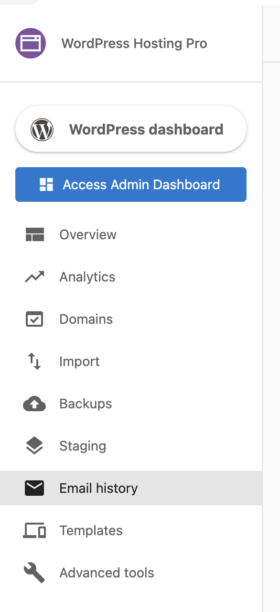
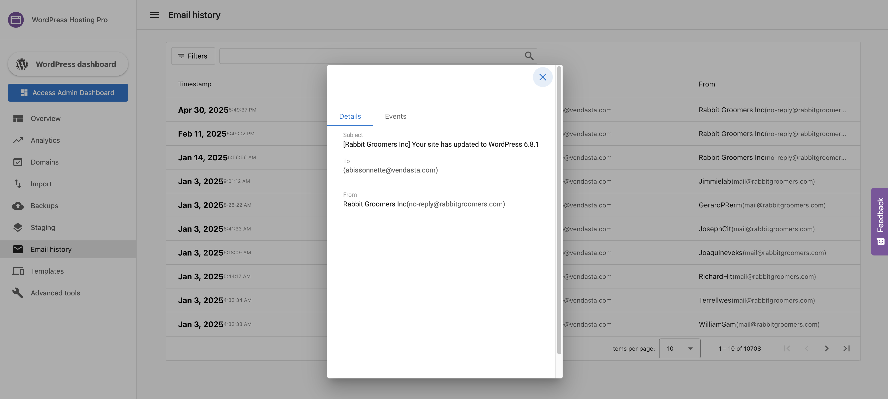

Email History provides a centralized view of all outgoing emails sent from your website. You can track delivery status, identify issues, and monitor email performance — all from the **Email History** tab in your dashboard.

:::info Single-site only
WordPress Hosting Pro includes a **built-in email system** to send and track emails for single-site installations. **WordPress Hosting Premium (Multisite) does not include built-in email infrastructure** — Multisite users need to configure a custom SMTP service to send and deliver emails.
:::

## How it works

Emails are automatically triggered when someone fills out a contact form or submits their email address on your site. These outgoing emails are routed through the built-in email system and logged in the **Email History** tab.

1. Navigate to the **Email History** tab in your WordPress Hosting Pro dashboard
2. View the list of all emails sent from your site with their delivery status
3. Click on any email to see detailed delivery information

:::important
You cannot send or reply to emails from the Email History tab. This feature is for viewing and tracking outgoing emails only.
:::

## What's included

- **[Email Delivery and Troubleshooting](./email-delivery-and-troubleshooting.md)** — Email statuses explained, unsubscribe behavior, fixing missing logs, deferred emails, and FAQs
