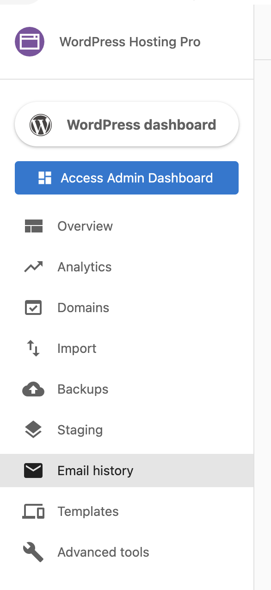

Email History provides a centralized location to track and troubleshoot outgoing emails sent through your WordPress site. This feature allows you to see details of all outgoing emails such as their delivery status and the time sent, helping you monitor email deliverability and identify issues. To protect privacy, the actual content of emails is not visible to all users; you can see your own email content.

## Why use Email History?

Email History helps you:

* **Monitor email deliverability** - Track whether emails are successfully reaching recipients
* **Troubleshoot delivery issues** - Identify bounced, deferred, or failed emails
* **Understand email performance** - See which emails are opened, clicked, or marked as spam
* **Debug contact form issues** - Verify that contact form submissions are sending emails correctly
* **Maintain email reputation** - Monitor spam reports and unsubscribes to protect your sender reputation

## What's included

* **[Email Status](./email-status-in-email-history.md)** - Understand different email statuses and what they mean
* **[Deferred Status](./emails-failing-with-a-deferred-status.md)** - Troubleshoot emails that are being deferred by receiving servers
* **[No Email Logs Showing](./why-are-no-email-logs-showing-in-the-email-history.md)** - Fix missing email logs and enable WordPress Hosting Pro's mail system

## Get started

1. **Log into WordPress Hosting Pro** - Access your WordPress Hosting dashboard
2. **Navigate to Email History** - Click on the **Email History** tab
3. **View email list** - See all emails sent from your site with their delivery status
4. **Click on an email** - View detailed information about any specific email's delivery status

:::important
A user is not able to send or respond to emails via the Email History tab. This feature is for viewing and tracking outgoing emails only.
:::

## How Email History works

Emails being sent through your website are usually automatically triggered when a customer fills out a contact form or expresses interest by providing their email address somewhere on your site. These outgoing emails are displayed in the Email History tab.

To see any emails that have been sent, navigate to the **Email History** tab in WordPress Hosting Pro.

You will see a list of all the emails that have been delivered via your site. Click on a specific email to get more information about it.

## Frequently Asked Questions (FAQs)

Does WordPress Hosting Pro require an SPF record?

No, an SPF record is **not required** to connect or launch a site with WordPress Hosting Pro.

The only DNS records you need are:

* **A Record**
  * Name: `@` or your domain name
  * Value: `34.149.86.124`
* **CNAME Record**
  * Name: `www`
  * Value: `host.websiteprohosting.com`

> DNS changes may cause brief downtime during propagation.

If you're sending emails using your own custom domain, and want to improve deliverability, you may optionally configure SPF, DKIM, and DMARC records, but WordPress Hosting Pro does not require them by default.

Why are emails bouncing after I migrated my website?

This is often due to missing email domain settings during the migration process.

**To fix:**

1. Go to your site's **WordPress Dashboard** in WordPress Hosting Pro
2. Navigate to **Plugins > Add New**
3. Search for and install **All-in-One WP Migration**
4. After activation, go to the plugin's menu and choose **Export > Advanced Options**
5. Make sure to select **"Do not replace email domain (SQL)"**

This prevents the migration tool from incorrectly rewriting email addresses which is a common cause of bounced messages after import.

> Bonus Tip: If needed, you can export your site manually using the **File** option in the plugin to keep a local copy.

