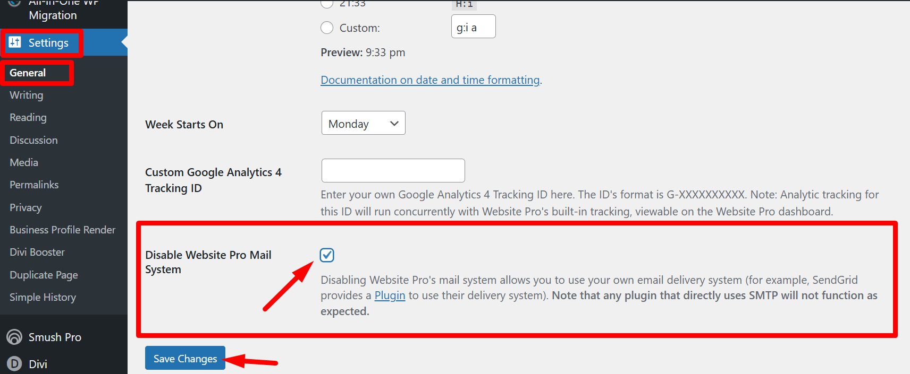

If you do not see any email logs under the **Email History** tab in WordPress Hosting Pro, it is likely because your website is configured to use an external SMTP service (like WP MAIL SMTP) to send emails. When external SMTP services are used, WordPress Hosting Pro cannot capture and log these emails.

### How to enable WordPress Hosting Pro's built-in mail system

To ensure email logs appear under the **Email History** tab, you can switch to using WordPress Hosting Pro's built-in SendGrid mail system. Follow these steps:

1. **Log in to the WordPress Dashboard**  
   Access the WordPress admin dashboard for your website.

2. **Navigate to General Settings**  
   From the left menu, click **Settings** > **General**.

3. **Enable WordPress Hosting Pro Mail System**  
   Locate the option to **Enable WordPress Hosting Pro Mail System** and check the box.

4. **Save Changes**  
   Click the **Save Changes** button to apply the new settings.

### Benefits of using WordPress Hosting Pro mail system

* Automatic logging of emails sent from your website.
* Simplified management of email logs via WordPress Hosting Pro.

