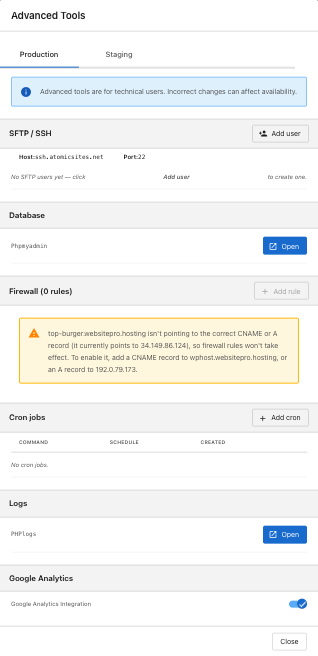

**Advanced Tools** give you direct access to your site's filesystem, database, firewall, scheduled tasks, and PHP error logs. These tools are for developers and technical users — incorrect changes can affect site availability.

## What you can do

The panel has separate **Production** and **Staging** tabs. Firewall rules are production-only; everything else is available in both.

| Section | What it's for |
| --- | --- |
| **SFTP / SSH** | File access for developers. Add users with their own credentials. |
| **Database** | Open phpMyAdmin to browse and edit the WordPress database. |
| **Firewall** | Block unwanted traffic by IP, range, or pattern. |
| **Cron jobs** | Schedule recurring tasks on your server. |
| **Logs** | View and download PHP error logs. |
| **Google Analytics** | Toggle built-in Google Analytics integration. |

## SFTP / SSH

Connect with any SFTP client using the **Host** and **Port** shown in the panel. Click **+ Add user** to create credentials for each developer who needs access; click **Reset** to rotate a user's password, and the delete icon to revoke access.

## Database (phpMyAdmin)

Click **Open** next to **Phpmyadmin** to manage your WordPress database directly.

:::caution
Editing the database can break your site. Back up before changes, and only run queries you understand.
:::

## Firewall rules

Block specific IPs or patterns to stop bots, scrapers, or abusive traffic. Click **+ Add rule** to create a rule; the delete icon to remove one.

If the panel shows a banner that your domain isn't pointing to the correct A or CNAME record, firewall rules won't take effect until DNS is updated. See [Domains and SSL](./domains-and-ssl) for the recommended values.

## Cron jobs

Schedule recurring tasks — queue processing, report generation, cleanup. Each job has a **Command**, **Schedule** (cron expression), and **Created** date. If you're not familiar with cron syntax, ask your developer.

## PHP error logs

Click **Open** next to **PHPlogs** to view recent PHP errors and warnings, with the most recent first. Use **Refresh** to pull the latest, or **Download** to save the log to your computer.

## Google Analytics integration

A built-in Google Analytics integration is available as a toggle. Turn it on for default analytics, or use [Web Analytics](./web-analytics) to connect your own GA4 property.

:::tip
When in doubt, test on [staging](./staging) before changing production.
:::
