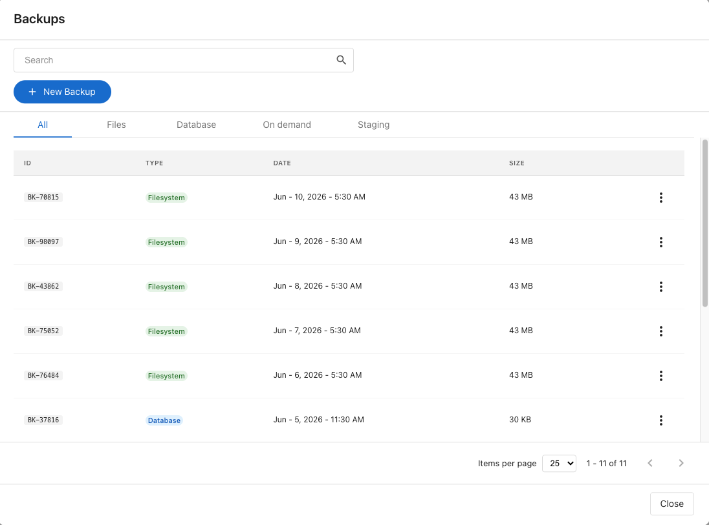

**Backups** protect your site. With a recent backup you can roll back from a bad plugin update, a broken theme change, or a content mistake in minutes. Backups run automatically every day; you can also create one on demand before making a significant change.

## What you see

- **Backup count** and **Last:** timestamp on the dashboard card.
- Filter tabs in the panel: **All**, **Files**, **Database**, **On demand**, **Staging**.
- Each row shows the backup **ID**, **Type**, **Date**, and **Size**.

## Create an on-demand backup

Click **+ New Backup** at the top of the panel. The backup runs in the background and appears in the **On demand** tab in a few minutes.

Run an on-demand backup before:

- Installing or updating a major plugin or theme.
- Updating WordPress core.
- Pushing changes from staging to production.

## Restore from a backup

1. Find the backup in the list.
2. Click the actions menu (the three dots) and choose **Restore**.
3. Confirm.

The restore takes several minutes. When it completes, your site is running from the chosen backup.

:::caution
Restoring overwrites the current state of your site. Anything created or changed after the backup will be lost. If unsure, create a fresh on-demand backup first so you can roll forward again.
:::

## Download a backup

Click the actions menu on a backup's row and choose **Download** to save a copy to your computer. Useful before deleting an on-demand backup you might want later.

## Delete a backup

Only **on-demand** backups can be deleted. Automatic backups follow a fixed retention schedule and can't be removed manually.

To delete: open the actions menu on an on-demand backup and choose **Delete**.

## Backup retention

Backups are kept on a **30-day rolling window**. Each day, a new backup is created and the oldest one falls off the list, so you always have the last 30 days available.

### Sites created before June 2026

If your site was created before June 2026, your older backups are being migrated to the current infrastructure. During this migration:

- Backups older than 60 days are brought over from the previous system in addition to the regular 30-day window.
- Each day that passes, one of those migrated backups ages out, so the older end of your backup history shrinks by one backup per day.
- Once the migration period ends, retention settles into the standard 30-day rolling window described above.

Download any backup you want to keep permanently — once it ages out of retention, it can't be recovered.

## FAQs

What's the difference between Files and Database backups?

**Files** back up your themes, plugins, uploads, and other site files. **Database** backs up your WordPress database — posts, settings, users. A full restore uses both from around the same time, which the restore flow handles for you.

The restore is taking longer than expected

Large sites can take a while to restore. The backups list shows the current status — check back in a few minutes.

