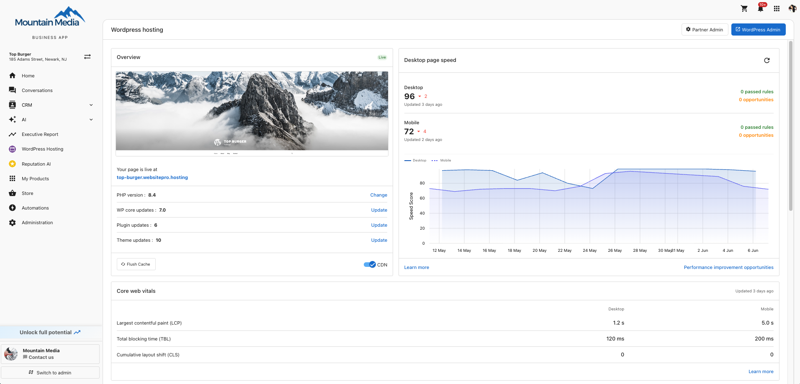

**Core web vitals** are Google's measurements of the experience real visitors get on your site. Strong scores help with search rankings and reduce the chance that visitors leave before your page finishes loading.

## What you see

The card has three rows, one per metric, with separate values for **Desktop** and **Mobile**. Color coding tells you at a glance how each metric is doing.

| Metric | What it measures | Good |
| --- | --- | --- |
| **LCP** — Largest Contentful Paint | How quickly your main content appears on screen | Under 2.5 seconds |
| **TBT** — Total Blocking Time | How long the page is unresponsive to clicks while loading | Under 200 ms |
| **CLS** — Cumulative Layout Shift | How much elements jump around as the page loads | Under 0.1 |

## When a score is poor

- **Slow LCP** — Compress hero images, enable the [CDN](./dashboard-overview), or upgrade to a faster PHP version.
- **High TBT** — Remove or defer heavy third-party scripts (chat widgets, marketing tags).
- **High CLS** — Set explicit width and height on images, reserve space for ads and embeds.

For specific, prioritized fixes, open **Performance improvement opportunities** from the [Performance](./page-speed) card.

:::tip
Core Web Vitals are part of Google's search ranking signals. Improving them often improves both search visibility and conversion.
:::
