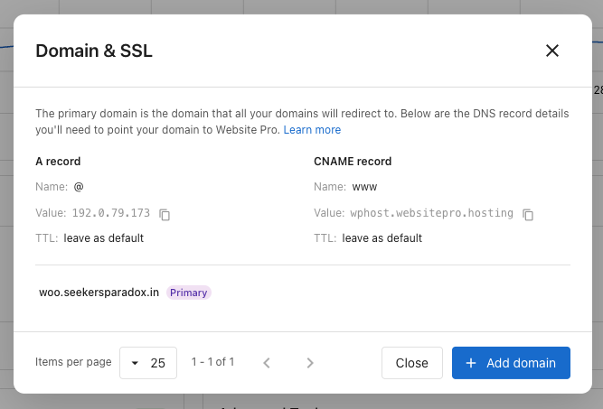
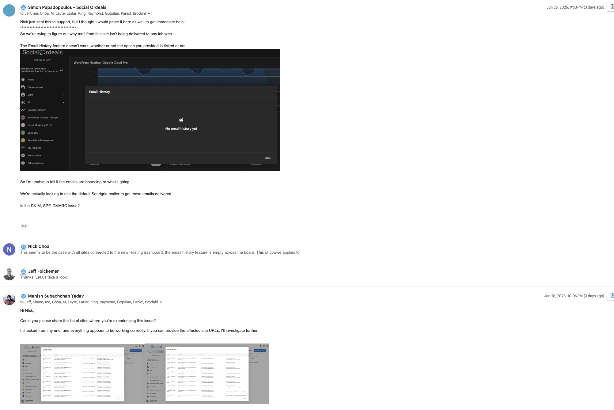

The **Domain & SSL** panel is where you connect a custom domain to your site, monitor SSL certificates, and choose which domain visitors see in their browser. The primary domain is the one all your other connected domains redirect to.

## Add a new domain

Always copy the DNS values from **your own Domain & SSL panel** — they are the source of truth. The records below are a sample of what you'll see.

:::info
The **A record value can vary slightly by site** — the last three numbers may differ. Always use the value shown in your dashboard, not the sample here. The CNAME value is the same for everyone.
:::

At your DNS provider, add these two records:

| Record | Name | Value | TTL |
| --- | --- | --- | --- |
| **A** (root domain) | `@` | `192.0.79.173` *(sample — check your panel)* | Leave as default |
| **CNAME** (`www` subdomain) | `www` | `wphost.websitepro.hosting` | Leave as default |

Then click **+ Add domain** in the panel, enter the domain, and confirm. SSL is issued automatically once DNS propagates — usually within an hour, occasionally up to 48 hours.

## Verify a domain that was used elsewhere

If the domain you're adding has been associated with another WordPress host in the past, the add will fail with a message like:

> **example.com points to another host. Add this TXT record to verify ownership, then retry.**

This is a privacy safeguard — only the owner of the domain can release it. The panel surfaces the TXT record you need to add at your DNS provider to prove ownership.

To complete verification:

1. Copy the **TXT record name** and **value** shown in the verification banner. Each field has a copy icon.
2. At your DNS provider, add a **TXT** record using those exact values. Leave the TTL at its default.
3. Wait for DNS to propagate. This usually takes a few minutes but can occasionally take longer.
4. Back in the panel, click **Verify and retry**.

Once verification succeeds, the domain finishes being added and SSL is issued automatically. You can leave the TXT record in place — it doesn't affect your site once verification is complete.

:::tip
If you remember which host the domain was previously connected to, an alternative is to remove the domain mapping there first. Be careful not to cancel the domain registration itself — only detach the domain from the old host.
:::

## Existing domains keep working

Domains that are already connected and serving your site don't need any change. Older A record IPs and CNAME targets continue to work through our proxy.

You only need the new values when:

- **You're adding a fresh domain** — new domains must point to the new A record and CNAME shown in your panel. The legacy values won't accept new connections.
- **You want firewall rules, the latest performance tuning, or SSL automation on an existing domain** — update it to the new values during a maintenance window.

## Legacy DNS values (existing sites only)

For reference when checking an existing setup. **Do not use these values for any new domain** — they only continue to serve sites that were already pointing to them.

**Legacy A record IPs:**

| IP |
| --- |
| `34.149.86.124` |
| `104.154.100.138` |
| `35.227.228.214` |

**Legacy CNAME targets (for `www`):**

| Value |
| --- |
| `host.websiteprohosting.com` |
| `host.websitepro.hosting` |

## Primary domain

The primary domain is the address all your other connected domains redirect to, marked with a purple **Primary** badge. To switch:

1. Make sure the target domain shows **Secure** SSL status.
2. Click **Make primary** on its row.
3. Confirm.

## SSL status

Each non-primary domain shows its SSL state:

- **Secure** — Certificate is valid and active.
- **Pending** — Certificate is being issued. Completes within an hour of DNS propagating.
- **Expired** — Certificate has expired. Check that DNS still points correctly.
- **Issue detected** — Something is blocking issuance. Expand the row to see the current DNS value.

## Remove a domain

Click **Remove** on the domain's row and confirm. Removing disconnects the domain and revokes its SSL. This cannot be undone.

## Troubleshooting

SSL stays Pending for hours

DNS may not have propagated everywhere yet. Use a tool like [dnschecker.org](https://dnschecker.org) to confirm your records match the values in your panel worldwide. SSL usually issues within an hour after global propagation.

Site loads on www but not the root domain (or vice versa)

One of the two DNS records is missing. Add both the A record (`@`) and the CNAME (`www`).

I added a new domain pointing to the legacy IP and it isn't connecting

The legacy A record IPs and CNAME targets only continue to serve sites that were already pointing to them. New domains must use the values in your Domain & SSL panel. Update your DNS to the new A record value shown there.

Visitors land on the wrong domain

Check which domain is marked **Primary**. Promote the correct one with **Make primary**.

Verify and retry keeps failing after I added the TXT record

DNS propagation can take a few minutes to a few hours. Use [dnschecker.org](https://dnschecker.org) and look up the TXT record for your domain — once the value you added shows up worldwide, **Verify and retry** will succeed. If the TXT record is correct globally but verification still fails after a few hours, contact support.

