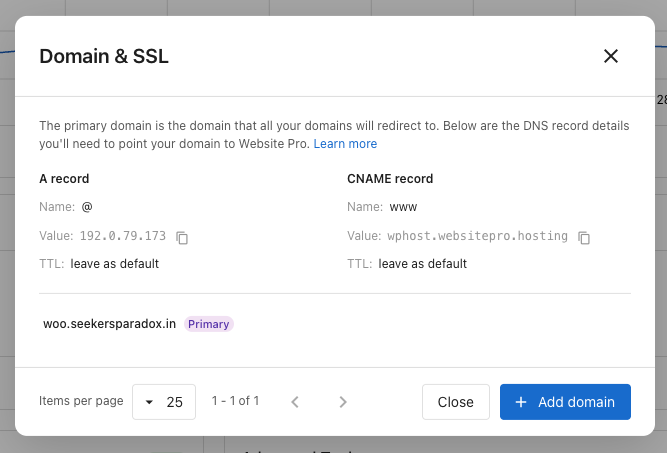
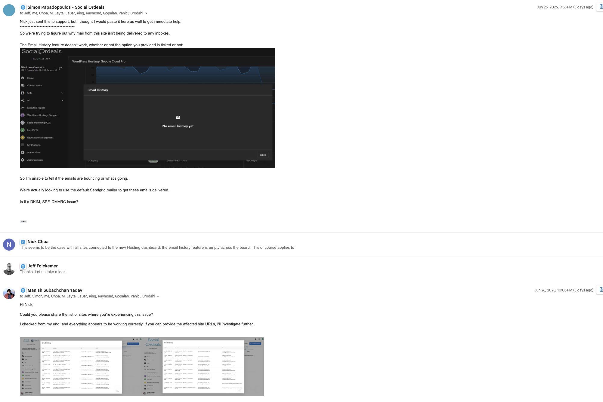
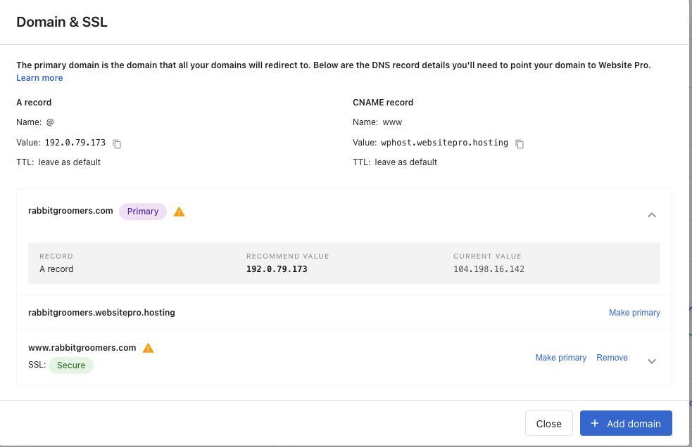

The **Domain & SSL** panel is where you connect a custom domain to your site, monitor SSL certificates, and choose which domain visitors see in their browser. The primary domain is the one all your other connected domains redirect to.

## Add a new domain

Always copy the DNS values from **your own Domain & SSL panel**. They are the source of truth. The records below are a sample of what you'll see.

:::info
**Both values vary by site.** The A record and the CNAME below are samples. Always use the values shown in your own dashboard.
:::

At your DNS provider, add these two records:

| Record | Name | Value | TTL |
| --- | --- | --- | --- |
| **A** (root domain) | `@` | `192.0.79.173` *(sample, check your panel)* | Leave as default |
| **CNAME** (`www` subdomain) | `www` | `wphost.websitepro.hosting` *(sample, check your panel)* | Leave as default |

Then click **+ Add domain** in the panel, enter the domain, and confirm. SSL is issued automatically once DNS propagates, usually within an hour and occasionally up to 48 hours.

## Verify domain ownership

Occasionally, when you add a domain that's been used somewhere before, the panel asks for one extra step, a one-time TXT record at your DNS provider:

1. Copy the **TXT record name** and **value** from the banner. Each has a copy icon.
2. Add a **TXT** record at your DNS provider with those exact values. Leave the TTL at its default.
3. Click **Verify and retry**. If you see *Not verified yet. DNS changes take a few minutes. Try again shortly*, wait a couple of minutes and click again.

You can leave the TXT record in place after verification. It doesn't affect your site.

## Point your domain to finish your upgrade

If a notice at the top of your WordPress Hosting dashboard asks you to point your domain, one or more of your connected domains is not yet using the recommended DNS records.

Pointing your domain directly gives your site:

- **Faster page loads**
- **Stronger uptime**
- **Better security protection**

The notice covers your primary domain and any other domains connected to the site. Click **Update your DNS** to open the Domain & SSL panel and see which ones need attention.

### Check where your domain points

In the **Domain & SSL** panel, a warning triangle marks each domain that needs updating. Expand the row to compare its **Current value** against the **Recommend value**.

You need to update a domain when its current value is one of these addresses:

| Current value |
| --- |
| `34.149.86.124` |
| `104.154.100.138` |
| `35.227.228.214` |
| `104.198.16.142` |

A domain pointing anywhere else outside your panel's recommended values, such as an old host, a website builder, or a CDN, also needs updating.

### Update the records

At your DNS provider, change the records to the values shown in your **Domain & SSL** panel:

- Your **root domain**, such as `yoursite.com`, takes an **A record** pointed at the IP shown in your panel.
- The **`www` version**, such as `www.yoursite.com`, takes a **CNAME** pointed at the value shown in your panel.
- **Any other subdomain**, such as `shop.yoursite.com` or `blog.yoursite.com`, takes an **A record** pointed at the same IP as your root domain.

Only `www` uses a CNAME. Everything else uses an A record.

Some domains need a record swapped rather than edited. If a domain has the wrong record type, delete the existing record and create the correct one in its place.

Changes usually take effect within an hour, though some providers take up to 48 hours. Return to the panel and the warning triangle turns into a green checkmark once it has.

:::caution
If a domain currently serves a live site somewhere else, confirm that site is no longer needed before you repoint it. Repointing takes the old site offline.
:::

If someone else manages your DNS, send them the values from your panel and they can make the change for you.

## Primary domain

The primary domain is the address all your other connected domains redirect to, marked with a purple **Primary** badge. To switch:

1. Make sure the target domain shows **Secure** SSL status.
2. Click **Make primary** on its row.
3. Confirm.

## SSL status

Each non-primary domain shows its SSL state:

- **Secure**: Certificate is valid and active.
- **Pending**: Certificate is being issued. Completes within an hour of DNS propagating.
- **Expired**: Certificate has expired. Check that DNS still points correctly.
- **Issue detected**: Something is blocking issuance. Expand the row to see the current DNS value.

## Remove a domain

Click **Remove** on the domain's row and confirm. Removing disconnects the domain and revokes its SSL. This cannot be undone.

## Troubleshooting

SSL stays Pending for hours

DNS may not have propagated everywhere yet. Use a tool like [dnschecker.org](https://dnschecker.org) to confirm your records match the values in your panel worldwide. SSL usually issues within an hour after global propagation.

Site loads on www but not the root domain (or vice versa)

One of the two DNS records is missing. Add both the A record (`@`) and the CNAME (`www`).

I added a domain and it isn't connecting

Check the A record value you entered at your DNS provider against the one in your Domain & SSL panel. Only the values shown in your panel accept new connections.

The notice is still showing after I updated my DNS

DNS changes take up to 48 hours to reach everyone. Confirm your records match your panel using a tool like [dnschecker.org](https://dnschecker.org), then check back. The notice clears on its own once every connected domain is on its recommended value.

If one domain is still listed, check that you updated both records: an A record on the root domain and a CNAME on `www`.

The panel shows no current value for my domain

An empty current value means the domain has no DNS records set up yet, so nothing is directing visitors to your site.

Add both records at your DNS provider: an A record on the root domain, and a CNAME on `www`. Use the values shown at the top of the panel.

If you registered the domain recently, it can take up to 48 hours before any records take effect.

The notice lists a domain I don't use any more

Remove it. Click **Remove** on that domain's row in the Domain & SSL panel and confirm. The notice stops counting it.

Visitors land on the wrong domain

Check which domain is marked **Primary**. Promote the correct one with **Make primary**.

