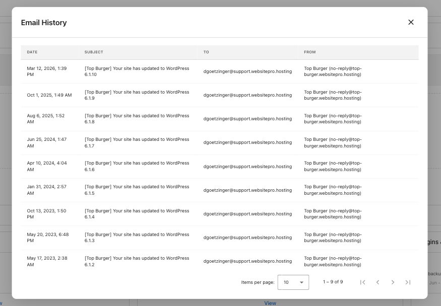

The **Email History** card shows every email your site has sent — form submissions, order confirmations, comment notifications, and anything else triggered by WordPress or your plugins. Available on both **Standard** and **Pro** editions.

Use it to confirm an email went out, debug missing messages, or audit what your site is sending.

## What you see

- **Emails sent** — Total messages sent from your site.
- **Last:** — Timestamp of the most recent email.

Click **View** to open the full email log. Each row shows the **Date**, **Subject**, **To**, and **From**. Click a row to open the email's full detail, with **Details** and **Events** tabs (sent, delivered, opened, bounced).

## Common uses

- Confirm a contact form submission was delivered.
- Audit what your site is sending and how often.
- Diagnose deliverability issues for any notification your site sends.

:::tip
If a recipient says they didn't get an email, open the email in the log and check the **Events** tab. A "delivered" event means the email reached their mail server — the issue is most likely a spam filter on their side.
:::
