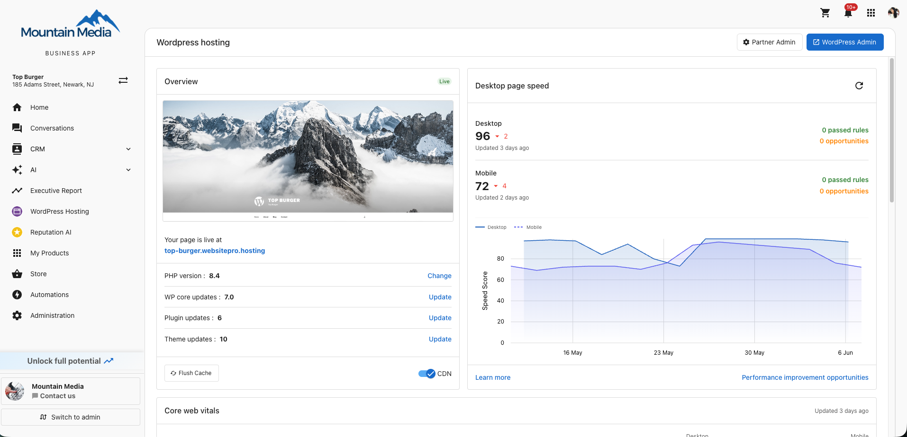

import Link from '@docusaurus/Link';

# Enhanced Dashboard

The Enhanced Dashboard brings every part of managing your WordPress site onto one page — site preview, performance, analytics, plugins, domains, staging, backups, and developer tools.

## What's on the dashboard

  

    <Link className="card-link" to="./dashboard-overview" style={{ height: '100%', display: 'block' }}>
      

        
<h3>Overview</h3>

        

          
Site preview, PHP version, WordPress core, plugin and theme updates, Flush Cache, and CDN.

        

      

    </Link>
  

  

    <Link className="card-link" to="./page-speed" style={{ height: '100%', display: 'block' }}>
      

        
<h3>Performance</h3>

        

          
Desktop and mobile page speed scores with history.

        

      

    </Link>
  

  

    <Link className="card-link" to="./core-web-vitals" style={{ height: '100%', display: 'block' }}>
      

        
<h3>Core Web Vitals</h3>

        

          
LCP, TBT, and CLS for desktop and mobile.

        

      

    </Link>
  

  

    <Link className="card-link" to="./web-analytics" style={{ height: '100%', display: 'block' }}>
      

        
<h3>Web Analytics</h3>

        

          
Visitors, sessions, page views, and bounce rate. Default analytics or connect Google Analytics.

        

      

    </Link>
  

  

    <Link className="card-link" to="./email-history" style={{ height: '100%', display: 'block' }}>
      

        
<h3>Email History</h3>

        

          
Every transactional email your site sent.

        

      

    </Link>
  

  

    <Link className="card-link" to="./domains-and-ssl" style={{ height: '100%', display: 'block' }}>
      

        
<h3>Domains & SSL</h3>

        

          
Connect a custom domain, manage DNS, monitor SSL.

        

      

    </Link>
  

  

    <Link className="card-link" to="./plugins-and-themes" style={{ height: '100%', display: 'block' }}>
      

        
<h3>Plugins & Themes</h3>

        

          
Install, update, activate, and deactivate.

        

      

    </Link>
  

  

    <Link className="card-link" to="./staging" style={{ height: '100%', display: 'block' }}>
      

        
<h3>Staging</h3>

        

          
Test changes on a copy of your site, then push to production.

        

      

    </Link>
  

  

    <Link className="card-link" to="./advanced-tools" style={{ height: '100%', display: 'block' }}>
      

        
<h3>Advanced Tools</h3>

        

          
SFTP/SSH, phpMyAdmin, firewall, cron, PHP logs.

        

      

    </Link>
  

  

    <Link className="card-link" to="./backups" style={{ height: '100%', display: 'block' }}>
      

        
<h3>Backups</h3>

        

          
Automatic and on-demand backups, restore in one click.

        

      

    </Link>
  

